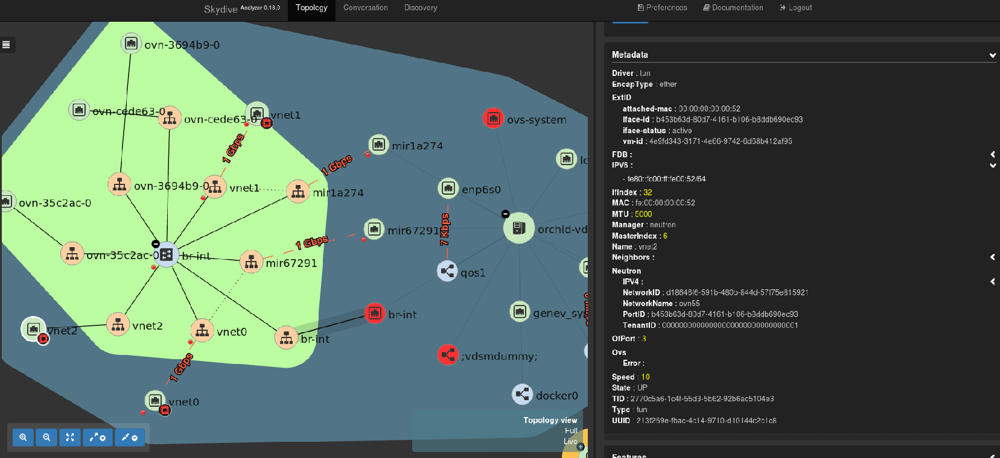

## Benefit to oVirt users
oVirt users may now analyze and see thier network topology via the Skydive UI. 
Skydive allows the users to see the result of their configuration done via oVirt.
They may capture traffic from VM1 to VM2 for example or monitor the traffic between two VMs or hosts. 
Also they may generate some traffic between 2 running VMs on different hosts for example.
Users may create alerts in Skydive UI to notify that some traffic disconnected or down.

[Skydive network](http://skydive.network/) is an open source real-time network topology and protocols analyzer providing a comprehensive way of understanding what is happening in your network infrastructure.
The common use cases will be, troubleshooting, monitoring, SDN integration and much more.
It has features such as:
* Topology capturing - Captures network topology, interface, bridge and more
* Flow capture - Distributed probe, L2-L4 classifier, GRE, VXLAN, GENEVE, MPLS/GRE, MPLS/UDP tunnelling support
* Extendable - Support for external SDN Controllers or container based infrastructure, OpenStack. Supports extensions through API

## Installation steps
1. git clone https://github.com/skydive-project/skydive.git
2. Create inventory file

```ini  
[skydive:children]
analyzers
agents

[skydive:vars]
skydive_listen_ip=0.0.0.0
skydive_fabric_default_interface=ovirtmgmt

skydive_os_auth_url=https://<ovn_provider_FQDN>:35357/v2.0
skydive_os_service_username=<ovn_provider_username>
skydive_os_service_password=<ovn_provider_password>
skydive_os_service_tenant_name=service
skydive_os_service_domain_name=Default
skydive_os_service_region_name=RegionOne

[analyzers]
<analyzer_FQDN> ansible_ssh_user=root ansible_ssh_pass=<ssh_password>

[agents]
<agent_FQDN> ansible_ssh_user=root ansible_ssh_pass=<ssh_password>
<agent_FQDN> ansible_ssh_user=root ansible_ssh_pass=<ssh_password>
<agent_FQDN> ansible_ssh_user=root ansible_ssh_pass=<ssh_password>
<agent_FQDN> ansible_ssh_user=root ansible_ssh_pass=<ssh_password>

[agents:vars]
skydive_extra_config={'agent.topology.probes': ['ovsdb', 'neutron'], 'agent.topology.neutron.ssl_insecure': true}
```
* skydive_os_auth_url - This is the FQDN(hostname or IP) address of ovirt-provider-ovn
* skydive_os_service_username - oVirt username used to authenticate the ovirt-provider-ovn, e.g. admin@internal
* analyzer FQDN will be the hostname of your analyzer
* agent FQDN will be the hostname of the hosts running in oVirt

3. cd to git/skydive/contrib/ansible
4. Run ansible-playbook -i <inventory file> playbook.yml.sample
5. Connect to skydive UI http://<IP/FQDN>:8082
6. If the UI cannot be accessed flush the iptables 
  

## Examples



