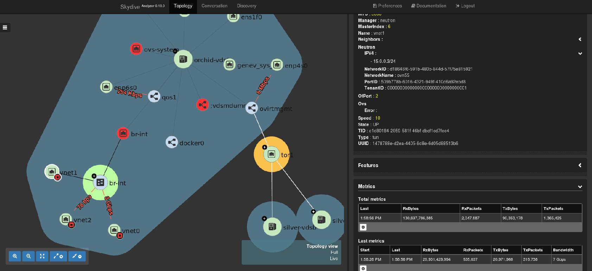
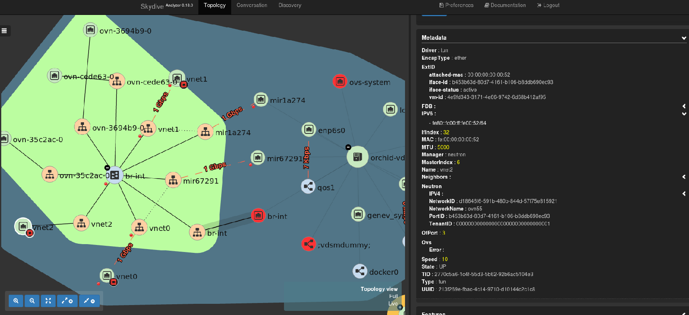

[Skydive network](http://skydive.network/) is an open source real-time network topology and protocols analyzer providing a comprehensive way of understanding what is happening in your network infrastructure.
The common use cases will be, troubleshooting, monitoring, SDN integration and much more.
It has features such as:
* Topology capturing - Captures network topology, interface, bridge and more
* Flow capture - Distributed probe, L2-L4 classifier, GRE, VXLAN, GENEVE, MPLS/GRE, MPLS/UDP tunnelling support
* Extendable - Support for external SDN Controllers or container based infrastructure, OpenStack. Supports extensions through API

## Benefit to oVirt users
Skydive allows oVirt administrators to see the network configuration and topology of their oVirt cluster.
Administrators can capture traffic from VM1 to VM2 or monitor the traffic between VMs or hosts.
Skydive can generate traffic between 2 running VMs on different hosts and then analyze.
Administrators can create alerts in Skydive UI to notify when traffic is disconnected or down.

READMORE

## Installation steps
1. `git clone https://github.com/skydive-project/skydive.git`
2. Create inventory file

    ```ini
    [skydive:children]
    analyzers
    agents

    [skydive:vars]
    skydive_listen_ip=0.0.0.0
    skydive_fabric_default_interface=ovirtmgmt

    skydive_os_auth_url=https://<ovn_provider_FQDN>:35357/v2.0
    skydive_os_service_username=<ovn_provider_username>
    skydive_os_service_password=<ovn_provider_password>
    skydive_os_service_tenant_name=service
    skydive_os_service_domain_name=Default
    skydive_os_service_region_name=RegionOne

    [analyzers]
    <analyzer_FQDN> ansible_ssh_user=root ansible_ssh_pass=<ssh_password>

    [agents]
    <agent_FQDN> ansible_ssh_user=root ansible_ssh_pass=<ssh_password>
    <agent_FQDN> ansible_ssh_user=root ansible_ssh_pass=<ssh_password>
    <agent_FQDN> ansible_ssh_user=root ansible_ssh_pass=<ssh_password>
    <agent_FQDN> ansible_ssh_user=root ansible_ssh_pass=<ssh_password>

    [agents:vars]
    skydive_extra_config={'agent.topology.probes': ['ovsdb', 'neutron'], 'agent.topology.neutron.ssl_insecure': true}
    ```
    * skydive_os_auth_url - This is the FQDN(hostname or IP) address of ovirt-provider-ovn
    * skydive_os_service_username - oVirt username used to authenticate the ovirt-provider-ovn, e.g. admin@internal
    * analyzer_FQDN will be the hostname of your analyzer
    * agent_FQDN will be the hostname of the hosts running in oVirt

3. `cd git/skydive/contrib/ansible`
4. `ansible-playbook -i inventory.file playbook.yml.sample`
5. Open port 8082 on the analyzer host - In the future this port will be opened by default after deploy
6. Connect to skydive UI http://analyzer_FQDN:8082


## Examples
In this screenshot we can see the neutron metadata of vnet1, which has an openstack icon next to it.
The neutron metadata contains the vnet IPv4 and IPv6, Network's ID, Network's name, port ID, Tenant ID


In this screenshot we can see 2 capture points(red points) between vnet0 and vnet1 and see traffic of 1Gb between the VMs



