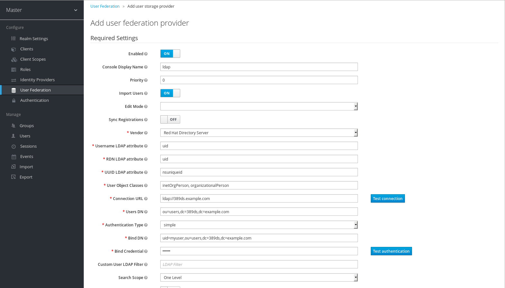
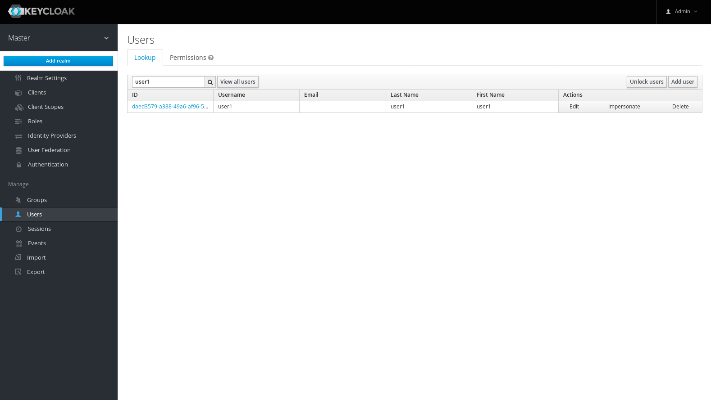
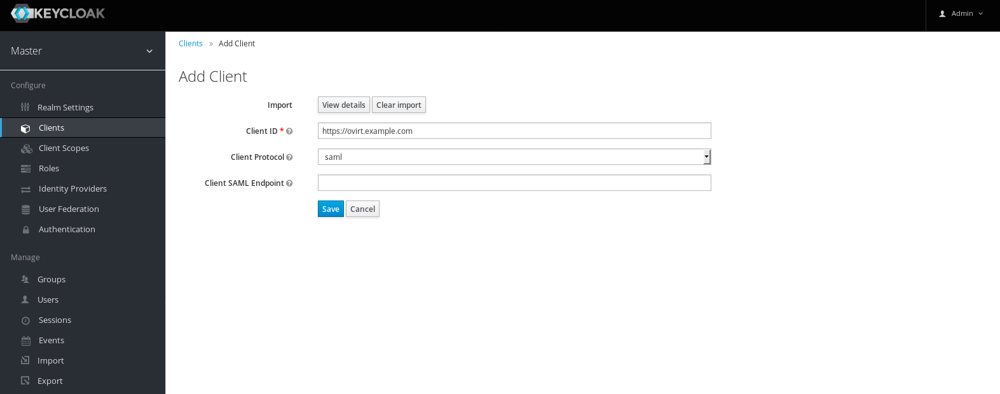
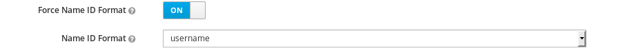

In this post I would like to introduce how simple is to integrate SAML into oVirt using [Keycloak](https://www.keycloak.org/) with LDAP user federation.

READMORE

In this blog I suppose you already have setup `389ds`, but the solution is very similar for any other LDAP provider.
As SAML is not integrated into oVirt directly we use Apache to do the SAML authentication for us. [mod_auth_mellon](https://github.com/Uninett/mod_auth_mellon) module pretty nicely cover all needed functionality.

## mod_auth_mellon configuration
First we need to configure oVirt's apache, so we need to first SSH to the oVirt engine,
and then create directory where we store all SAML related certificates

```bash
# ssh root@engine
# yum install -y mod_auth_mellon
# mkdir -p /etc/httpd/saml2
```

When we install `mod_auth_mellon` package it will create following file `/etc/httpd/conf.d/auth_mellon.conf`,
we need to reconfigure this file to our needs, as follows:

```
<Location />
    MellonEnable "info"
    MellonDecoder "none"
    MellonVariable "cookie"
    MellonSecureCookie On
    MellonSessionDump On
    MellonSamlResponseDump On
    MellonSessionLength 86400

    MellonUser "NAME_ID"
    MellonEndpointPath /saml2

    MellonSPCertFile /etc/httpd/saml2/ovirtsp-cert.cert
    MellonSPPrivateKeyFile /etc/httpd/saml2/ovirtsp-key.key
    MellonSPMetadataFile /etc/httpd/saml2/ovirtsp-metadata.xml
    MellonIdPMetadataFile /etc/httpd/saml2/idp-metadata.xml

    RewriteEngine On
    RewriteCond %{LA-U:REMOTE_USER} ^(.*)$
    RewriteRule ^(.*)$ - [L,NS,P,E=REMOTE_USER:%1]
    RequestHeader set X-Remote-User %{REMOTE_USER}s
</Location>

<LocationMatch ^/ovirt-engine/sso/(interactive-login-negotiate|oauth/token-http-auth)|^/ovirt-engine/api>
  <If "req('Authorization') !~ /^(Bearer|Basic)/i">

    Require valid-user
    AuthType "Mellon"
    AuthName "SAML Login"
    MellonEnable "auth"

    ErrorDocument 401 "<html><meta http-equiv=\"refresh\" content=\"0; url=/ovirt-engine/sso/login-unauthorized\"/><body><a href=\"/ovirt-engine/sso/login-unauthorized\">Here</a></body></html>"
  </If>
</LocationMatch>
```

You may notice in the configuration file that we are using following four files:

```
Certificate file - /etc/httpd/saml2/ovirtsp-cert.cert
Private key file - /etc/httpd/saml2/ovirtsp-key.key
Sp metadata file - /etc/httpd/saml2/ovirtsp-metadata.xml
Idp metadata file - /etc/httpd/saml2/idp-metadata.xml    
```

We need to create those files using provided script from `mod_auth_mellon` package:

```bash
# cd /etc/httpd/saml2
# /usr/libexec/mod_auth_mellon/mellon_create_metadata.sh https://<ovirt-fqdn> https://<ovirt-fqdn>/saml2
```
Now we have to rename created files to the file names, which we defined in `/etc/httpd/conf.d/auth_mellon.conf`:

```bash
# mv https_<ovirt-fqdn>.key  ovirtsp-key.key
# mv https_<ovirt-fqdn>.cert ovirtsp-cert.cert
# mv https_<ovirt-fqdn>.xml  ovirtsp-metadata.xml
```

Now that we have generated Service provider `ovirtsp-metadata.xml` we may configure Identity provider using `Keycloak`.

## Keycloak
Keycloak is an open source Identity and Access Management solution aimed at modern applications and services. It makes it easy to secure applications and services with little to no code.
Users authenticate with Keycloak rather than individual applications. This means that your applications don't have to deal with login forms, authenticating users. Once logged-in to Keycloak, users don't have to login again to access a different application. 
For our single sign on purpose we will use Keycloak as SAML provider.

## Keycloak configuration
In our example we will use default master realm. First let's create user federation with our `389ds` directory server.
Fill the values of your 389ds server as show in image below.


After testing the connection and authentication click `save` button and check if your users are searchable, as shown in image below.


Now that user federation is working and is integrated, let's configure SAML client. For this we need to upload `ovirtsp-metadata.xml` created in previous step into `Keycloak`:


**IMPORTANT** After client is created we have to change `Name ID Format` format from default value `transient` to `username`,
and we have to enable `Force Name ID Format` option. That's because oVirt is using username to search in LDAP providers.


Our Idp is configured, so now we have to add them to our engine configuration:
```bash
# ssh root@engine
# cd /etc/httpd/saml2
# curl -s -o idp-metadata.xml http://<keycloak-server>:8080/auth/realms/master/protocol/saml/descriptor
# systemctl restart httpd
```

## oVirt AAA configuration
In this part we create last peace which we need to get this up and running.

### Installation
```
# yum install -y ovirt-engine-extension-aaa-ldap ovirt-engine-extension-aaa-misc
```

### Create /etc/ovirt-engine/extensions.d/saml-authn.properties
```
ovirt.engine.extension.name = saml-authn
ovirt.engine.extension.bindings.method = jbossmodule
ovirt.engine.extension.binding.jbossmodule.module = org.ovirt.engine-extensions.aaa.misc
ovirt.engine.extension.binding.jbossmodule.class = org.ovirt.engineextensions.aaa.misc.http.AuthnExtension
ovirt.engine.extension.provides = org.ovirt.engine.api.extensions.aaa.Authn
ovirt.engine.aaa.authn.profile.name = saml-http
ovirt.engine.aaa.authn.authz.plugin = saml-authz
ovirt.engine.aaa.authn.mapping.plugin = saml-http-mapping
config.artifact.name = HEADER
config.artifact.arg = X-Remote-User
```

### Create /etc/ovirt-engine/extensions.d/saml-http-mapping.properties
```
ovirt.engine.extension.name = saml-http-mapping
ovirt.engine.extension.bindings.method = jbossmodule
ovirt.engine.extension.binding.jbossmodule.module = org.ovirt.engine-extensions.aaa.misc
ovirt.engine.extension.binding.jbossmodule.class = org.ovirt.engineextensions.aaa.misc.mapping.MappingExtension
ovirt.engine.extension.provides = org.ovirt.engine.api.extensions.aaa.Mapping
config.mapAuthRecord.type = regex
config.mapAuthRecord.regex.mustMatch = false
config.mapAuthRecord.regex.pattern = ^(?<user>.*?)((\\\\(?<at>@)(?<suffix>.*?)@.*)|(?<realm>@.*))$
config.mapAuthRecord.regex.replacement = ${user}${at}${suffix}
```

### Create /etc/ovirt-engine/extensions.d/saml-authz.properties
```
ovirt.engine.extension.name = saml-authz
ovirt.engine.extension.bindings.method = jbossmodule
ovirt.engine.extension.binding.jbossmodule.module = org.ovirt.engine-extensions.aaa.ldap
ovirt.engine.extension.binding.jbossmodule.class = org.ovirt.engineextensions.aaa.ldap.AuthzExtension
ovirt.engine.extension.provides = org.ovirt.engine.api.extensions.aaa.Authz
config.profile.file.1 = ../aaa/saml-ldap.properties
```

### Create /etc/ovirt-engine/aaa/saml-ldap.properties
```
include = <389ds.properties>

vars.server = 389ds.example.com
vars.user = uid=user1,ou=users,dc=389ds,dc=example,dc=com
vars.password = password

pool.default.auth.simple.bindDN = ${global:vars.user}
pool.default.auth.simple.password = ${global:vars.password}
pool.default.serverset.type = single
pool.default.serverset.single.server = ${global:vars.server}
```

This is it, now restart ovirt-engine:
```
systemctl restart ovirt-engine.service
```

If you try to login to webadmin, you will be redirected to `Keycloak` (if you are not already logged in), where you can enter credentials from your 389ds ldap setup.
Note that your users won't have permissions to login, so you must first assign a permissions them.
