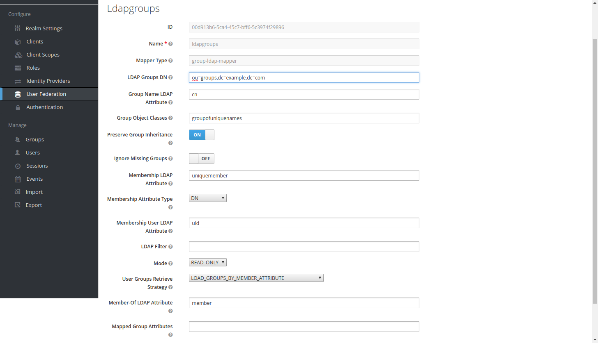
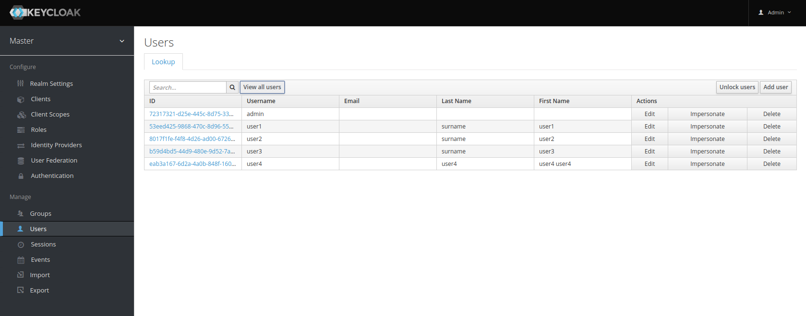
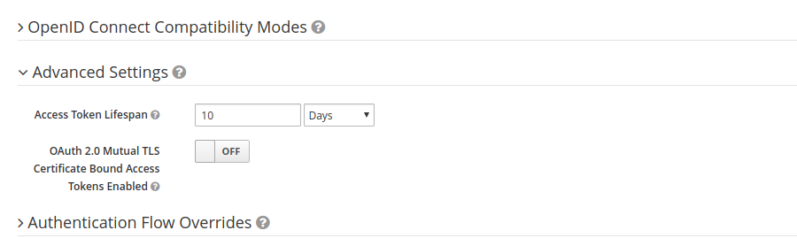
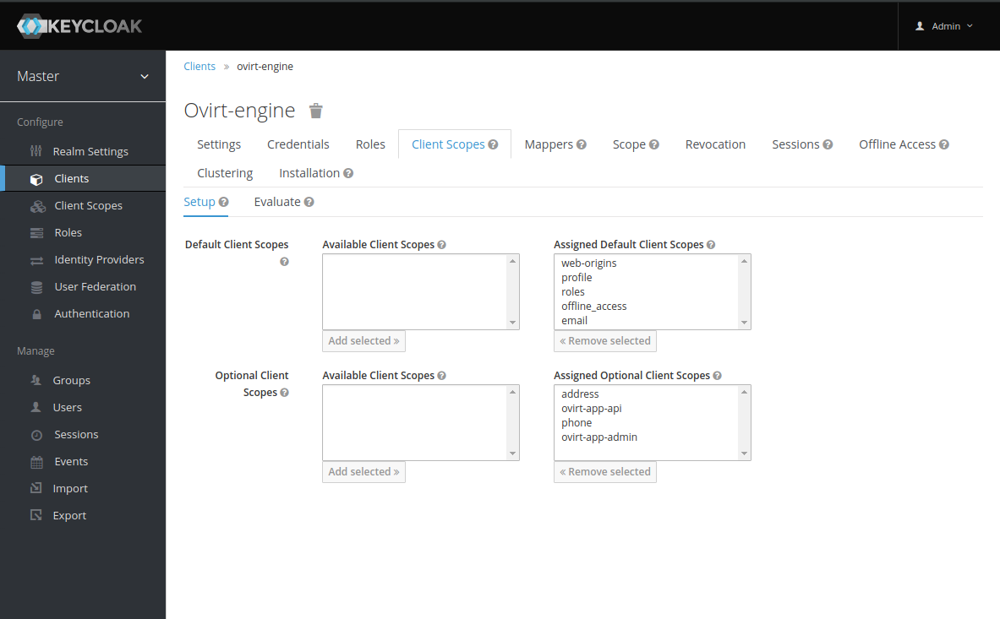
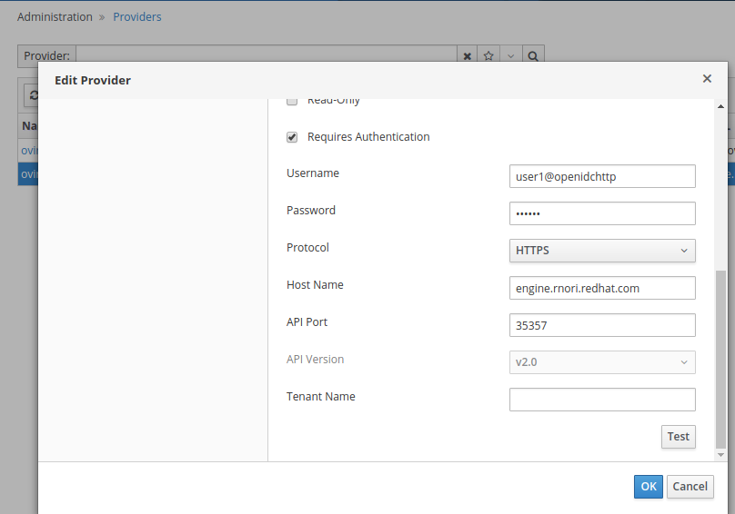

In this post I will introduce how to integrate OIDC with oVirt engine using [Keycloak](https://www.keycloak.org/) and LDAP user federation.

Prerequisites: I assume you have already setup the `389ds` directory server, but the solution is very similar for any other LDAP provider.
As OIDC is not integrated into oVirt directly, we use Apache to do the OIDC authentication for us. The [mod_auth_openidc](https://github.com/zmartzone/mod_auth_openidc) module nicely covers all needed functionality.

Overview

Integrate with external OpenID Connect Identity Provider (IDP) to provide Single Sign-On  (SSO) across products that use the IDP for authenticating users. We currently have oVirt SSO for providing unified authentication across Administrator and VM portals. The oVirt engine SSO also provides tokens for REST API clients and supports bearer authentication to reuse tokens to access oVirt engine RESTAPI. With external IDP integration the internal oVirt SSO is disabled and browser users will be redirected to the external IDP for authentication. After successful authentication users can access both Admin and VM portals as they normally do. REST API clients don't have to change, they can still obtain a token from engine SSO and use the token for bearer authentication to access oVirt engine RESTAPI. Engine SSO acts as a proxy obtaining the token from external IDP on behalf of the RESTAPI client.

To access Administrator portal users need to belong to LDAP group named “ovirt-administrator” or an LDAP group that has been manually granted permissions to access Admin portal.

Note

In the examples and configuration below we use keycloak.example.com as the Keycloak server FQDN and engineopenid.example.com as the oVirt engine server FQDN. Please note that these should be replaced with real FQDNs from your setup.

READMORE

## Keycloak
Keycloak is an open source Identity and Access Management solution aimed at modern applications and services. It makes it easy to secure applications and services with little to no code.
Users authenticate with Keycloak rather than individual applications. This means that your applications don't have to deal with login forms to authenticate users. Once logged in to Keycloak, users don't have to login again to access a different application.
For our single sign on purpose we will use Keycloak as the OIDC provider.

## Keycloak configuration
For our example, we'll use default master realm. First let's create user federation with our `389ds` directory server.
Fill the values of your 389ds server as show in the image below.


Add ldap groups mapper



After testing the connection and authentication, click the `save` button And then Synchronize All Users using the button at the bottom of User Federation Provider page.. Check if your users are searchable, as shown in image below.


Now that user federation is working and is integrated, let's configure the OIDC client. 


**IMPORTANT** After the client is created, we must change `Access Token Lifespan` to `10 days`. This is required because oVirt manages the token lifespan and we do not want Keycloak invalidating the tokens.


Make a note of client id and client secret from the client credentials page, the client id and secret is needed to configure the Apache mod_auth_openidc and also ovirt-engine.


Create a mapper to add groups to the claim


Add the build in mapper for username


Create the scopes need by ovirt engine, ovirt-app-api and ovirt-app-admin


Set up optional client scopes for the ovirt-engine client


## mod_auth_openidc configuration
First we need to configure Apache on oVirt engine machine. SSH to the oVirt engine and install mod_auth_openidc and ovirt-engine-extension-aaa-misc.

```bash
ssh root@engineopenid
yum install -y mod_auth_openidc
yum install -y ovirt-engine-extension-aaa-misc
```

We need to create a file `/etc/httpd/conf.d/ovirt-openidc.conf` to configure mod_auth_openidc as follows:

```
LoadModule auth_openidc_module modules/mod_auth_openidc.so
ServerName engineopenid.example.com

OIDCProviderMetadataURL https://keycloak.example.com:8443/auth/realms/master/.well-known/openid-configuration
OIDCSSLValidateServer Off
    
OIDCClientID ovirt-engine
OIDCClientSecret c0f7a8ba-72d2-4003-ace2-b86cf4a27e6a
OIDCRedirectURI https://engineopenid.example.com/ovirt-engine/callback
OIDCDefaultURL https://engineopenid.example.com/ovirt-engine/login?scope=ovirt-app-admin+ovirt-app-portal+ovirt-ext%3Dauth%3Asequence-priority%3D%7E
    
# maps the prefered_username claim to the REMOTE_USER environment variable
OIDCRemoteUserClaim preferred_username
OIDCCryptoPassphrase random1234

<LocationMatch ^/ovirt-engine/sso/(interactive-login-negotiate|oauth/token-http-auth)|^/ovirt-engine/callback>
    <If "req('Authorization') !~ /^(Bearer|Basic)/i">
    
      Require valid-user
      AuthType openid-connect
    
      ErrorDocument 401 "<html><meta http-equiv=\"refresh\" content=\"0; url=/ovirt-engine/sso/login-unauthorized\"/><body><a href=\"/ovirt-engine/sso/login-unauthorized\">Here</a></body></html>"
    </If>
</LocationMatch>
    
OIDCOAuthIntrospectionEndpoint https://keycloak.example.com:8443/auth/realms/master/protocol/openid-connect/token/introspect
OIDCOAuthSSLValidateServer    Off
OIDCOAuthIntrospectionEndpointParams token_type_hint=access_token
OIDCOAuthClientID ovirt-engine
OIDCOAuthClientSecret c0f7a8ba-72d2-4003-ace2-b86cf4a27e6a
OIDCOAuthRemoteUserClaim sub

<LocationMatch ^/ovirt-engine/api>
   AuthType oauth20
   Require valid-user
</LocationMatch>

```

Create /etc/ovirt-engine/extensions.d/openidc-authn.properties

```
ovirt.engine.extension.name = openidc-authn
ovirt.engine.extension.bindings.method = jbossmodule
ovirt.engine.extension.binding.jbossmodule.module = org.ovirt.engine-extensions.aaa.misc
ovirt.engine.extension.binding.jbossmodule.class = org.ovirt.engineextensions.aaa.misc.http.AuthnExtension
ovirt.engine.extension.provides = org.ovirt.engine.api.extensions.aaa.Authn
ovirt.engine.aaa.authn.profile.name = openidchttp
ovirt.engine.aaa.authn.authz.plugin = openidc-authz
ovirt.engine.aaa.authn.mapping.plugin = openidc-http-mapping
config.artifact.name = HEADER
config.artifact.arg = OIDC_CLAIM_preferred_username
```

Create /etc/ovirt-engine/extensions.d/openidc-http-mapping.properties

```
ovirt.engine.extension.name = openidc-http-mapping
ovirt.engine.extension.bindings.method = jbossmodule
ovirt.engine.extension.binding.jbossmodule.module = org.ovirt.engine-extensions.aaa.misc
ovirt.engine.extension.binding.jbossmodule.class = org.ovirt.engineextensions.aaa.misc.mapping.MappingExtension
ovirt.engine.extension.provides = org.ovirt.engine.api.extensions.aaa.Mapping
config.mapAuthRecord.type = regex
config.mapAuthRecord.regex.mustMatch = false
config.mapAuthRecord.regex.pattern = ^(?<user>.*?)((\\\\(?<at>@)(?<suffix>.*?)@.*)|(?<realm>@.*))$
config.mapAuthRecord.regex.replacement = ${user}${at}${suffix}
```

Create /etc/ovirt-engine/extensions.d/openidc-authz.properties

```
ovirt.engine.extension.name = openidc-authz
ovirt.engine.extension.bindings.method = jbossmodule
ovirt.engine.extension.binding.jbossmodule.module = org.ovirt.engine-extensions.aaa.misc
ovirt.engine.extension.binding.jbossmodule.class = org.ovirt.engineextensions.aaa.misc.http.AuthzExtension
ovirt.engine.extension.provides = org.ovirt.engine.api.extensions.aaa.Authz
config.artifact.name.arg = OIDC_CLAIM_preferred_username
config.artifact.groups.arg = OIDC_CLAIM_groups
config.globals.baseDN.simple_baseDN = dc=example,dc=com
```

Create 99-enable-external-auth.conf in /etc/ovirt-engine/engine.conf.d/

```
ENGINE_SSO_ENABLE_EXTERNAL_SSO=true
ENGINE_SSO_EXTERNAL_SSO_LOGOUT_URI="${ENGINE_URI}/callback"
```

Create 99-config-external-auth.conf in /etc/ovirt-engine/engine.conf.d/

```
EXTERNAL_OIDC_USER_INFO_END_POINT=https://keycloak.example.com:8443/auth/realms/master/protocol/openid-connect/userinfo
EXTERNAL_OIDC_TOKEN_END_POINT=https://keycloak.example.com:8443/auth/realms/master/protocol/openid-connect/token
EXTERNAL_OIDC_LOGOUT_END_POINT=https://keycloak.example.com:8443/auth/realms/master/protocol/openid-connect/logout
EXTERNAL_OIDC_CLIENT_ID=ovirt-engine
EXTERNAL_OIDC_CLIENT_SECRET="c0f7a8ba-72d2-4003-ace2-b86cf4a27e6a"
EXTERNAL_OIDC_HTTPS_PKI_TRUST_STORE="/home/cacerts"
EXTERNAL_OIDC_HTTPS_PKI_TRUST_STORE_PASSWORD=""
EXTERNAL_OIDC_SSL_VERIFY_CHAIN=false
EXTERNAL_OIDC_SSL_VERIFY_HOST=false
```

Restart ovirt-engine and httpd

```
systemctl restart httpd
systemctl restart ovirt-engine
```

## Test the setup

Obtain token from engine

```
curl -k -H "Accept: application/json" 'https://engineopenid.example.com/ovirt-engine/sso/oauth/token?grant_type=password&username=user1@openidchttp&password=123456&scope=ovirt-app-api'
```

Use token to access api

```
curl -v -k -H "Authorization: Bearer $1" -L https://engineopenid.rnori.redhat.com/ovirt-engine/api
```

Using python SDK to access engine, SDK directly obtains token from engine and doesn’t have to deal with Keycloak
```
import logging
import pdb
import ovirtsdk4 as sdk
import ovirtsdk4.types as types

logging.basicConfig(level=logging.DEBUG, filename='example.log')

# This example will connect to the server and print the names and identifiers of all the data centers and virtual machines:

# Create the connection to the server:
connection = sdk.Connection(
    url='https://engineopenid.example.com/ovirt-engine/api',
    username='user1@openidchttp',
    password='123456',
    debug=True,
    log=logging.getLogger(),
    insecure=True
)

# Verify connection
if connection.test(raise_exception=False):
    print("Connection works.")
else:
    print("Connection doesn't work.")

# Get the reference to the "vms" service:
dcs_service = connection.system_service().data_centers_service()

# Use the "list" method of the "vms" service to list all the virtual machines of the system:
dcs = dcs_service.list()

# Print the virtual machine names and identifiers:
for dc in dcs:
  print("%s " % (dc.name))

# Get the reference to the "vms" service:
vms_service = connection.system_service().vms_service()

# Use the "list" method of the "vms" service to list all the virtual machines of the system:
vms = vms_service.list()

# Print the virtual machine names and identifiers:
for vm in vms:
  print("%s: %s" % (vm.name, vm.id))

# Close the connection to the server:
connection.close()
```

Login to webadmin, user1 belongs to group ovirt-administrator in ldap, so user1 should be able to login to webadmin without any additional permission settings.

## Configuring OVN

Configuring ovn requires to create 20-setup-ovirt-provider-ovn.conf config file under /etc/ovirt-provider-ovn/conf.d/ with the contents. Where user1 belongs to ldap group ovirt-administrator and openidchttp is the profile configured for aaa-ldap-misc

```
[OVIRT]
ovirt-admin-user-name=user1@openidchttp
```

Restart ovirt-provider-ovn
```
systemctl restart ovirt-provider-ovn
```

Login in webadmin to update the password for ovn under Administration -> Providers


