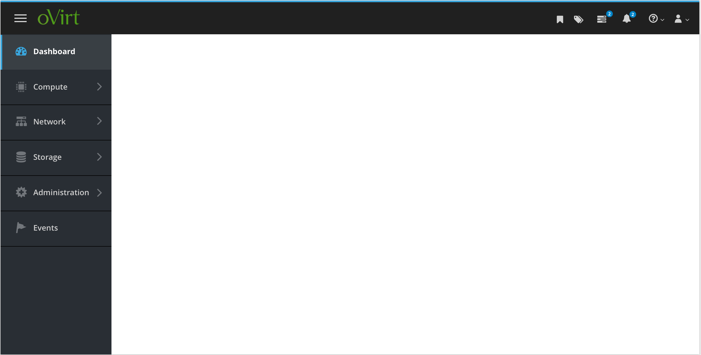

# Masthead

The oVirt UI uses the PatternFly [Masthead](https://www.patternfly.org/components/masthead) pattern.

The following items are on the masthead:

- Bookmarks
- Tags
- Tasks
- Notifications
- Help
- User Options

