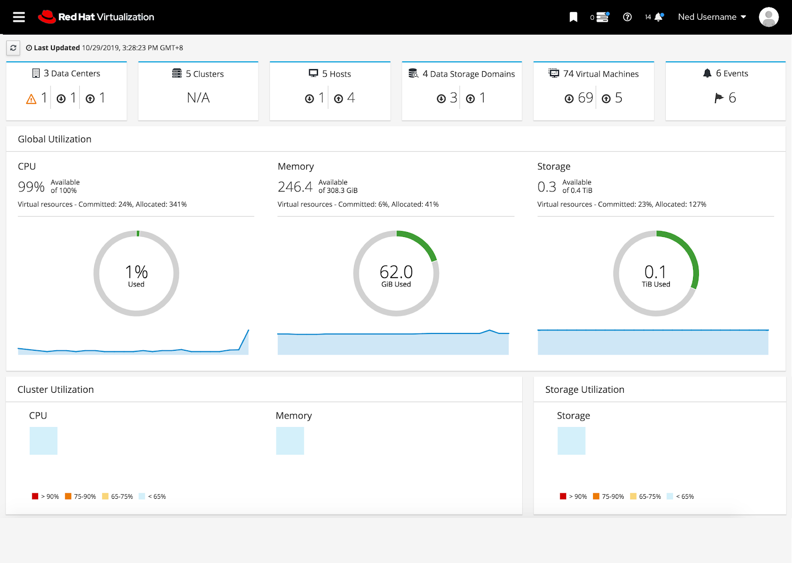
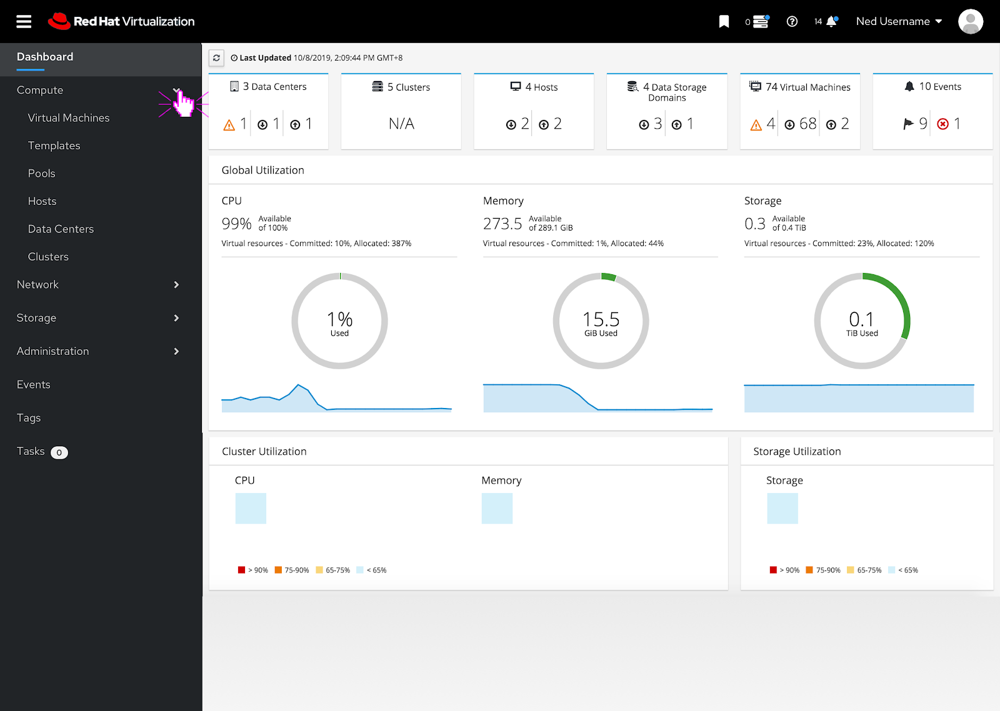
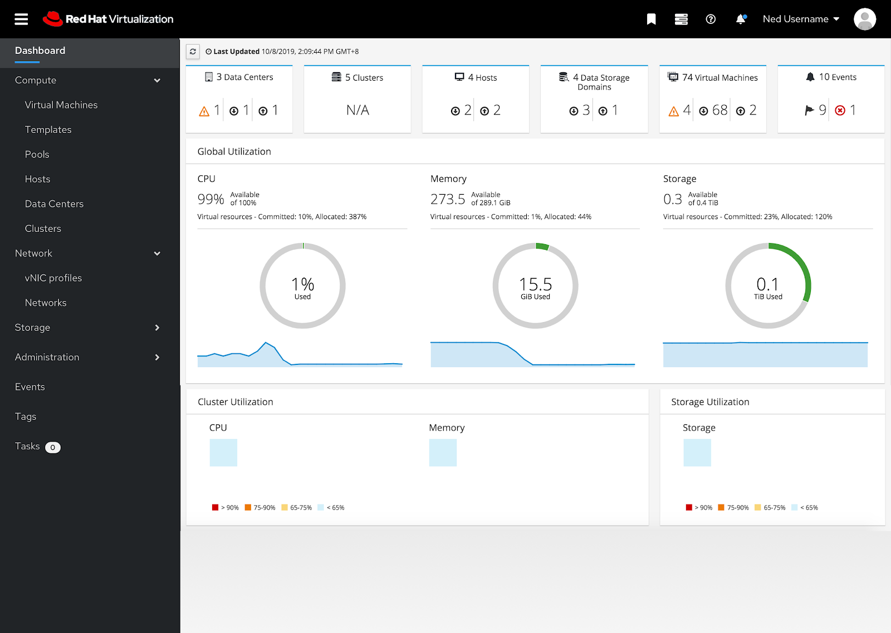
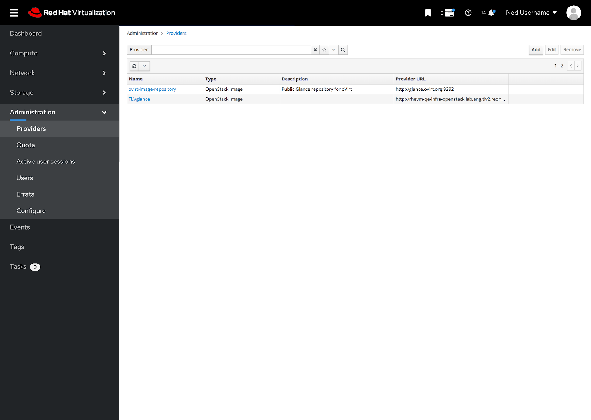

# Masthead and Vertical Navigation

## Masthead and Vertical Navigation Overview

The PatternFly 4 designs for the masthead and vertical navigation feature an updated visual design based off of PatternFly 4 components.

## Hamburger Menu

If the user clicks on the hamburger menu, the vertical navigation can be fully collapsed or expanded.

## Expanded Section

To expand a section the user can click on the caret and the sub menu items appear below the expanded caret.

## Multiple Subsections Expanded

The user can have multiple sub menus expanded at the same time.

## Highlighted Section

If a user selects a menu item, the item and the sub menu section become highlighted. The content area reflects the menu selection as well.

