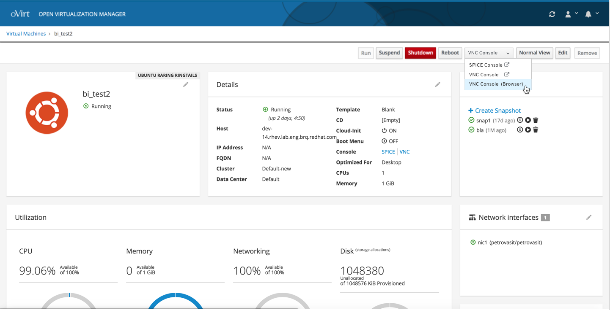
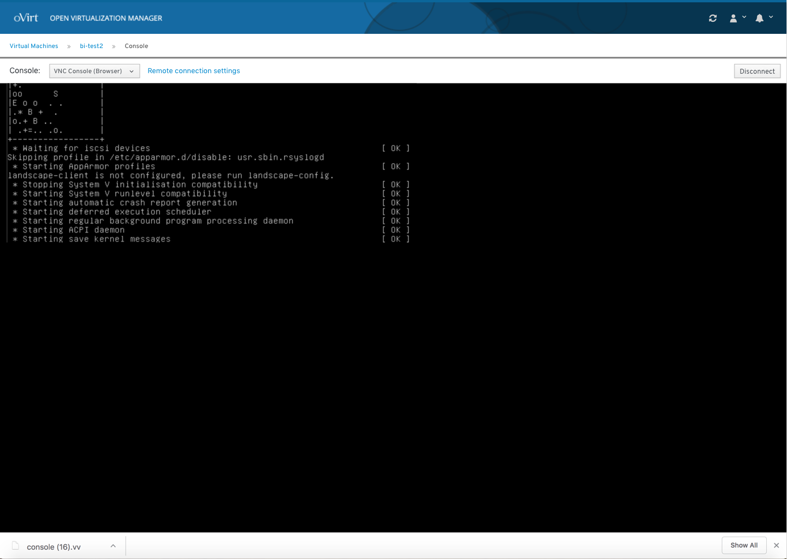

# Console

## Select Console Type

The user clicks on the console button of a specific VM to access the console. The user can select from different types of console types.

## Console in Browser

If the user selects an in browser console type, the console will appear in the user's browser.

