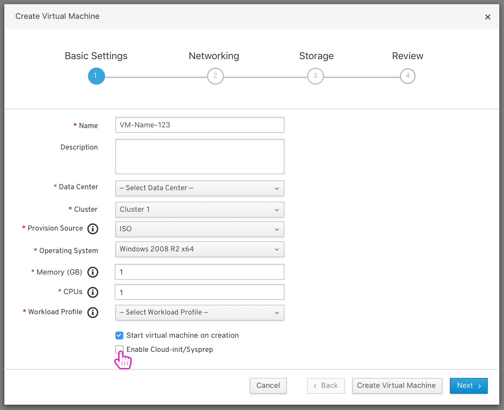
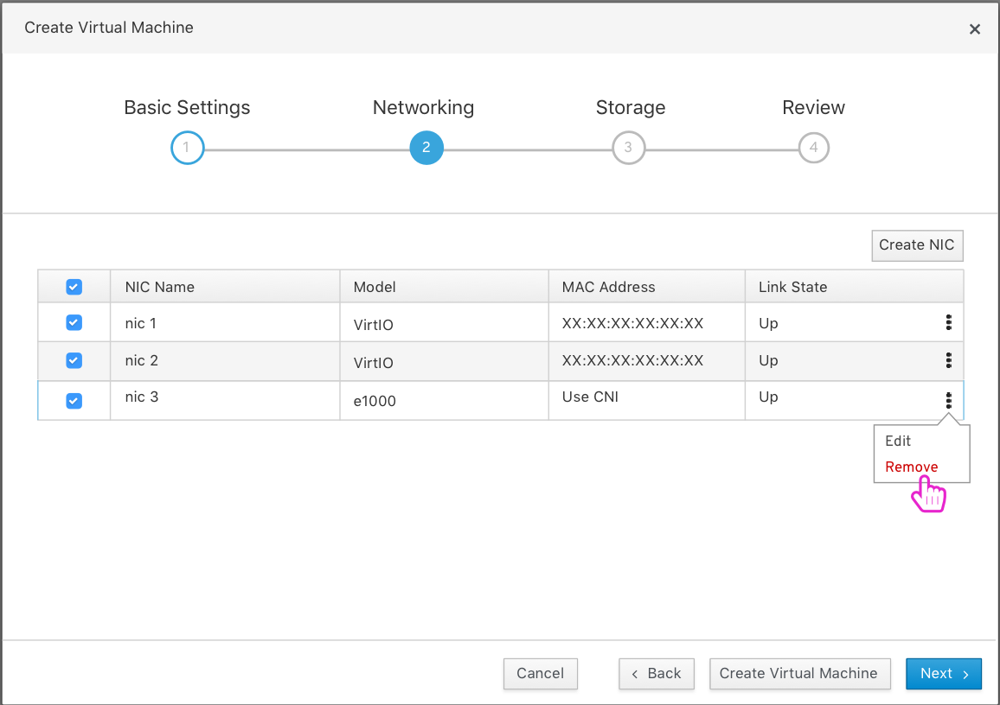
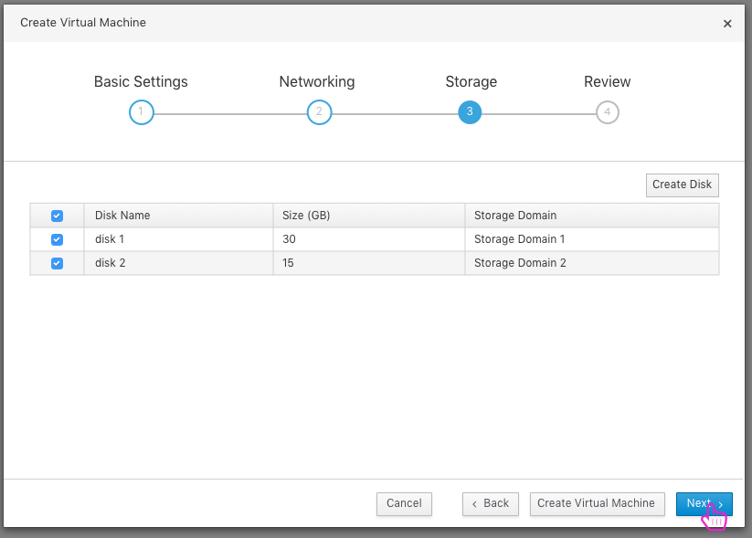
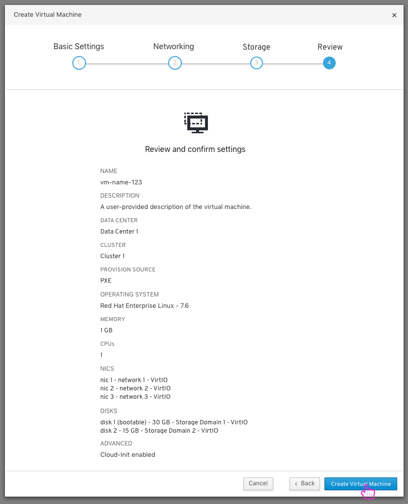
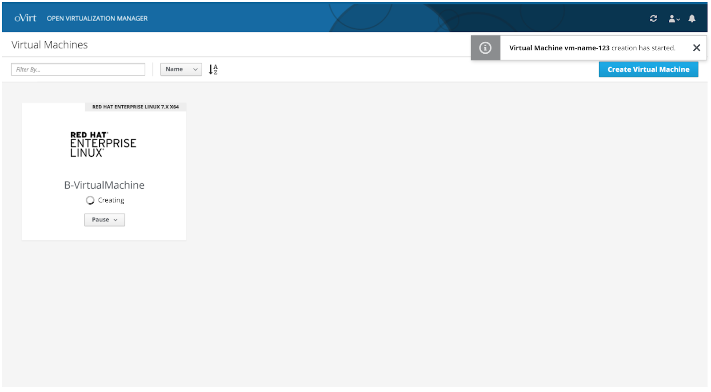

# Create New VM

To create a new VM, the user clicks the 'Create Virtual Machine' button and a 'Create Virtual Machine' modal appears where the user can start to fill out basic setting information for a new VM.

## Create New VM- Network Settings

At the second step the user can configure the network settings of the VM.

## Create New VM- Storage Settings

At the third step the user can configure the storage settings of the VM.

## Create New VM- Review Settings

At the final step the user can review the selected settings of the VM and create the VM.

## VM Creation Complete

A toast notification appears and lets the user know that the VM is bring created. Once the VM is done being created it will appear on the 'Virtual Machines' page.

