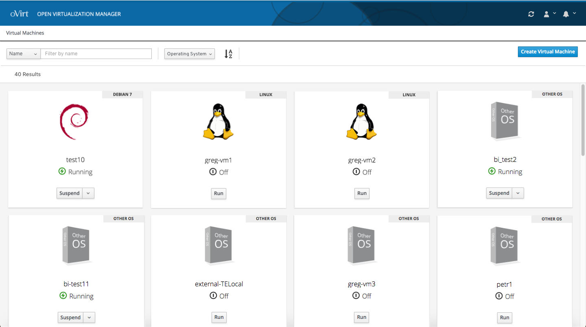
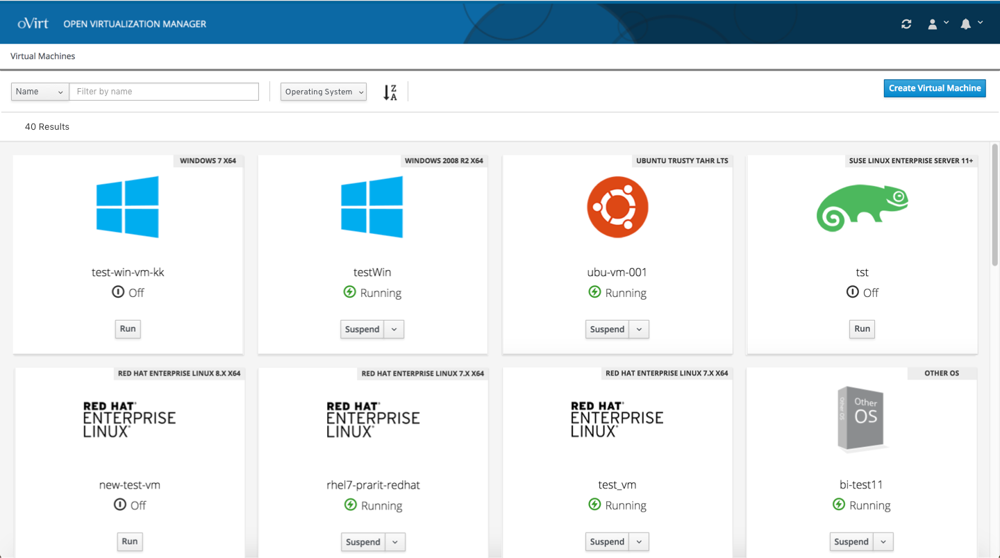
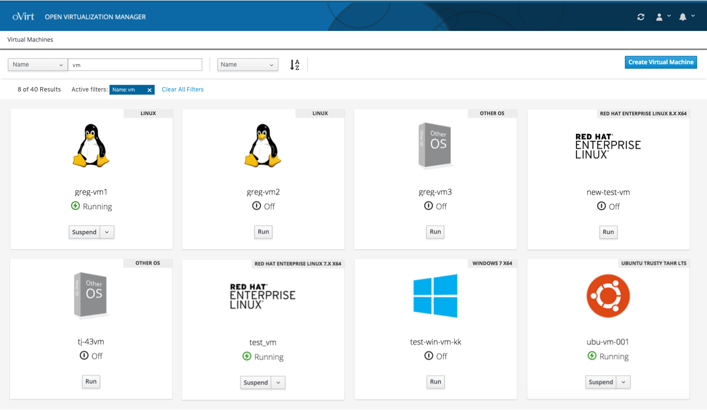

# Filter and Sort

### In Toolbar

To further refine the list of VMs, the user can use the filter and sort options featured in the toolbar.

### Sort

The user can sort the list of VMs by alphabetical order or reverse alphabetical order.

### Filter by Search Term

The user can enter a search term and the list of VMs is filtered to only show the VMs that feature that search term.

