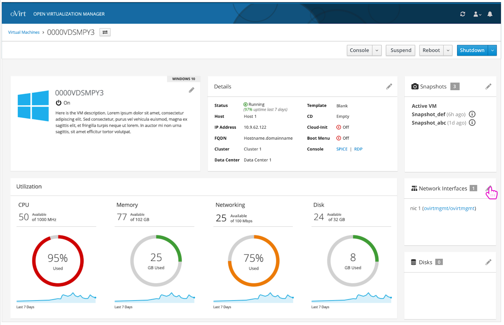
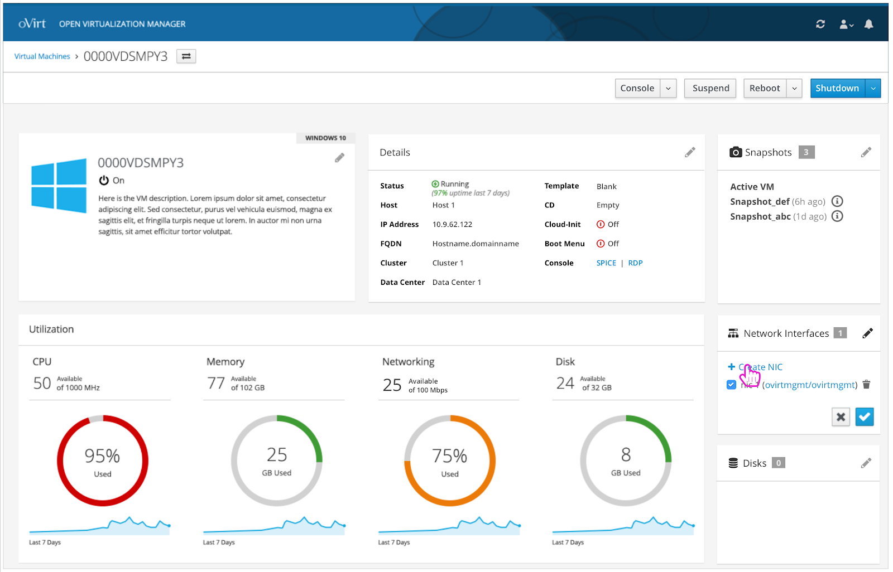
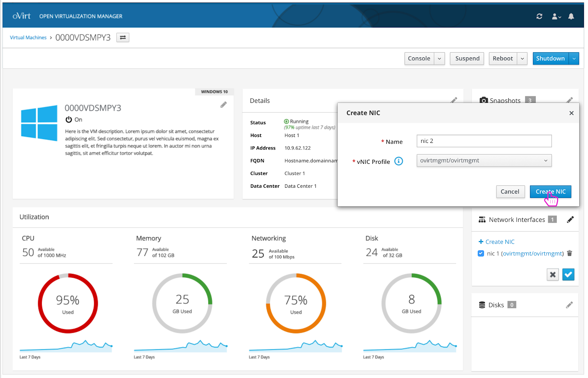
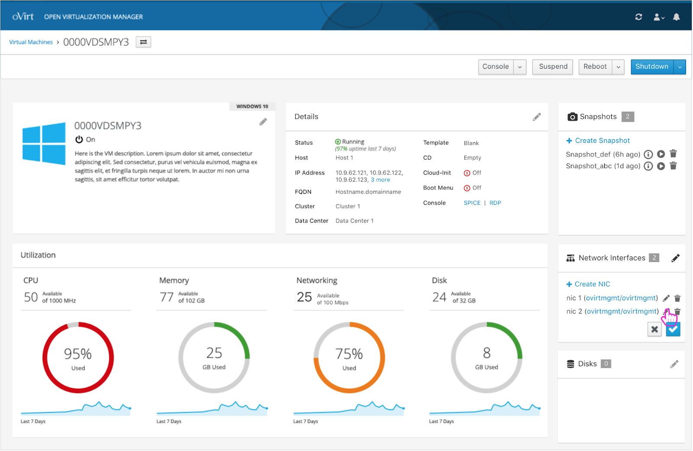
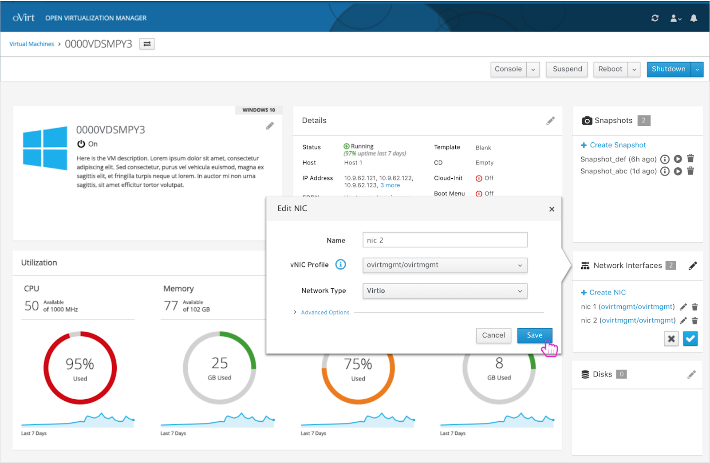
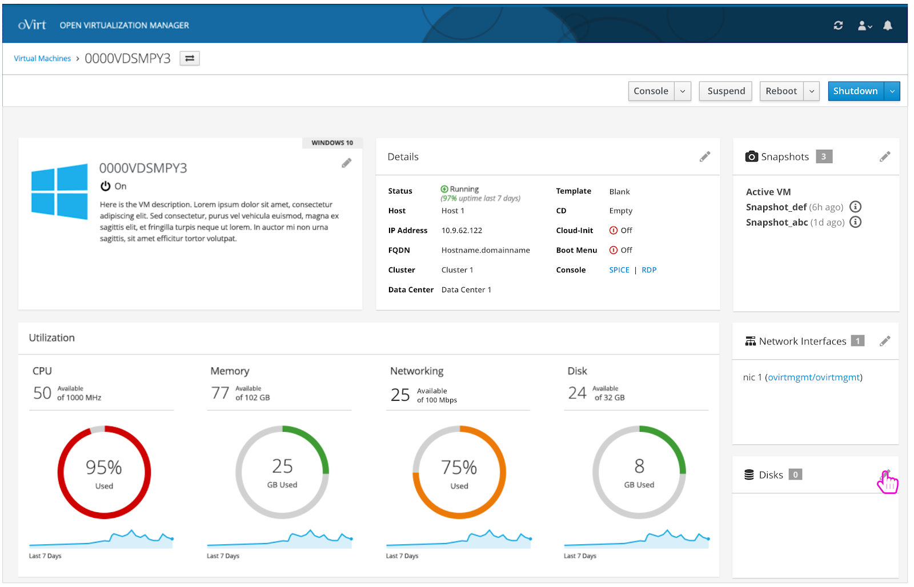
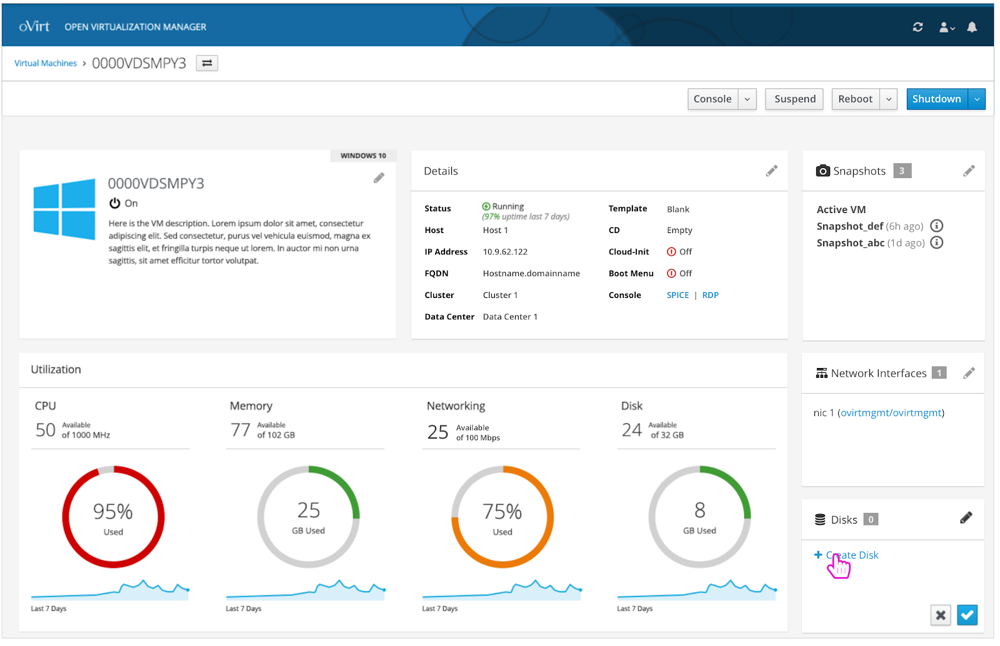
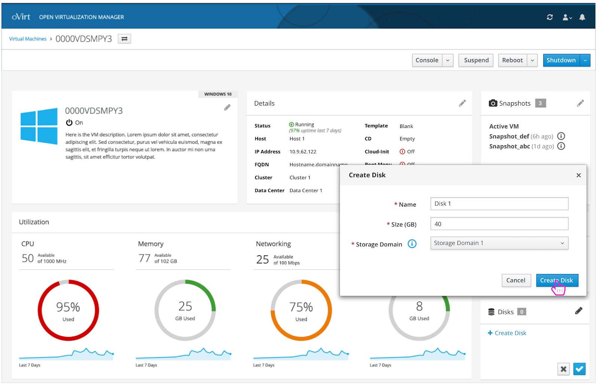
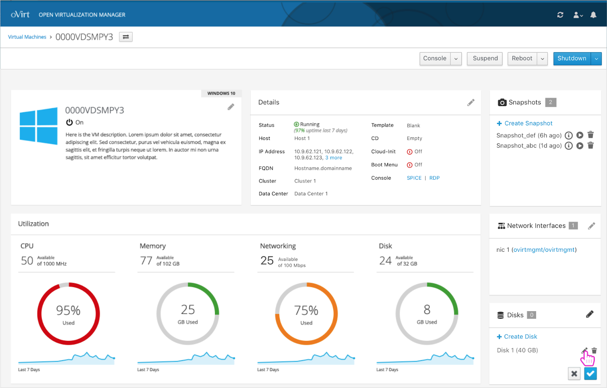
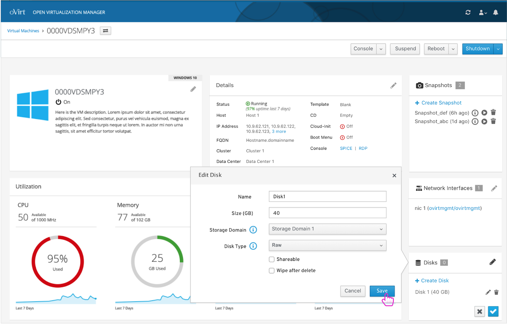

# NICs and Disks

The user can create and edit NICs and disks from the cards on the VM's dashboard.

## NICs

To edit the network interfaces of a VM, the user must first click the pencil icon on the NICs card.

## Create NIC

The user can create a new network interface by clicking the 'Create NIC' button.

## Create NIC- Select Criteria

A 'Create NIC' modal appears and the user can select a name and a vNIC profile for the NIC.

## NIC Appears

A newly created NIC appears and the user can edit it.

## Edit NIC

An 'Edit NIC' modal appears and the user can make updates to the selected NIC.

## Disks

To edit the disks of a VM, the user must first click the pencil icon on the disks card.

## Create Disk

The user can create a new disk by clicking the 'Create Disk' button.

## Create Disk- Select Criteria

The user selects a name, size, and storage domain for the new disk.

## Disk Appears

A newly created disk appears and the user can edit it.

## Edit Disk

An 'Edit Disk' modal appears and the user can make updates to the selected disk.

