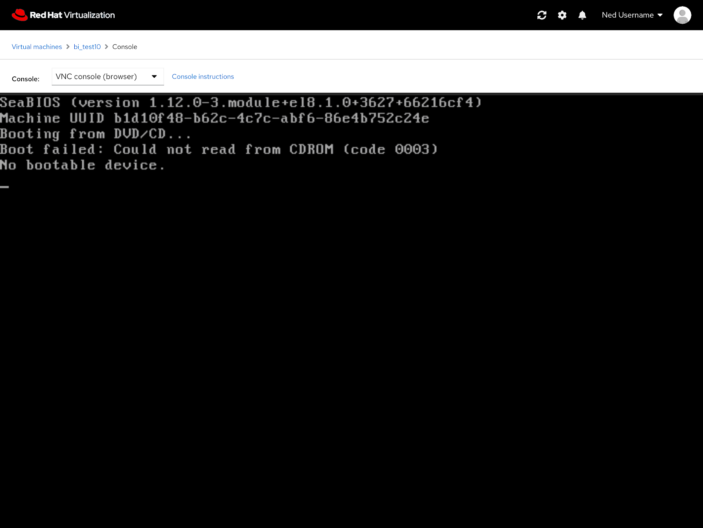
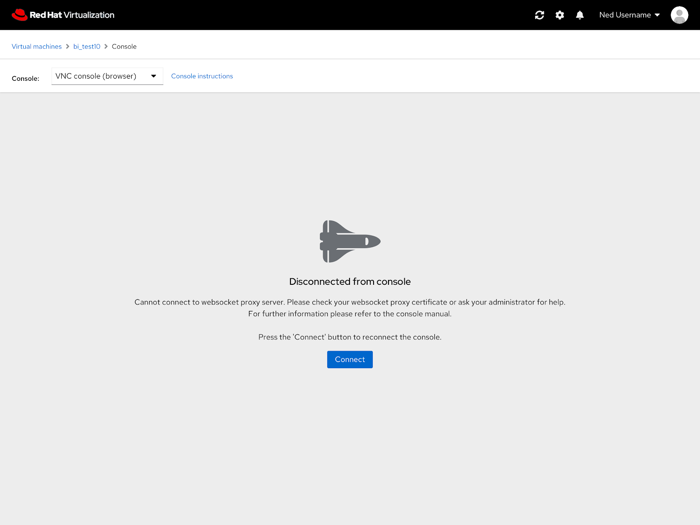
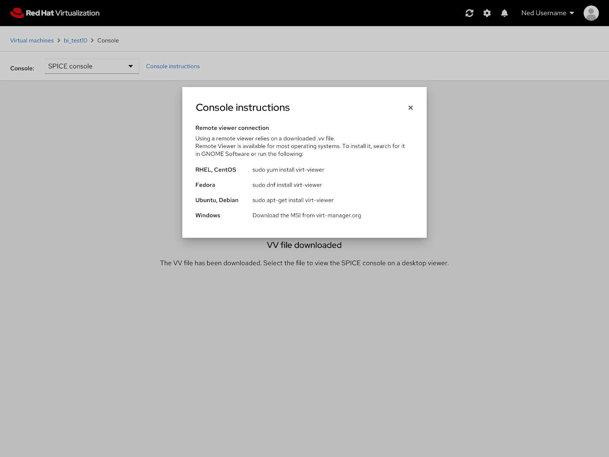

# PatternFly 4 Console

The PatternFly 4 version of the console features the same functionality as the current console but an updated look.

## Empty State

The empty state of the console features an updated look but the content is still the same as the current console.

## Console Instructions

Same goes for the console instructions modal.

