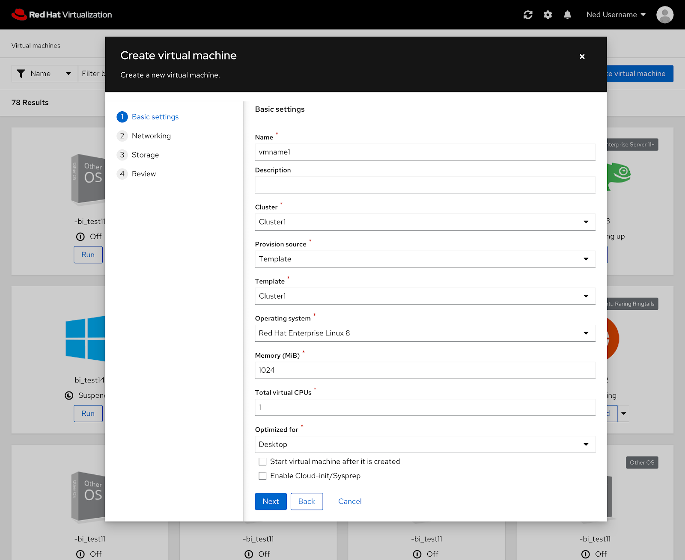
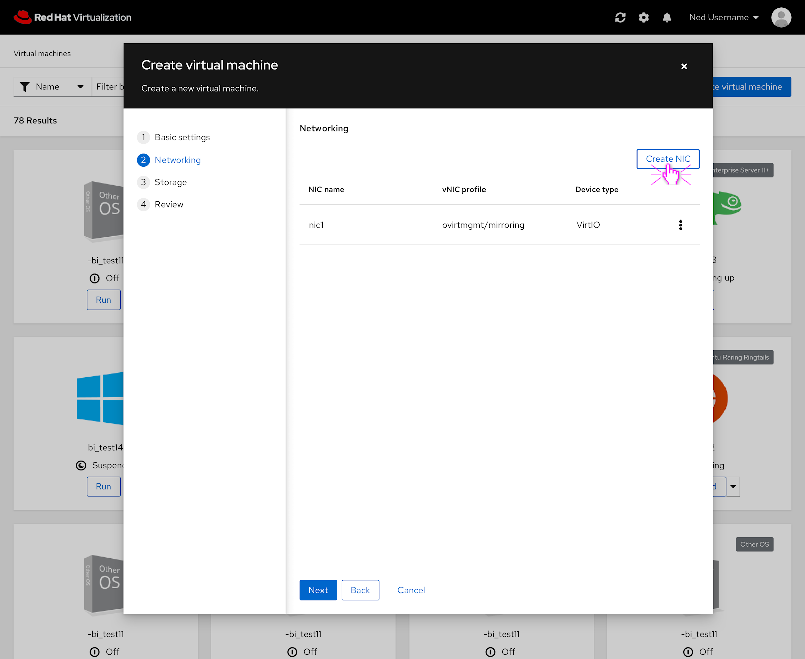
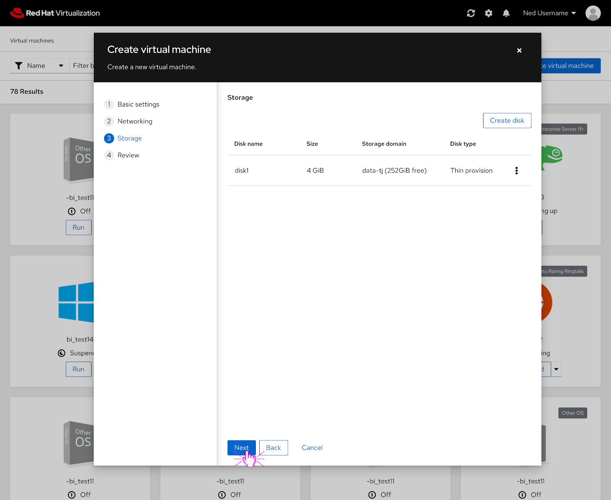
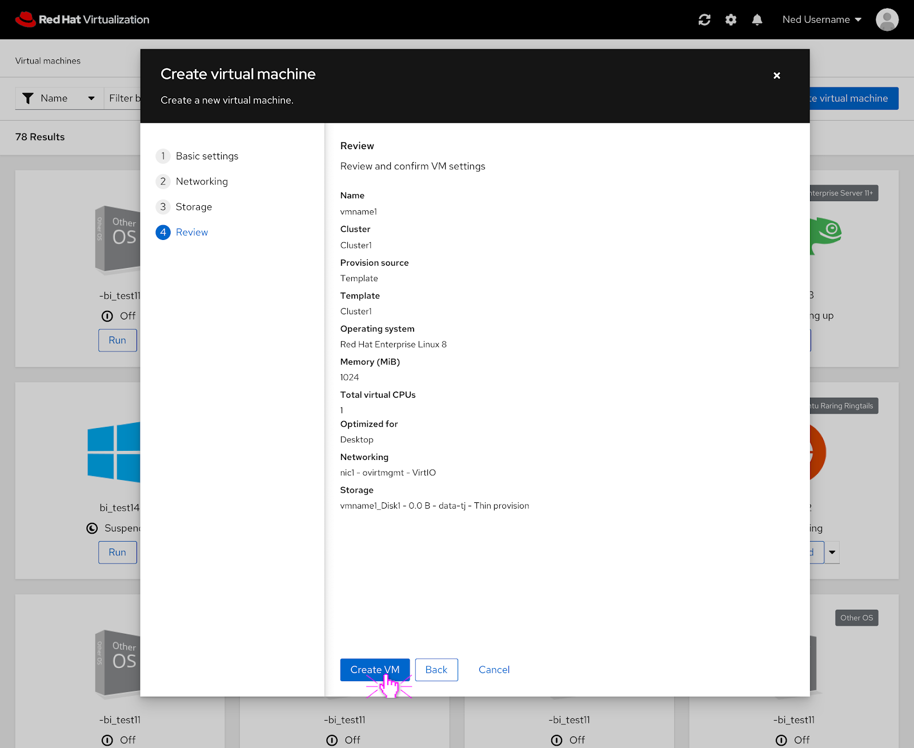
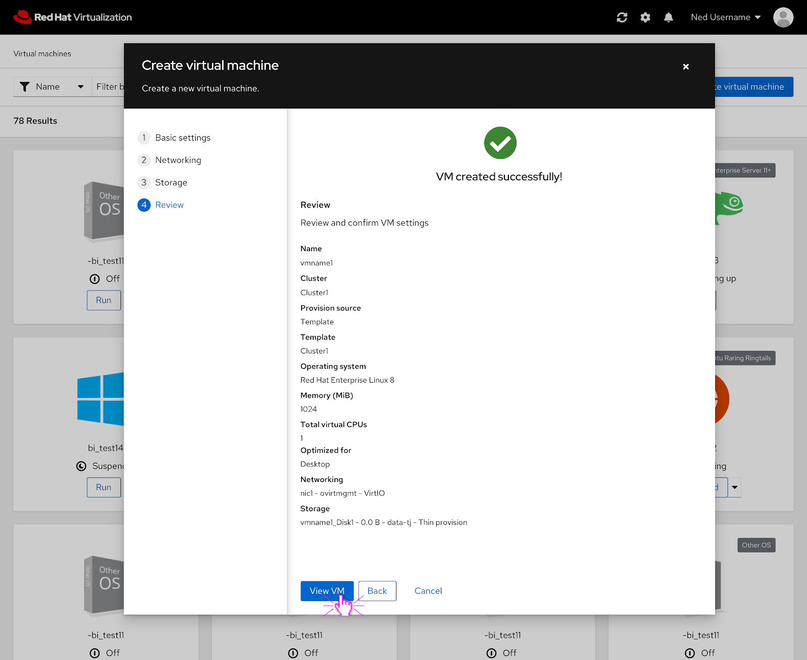

# PatternFly 4 Create New VM

## Create New VM

The PatternFly 4 version of the create new VM modal features the same functionality as the current one but an updated look.

## Create New VM- Create NIC

If the user were to create a NIC for the VM, this is what it would look like in PatternFly 4.

## Create New VM- Create Disk

If the user were to create a disk for the VM, this is what it would look like in PatternFly 4.

## Create New VM- Review

The user can review their selections before creating the VM.

## Create New VM- VM is Being Created

The top part of the review screen features the status of the VM that is being created.

