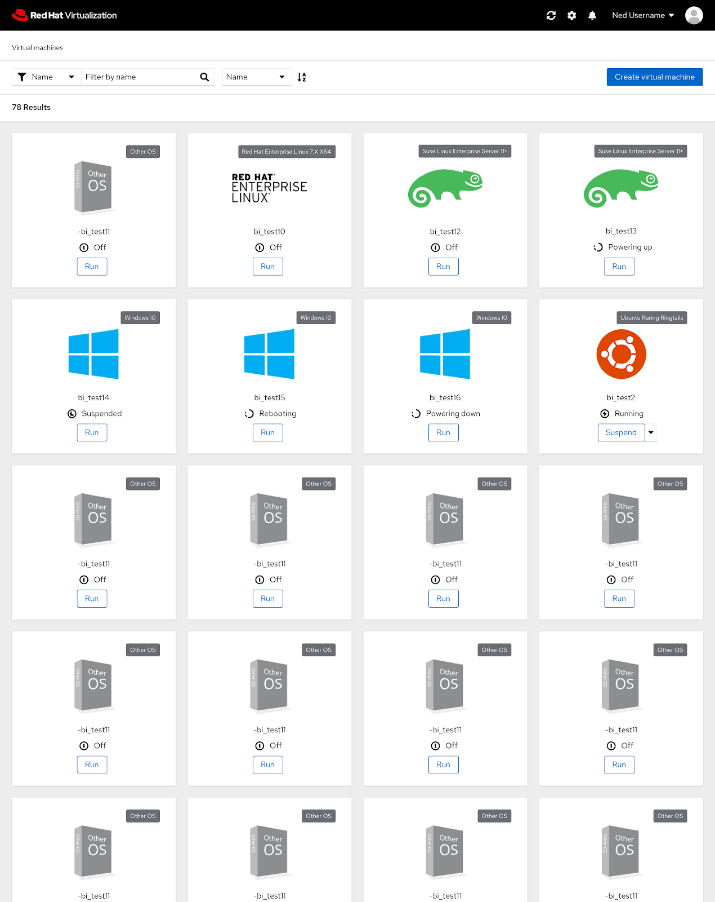
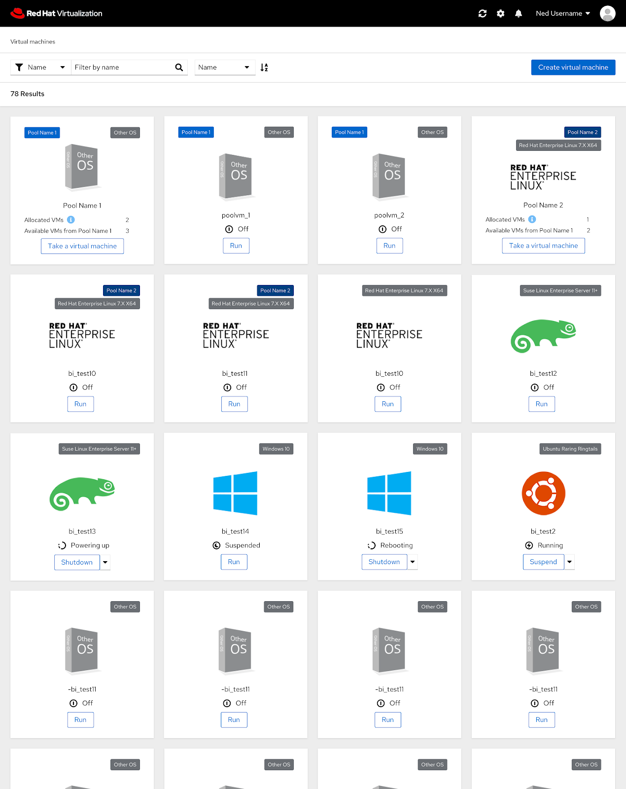
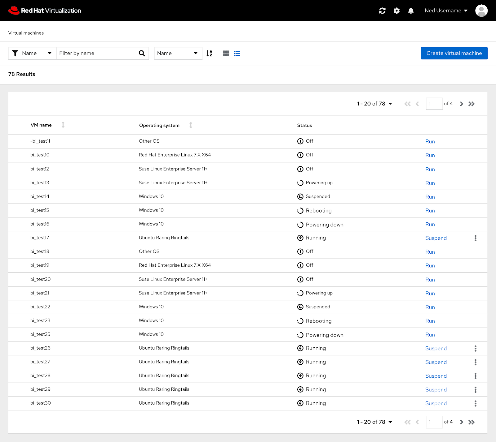

# PatternFly 4 User Portal Homepage

## User Portal Homepage

The PatternFly 4 version of the user portal homepage features the same functionality as the current homepage but an updated look.

## Pools

If the user has pools or VMs from a pool, this is what the homepage in PatternFly 4 would look like.

## List View

One feature proposed in the PatternFly 4 designs includes adding a list view to the user portal homepage. The list view allows the user to view more VMs in one place in comparison to the card view.

