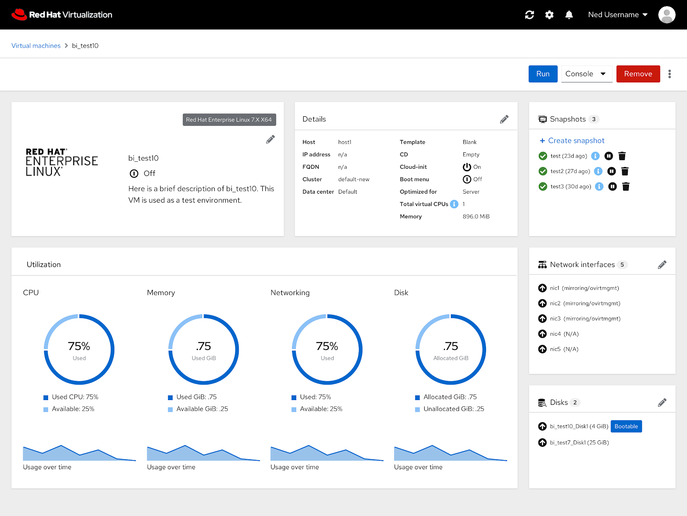
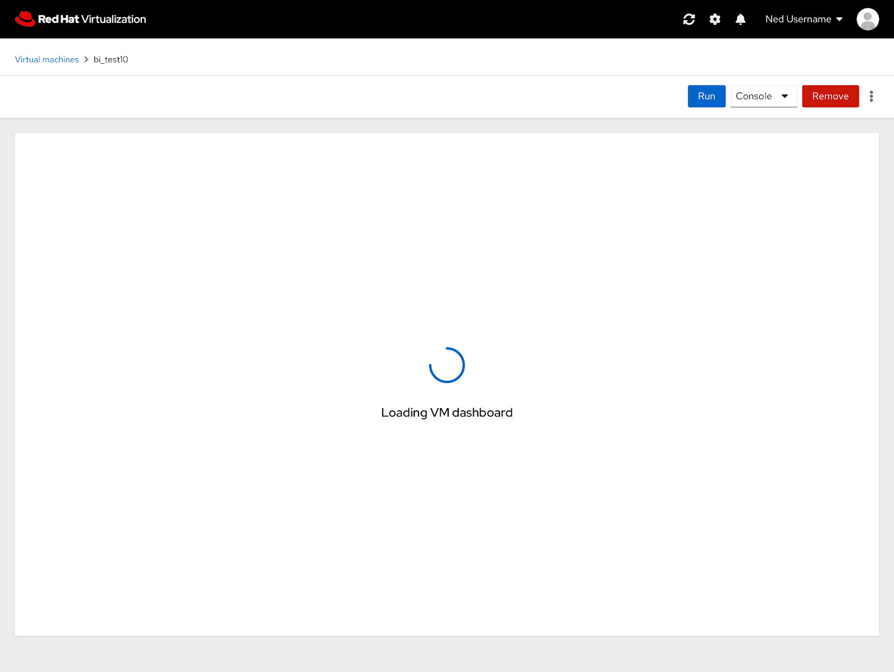
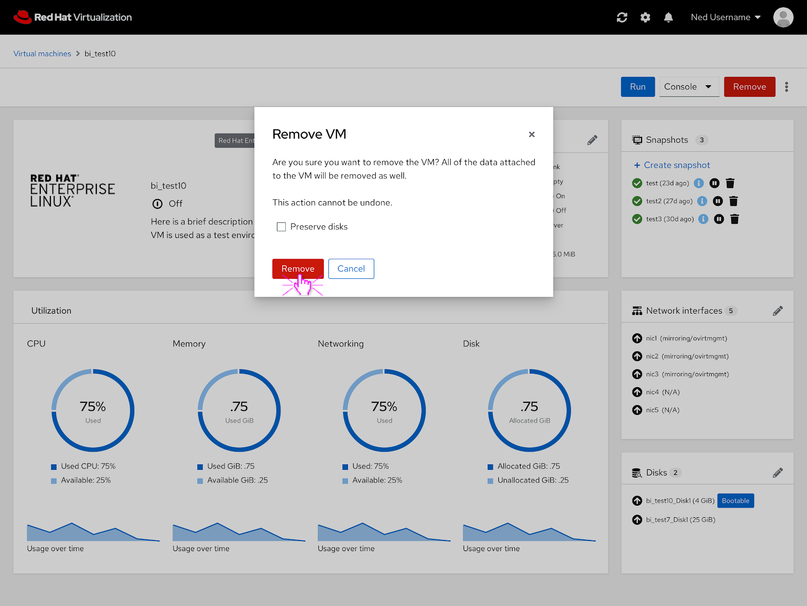

# PatternFly 4 VM Dashboard

## Updated VM Dashboard

The PatternFly 4 version of the VM dashboard features the same functionality as the current one but an updated look.

## Loading VM Dashboard

If the VM dashboard is loading, a loading spinner appears in the content area while the VM dashboard loads.

## Modal Dialog
What a modal dialog would look like in PatternFly 4.

