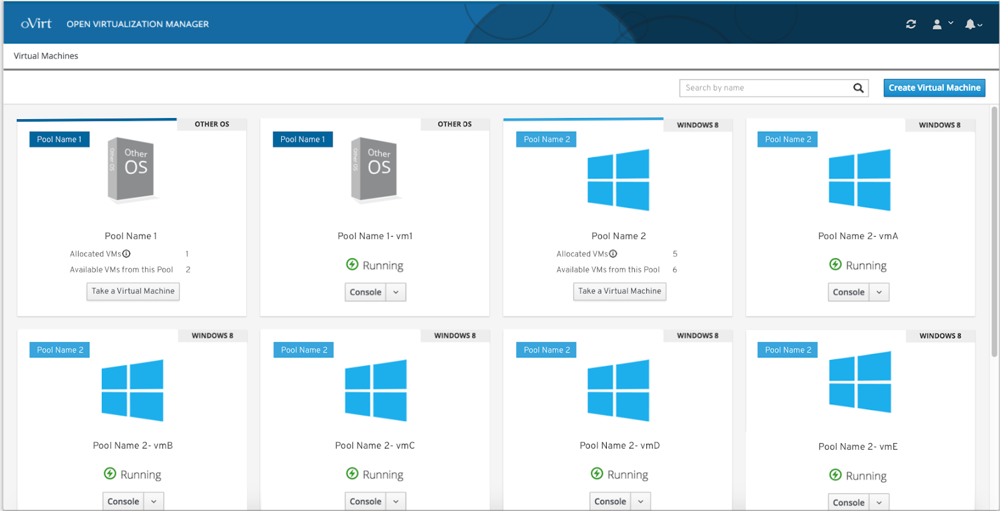
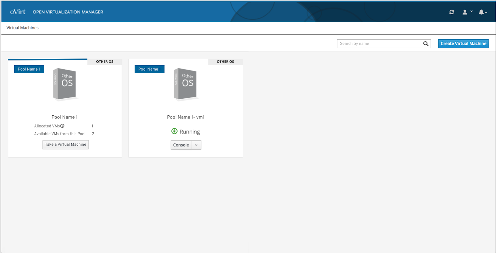
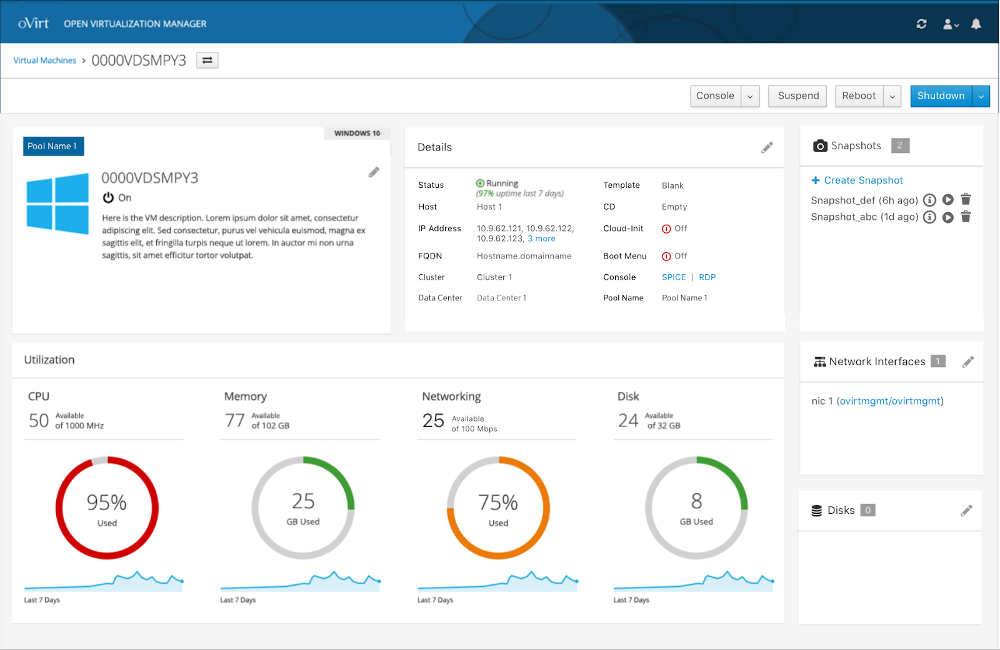

# Pools

## Allocated VMs

If the user has access to a certain pool of VMs, the user can take a certain number of allocated VMs from the pool.

## Taking a VM from a Pool

If a user takes a VM from a pool, the allocated VM will appear next to the pools card on the right.

## Pool Label

If a VM is from a pool, the VM dashboard features a label with the pool name attached on it.

