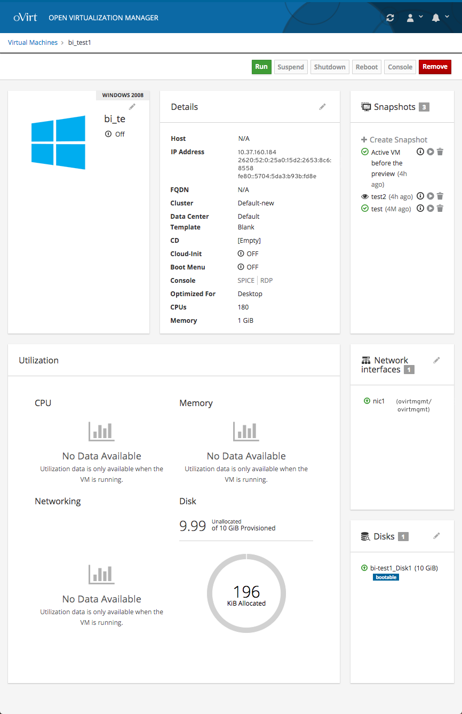
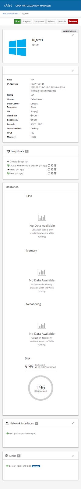
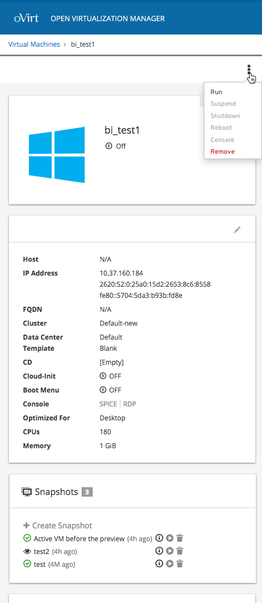

# Responsiveness

## Responsive Cards

To make the VM dashboard more responsive, the text in the cards should stay bound within the borders of the card and the width of the cards should dynamically change to fit the user's viewport.

## Mobile Cards

When the viewport becomes the width of what a mobile device might be, the cards should each become the width of the viewport and the cards should stack on top of one another.

## Kebab Menu

If the wdith of the viewport becomes smaller and the action buttons no longer fit on one line, it is suggested that the action buttons become grouped in a kebab menu so the actions are in a more condensed area.

