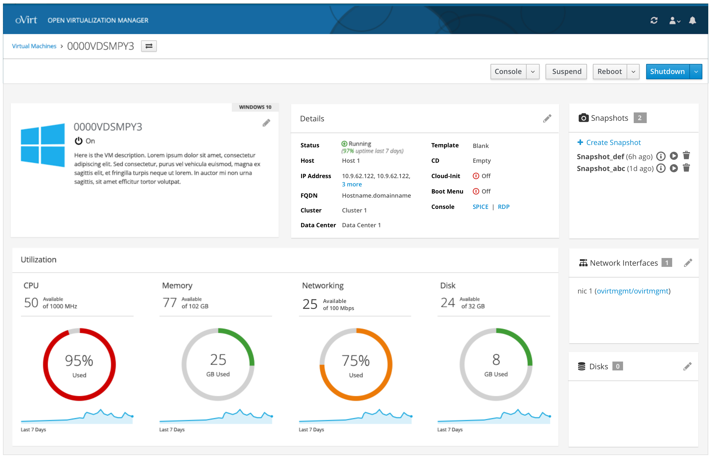
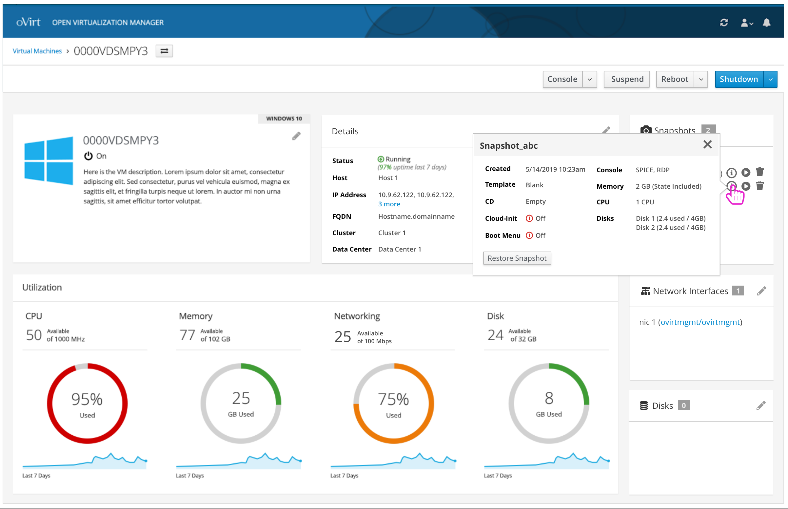
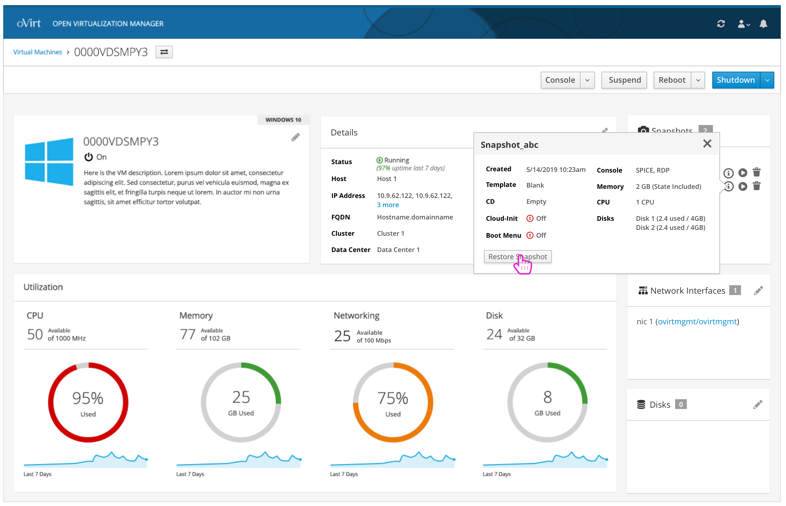
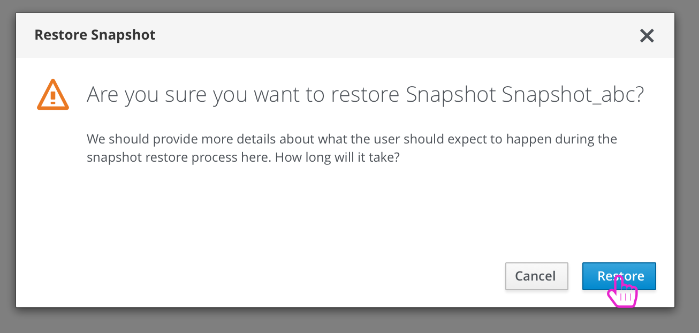
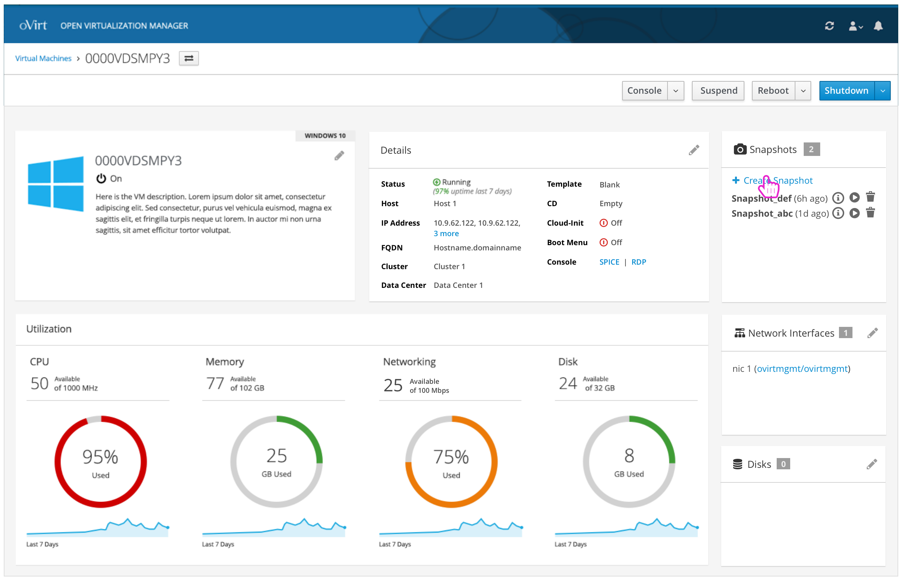
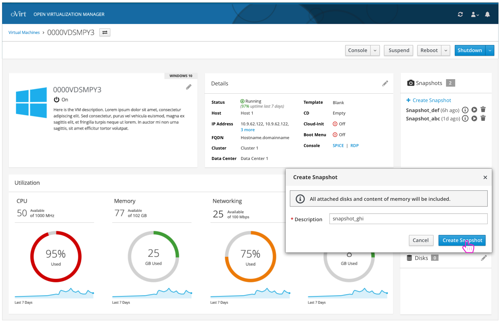
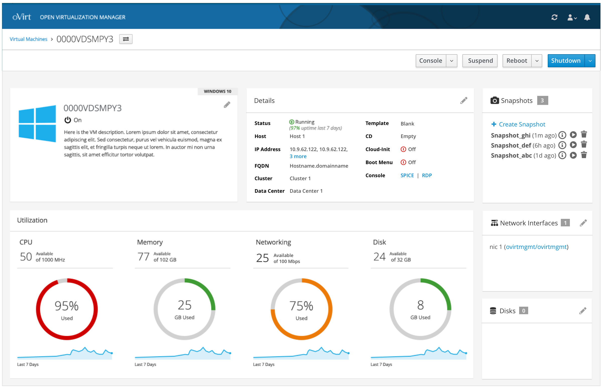
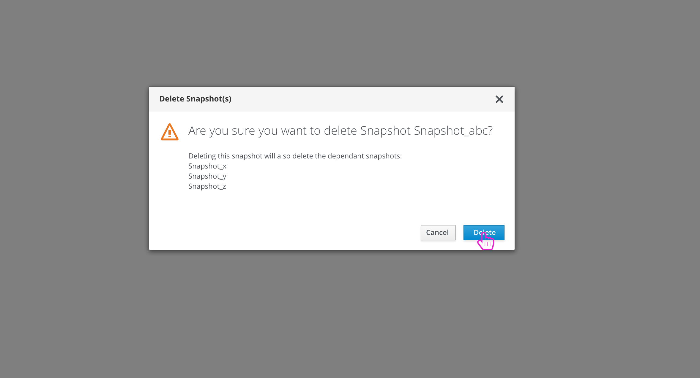

# Snapshots

Users will have the ability to manage snapshots for each VM.

## View Snapshots

Within the details page, the user will be able to see a card that lists all of the snapshots for the VM.

The user can hover over the information icon to view some high level details about that snapshot.

## Restore Snapshot

If the user wants to restore a snapshot, they will be given a confirmation modal before proceeding.

## Create Snapshot

One of the options in the Snapshots card is for the user to Create a Snapshot.

## Delete Snapshot(s)

Deleting a snapshot should give the user a confirmation dialog. In some cases, other dependent snapshots would be deleted as well and this should be clear to the user.

