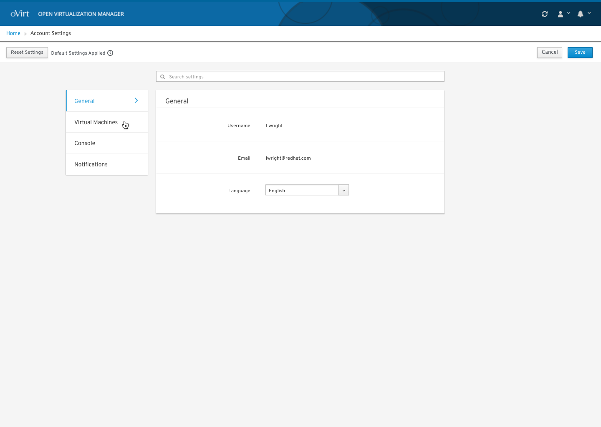
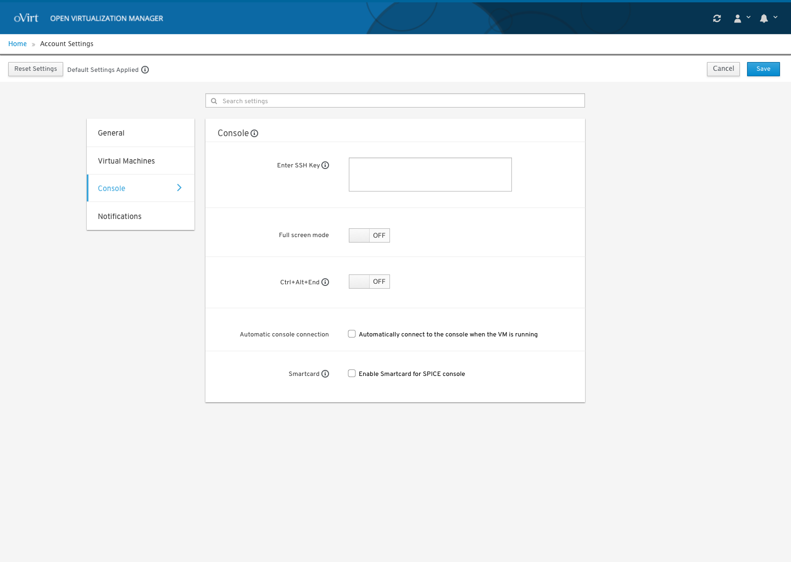

# User Settings

## Acessing User Settings

A user can access account wide settings and make application wide settings changes.

## Selecting User Settings

The user can set application wide settings for features like the console.

