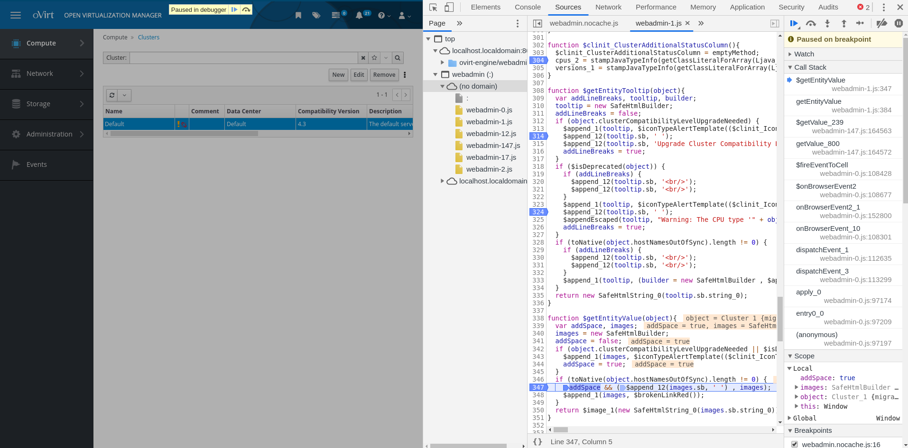

# oVirt Engine Debug Non-Obfuscated UI

## Debug Non-Obfuscated UI

### Owner

*   Name: Eitan Raviv (eraviv)
*   Email: <eraviv@redhat.com>

### Introduction

Sometimes during development for the Web admin it is required to understand how different events for rendering, backend queries, garbage collection etc. influence the GUI behaviour and responsiveness.
In these cases working with gwt-debug does not help because the debug session sends requests to the gwt code server at which time the UI in the browser freezes and waits for the response.
During the wait the natural sequence of events is altered and it is not possible to get a real picture of what is happening in the browser.

In these instances debugging the UI in the browser itself is the only viable option, but debugging the code in obfuscated form is next to impossible.

## Debugging steps

#### Building engine with non-obfuscated code

- To get non-obfuscated javascript code in the browser, in ovirt-engine | frontend | webadmin | modules | pom.xml | gwt-maven-plugin | style: modify from 'OBF' to 'pretty'
- To get non-obfuscated css code in the browser, in ovirt-engine | frontend | webadmin | modules | pom.xml | properties | gwt.cssResourceStyle: modify from 'obf' to 'pretty'

Build engine per the standard build instructions in the ovirt-engine repo README.adoc

#### Debugging the code in the browser

Load the Web admin page in Chrome.
Open Chrome's developer tool, focus the sources tab and open the navigator where the tree of loaded files is displayed. Look for files named webadmin-*.js.
In these files you can search for classes with names mostly equal to the java classes in the webadmin jar. You can place breakpoints and debug the code as desired.

A sample screen-shot of the debugger with non-obfuscated code:

