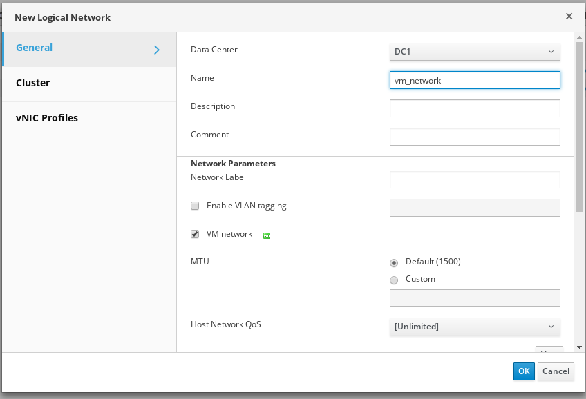
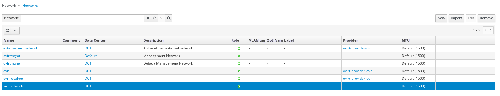

# Autodefine External Network

## Summary

This feature extends [Provider Physical Network](/develop/release-management/features/network/provider-physical-network.html) 
adding support for auto-defined external network connected to physical ones. 
With this feature implemented, when a physical VM network is created, Engine 
automatically creates an external network based on it, and connects the external
network to the physical one. This makes it easier to use the former feature, and
helps oVirt to model host networks and VM networks separately.

Related patches can be found on [gerrit topic:autodefine](https://gerrit.ovirt.org/#/q/topic:autodefine).

### Owner

- Feature Owner: Ales Musil (amusil)
- E-mail: <amusil@redhat.com>

### Benefit to oVirt

Provider Physical Network is useful for users who would like to 
manage their network via SDN (such as OVN or Neutron) yet have near-native 
performance. However, without auto-define feature, such admin would have to 
create a physical network (and attach it to hosts), create an external network,
and remember to connect this two networks together. Autodefine helps reducing 
these administrative tasks. In an OvS cluster with an external provider 
attached, the external network is automatically created and connected to the 
physical one.

## Prerequisites

Cluster has to be configured with switch type OvS and valid external provider.
The user needs to make sure that connection to external provider is valid.

### Limitations

* With OvS switch type in cluster, only external networks are allowed to 
  be attached to the VM interface via UI. 

* Physical network linked to any external network cannot be removed. This is for
  keeping the consistency of database. In the future we might add a way to 
  remove all dependent external networks with physical one. 

* The switch type of existing clusters cannot be changed (from Linux bridge to 
  OvS or vice versa) via UI. Thus, we currently do not need to worry about 
  auto-defining external networks on top of existing physical networks.

* Currently, updating the physical network will not update the auto-defined 
  external network. This might change in the future. 

* VMs will be scheduled only on hosts that does have attached linked physical 
  network to one of it's interfaces. Same rule applies for hotplug of VM 
  interfaces. 

## Detailed description

### Creating of new physical network

When creating new network choose its name. Check the `VM network`. If vlan 
tagging is needed, check the `Enable VLAN tagging` and put the tag into the 
field. Please note that auto-define can be triggered only on top of network that
is not marked as external. 

After confirmation if all conditions were met, the external network connected to 
the physical one, will be created simultaneously. The auto-defined external 
network is named `external_name_of_physical_network` (The physical network name
might be shortened so that auto-defined network name is not bigger than 256 
characters). 

In case there are clusters with different default external providers in the data 
center the Engine will create multiple external networks for every provider and 
add a number behind to this auto-defined network name. 

Please note that all hosts running VMs connected to the external network has
to be attached to the physical network. 

## Implementation

### Engine

* A new query `GetAllVmNetworksByClusterId` that returns only VM networks is 
  added. For Cluster with OvS switch type, this query returns only external 
  networks. 

* Validations for all limited operations with auto-defined external network and 
  its linked physical network. According to [Autodefine External Network - Limitations](#limitations)

* Added new command `AutodefineExternalNetwork`. This command is 
  triggered every time a new network is created. The command validates the 
  incoming network and its parameters. Then it finds all clusters with OvS 
  switch type attached to incoming network and clusters external providers.
  The command continues with creating new external network and connecting it to 
  the incoming physical network and attaching to clusters. The command might 
  create multiple external networks, one for each external provider in the data 
  center. The command will automatically create vNIC profile, with permissions
  given only to the user that created the physical network.
  
* Added new function `getAllExternalNetworksLinkedToPhysicalNetwork` into 
  `NetworkDao` which returns list of all external networks linked to provided
  physical network. 

## Testing

Testing should cover: 

* Addition/Removal new physical network.

* Physical network linked to external network cannot be 
  removed.

* Only external networks can be used for VM interfaces.

* Cluster switch type cannot be updated to OvS for existing cluster.

* VMs cannot be scheduled on hosts without attached physical network linked to 
  auto-define network. 

* Interface cannot be hotplugged onto a VM that runs on host that is not 
  attached to physical network which is linked to auto-define network.
