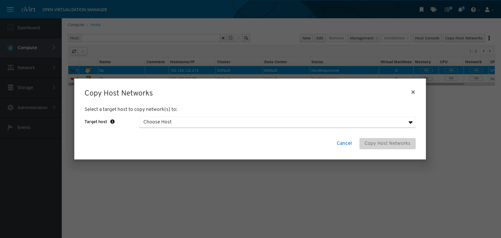

# Copy Host Networking

## Summary

Ordinarily, adding hosts in oVirt in the UI is tedious because you, as an administrator, have to set up the host 
network on each new host.

The Copy Host Networking feature makes adding new hosts easier because you can configure the network on a single host
and then copy that configuration to any new host that has the same layout of network interfaces.

You can use this feature to perform initial deployments and to update running environments. It is available as a button
in the Administration Portal UI, and as a REST API method.


### Owner

- Feature Owner: Ales Musil (amusil)
- E-mail: <amusil@redhat.com>

### Example flow

After creating a cluster, you add several hosts (`Host0, Host1, Host2`). 
You configure the network settings for `Host0`. The two other hosts have the same network 
interface layout as `Host0`, so you copy the network configuration from `Host0` to `Host1` and `Host2`.

In the Admin Portal, you go to the `Host1` and `Host2` network interfaces and click
the `Copy Host Networking` button. In the popup window that appears,
you select the host, `Host0`, from which to copy the configuration.

Alternatively, with the REST API, you can use the `copynetworks` method for `Host1` and `Host2`. 
This method takes a single parameter, the host ID from which to copy the configuration (`Host0`). 

### Procedure

#### Copy a network configuration using the Web Administration portal

1. In the Administration portal main Hosts page, identify the "source host" whose configuration is to be copied.
2. Identify a "destination host" to which you are copying the configuration.
3. On the destination host, verify that the number of physical connections is equal to, or greater than, those on the
source host.

    * If the destination host has more interfaces than the source host, ignore the surplus interfaces.

4. When the source host is selected in the hosts list, click the `Copy Host Networks` button or right-click the host
   and select the `Copy Host Networks` option from the context menu.
   * Note: only one host must be selected for this action to be available.
5. In the popup window that appears, select the destination host to which the configuration is to be copied.
   * Note: only hosts in the same cluster as the source host will be listed as potential destinations.
6. Click the `Copy Host Networks` button. 
7. Engine applies the configuration and posts a notification when done.


  
#### Copy a network configuration using the REST API

Send POST method 

`api/hosts/{destinaton_host_id}/copyhostnetworks` 

with body:

##### XML

```
<?xml version="1.0" encoding="UTF-8"?>
<action>
    <source_host id="{source_host_id}" />
</action>
```

##### JSON

```
{
    "source_host" : {
      "id" : "{source_host_id}"
    }
}
```

### Limitations

* You can copy host configurations only within the same cluster. 

* You cannot copy network configurations that contain static IP addresses: 
This sets the boot protocol in the resulting network to `none`.

* Copying a configuration to a host with the same interface names but different physical network connections will
produce a bad configuration.

* The destination host has to have an equal or greater number of interfaces as the original host. Otherwise,
the feature cannot determine what to do and the operation will fail.

* The cluster's management network stays on the original interface which is excluded from the operation. 


### Implementation

The engine has a new method, CopyNetworks, that copies the network configuration of the source host (SourceHost)
and uses it to overwrite the network configuration of the destination host (DestinationHost).

This method takes two parameters, the IDs of the SourceHost and DestinationHost.

Given the parameters, the method validates that the following items are correct:

* Both hosts are in the same cluster.
* The destination host has an equal or higher number of interfaces than the source host.

(NOTE: These interface names and physical connections to the datacenter are recommended to be identical. Otherwise, 
this sorting process might produce a bad network configuration on the destination host.)

The method prepares a set of network attachment definitions for the DestinationHost by doing the following:

* Lists the interfaces on the SourceHost that don't have bonds.
* Lists all of the interfaces on the DestinationHost.
* Sorts both lists by name.
* Excludes interface/bonds connected to the ovirtmgmt network.
* Pairs all of the bond slaves from the SourceHost with their corresponding partners on the DestinationHost.
* Creates bond definitions in a configuration for the DestinationHost.
* Retrieves a list of all interfaces with bonds from SourceHost.
* Excludes bond slaves from both lists.
* Shortens the DestinationHost list to match the same length as SourceHost list.
* Copies the network attachments for all interfaces in SourceHost list.
* Walks through the new network attachments list and updates any static IP address configurations.
* Sends HostSetupNetworks with new attachments and bonds for DestinationHost to complete everything in a single
 transaction.
* If there is an error, it reverts the configuration changes.

The Admin Portal has a new button called Copy Host Networking. Clicking the button opens a dialog window. There, 
you can select the source host from which to copy the configuration.


### Future work

The biggest limitation is network mapping of interfaces with different name. 
This can be overcome by enabling custom mapping which would let the administrator to map certain
or all interfaces to their corresponding equivalents on the destination host. This way the limitation
of interface count on destination host could be removed assuming that the administrator would provide
specific mapping for this setups. This functionality could be enabled via UI and REST API.

Static IP configuration could be improved by letting the administrator to set the increment value
or provide mapping some or all of the static addresses. 

## Testing

* Copy network for hosts in different cluster should fail

* Copy network for destination host with less interfaces than source should fail

* Copy network for destination and source with equal interface count should pass

* Copy network for destination with more interfaces than source should pass, interfaces that are
excessive should be left without any configuration change

* Configuration that should be tested for successful run, all settings should be copied except the
static IP configuration which should be set as none: 

    -  Interface with single network
    -  Bond with two interfaces with single non-VLAN and VLAN network attached
    -  Interface with multiple VLANs
    -  Interface with a label
    -  Network with DHCP configuration IPv4 and IPv6
    -  Network with static IP configuration IPv4 and IPv6 
    -  Network with stateless IPv6 configuration
    -  Network with no boot protocol 
