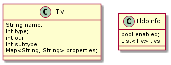

# Link Layer Discovery Protocol (LLDP) Support

## Summary

The [Link Layer Discovery Protocol (LLDP)][1] is a vendor-neutral networking
protocol, used by network devices, especially switches, for advertising their
identity, capabilities and management addresses on an IEEE 802 local area
network (LAN).

The feature will enable oVirt hosts to gather information from their networking
interfaces and let oVirt Engine use this information in a beneficial way.

## Owner

*   Name: [Aleš Musil](https://github.com/almusil)

*   Email: <amusil@redhat.com>


## Detailed Description

To support the integration of oVirt with other software, the information gathered
by LLDP on each host will be provided by oVirt Engine's REST-API.

Some of the information, like the number of the switch port a network interface
of the host is connected to, might be helpful for the user and will be shown in
the graphical user interface.

At this point in time we do not intend to expose information by LLDP to the
switch.

## Prerequisites

LLDP has to be enabled on the switch connected to the relevant oVirt hosts.

## Limitations

* There is a delay from receiving the LLDP data on the oVirt host, propagating
  the data to the oVirt Engine and presenting the data to the user.
  Whatever value we present over REST may be out of date.

* This feature is only about LLDP, Cisco Discovery Protocol (CDP) is not
  addressed.

* Receiving LLDP on hot plugged network interfaces requires restarting of VDSM,
  because receiving LLDP on the network interfaces is enabled during the startup
  of VDSM.

* LLDP is only received on network interfaces with state UP.

## Benefit to oVirt

Information from LLDP provided by oVirt engine's REST-API will support the
integration of oVirt in other software.

## Requirements

* The following TLVs have to be available in oVirt Engine's REST API:
  * Chassis ID TLV (Type = 1)
  * Port ID TLV (Type = 2)
  * Port Description TLV (Type = 4), with a value of up to 512 chars
  * System Name TLV (Type = 5)
  * System Description TLV (Type = 6)
  * Management Address TLV (Type = 8)
  * Port VLAN Id ( Type = 127, Oui = 0x0080c2 (802.1), Subtype = 1)
  * VLAN name (Type = 127, Oui = 0x0080c2 (802.1), Subtype = 3)
  * Link Aggregation TLV (Type = 127, Oui = 0x0080c2 (802.1), Subtype = 7)
  * Maximum Frame Size TLV (Type = 127,  Oui = 0x00120F (802.3), Subtype = 4)

* oVirt should keep track of the hosts and their neighbors which are active
  and report only those when queried.

## Approach

Steps to present the LLDP information:

1. [Receive LLDP information on the Ethernet cable on the host](#vdsm-implementation-options)
2. [Cache the LLDP information on the host](#vdsm-implementation-options)
3. [Transport the LLDP information to oVirt Engine](#communication-of-vdsm-and-ovirt-engine)
4. Present LLDP information:
  * [On REST-API](#rest-api)
  * [On Web-UI](#follow-up-features)
  * [For oVirt Engine internal use](#follow-up-features)

If the LLDP information is used internally in oVirt Engine or in Web-UI, it
would be useful to cache the information in the data base.

To meet the requirements of this feature, there is no need to store the
information in the data base, because the information could be queried when a
REST request is processed processed. This way the age of the information is
kept as minimal as possible.

Thus we opt to avoid the DB completely. When Engine is asked about LLDP data of
a host, it would contact the specific host synchronously in order to provide an
answer.

## Gathering the LLDP data from the hosts

There are multiple alternatives for oVirt Engine to gather the LLDP data from
the hosts:

* Extend VDSM to provide the LLDP data

* Use [Ansible's lldp module][3]

Because the Ansible module is flagged as preview and requires lldpd, which is
in only in EPEL repository for RHEL, VDSM has to be extended.

## VDSM implementation options

VDSM is planned to collect LLDP information through lldpad or NetworkManager
services.

- lldpad is as immediate solution to the data collection as it can be used by
  VDSM as a driver without any special work dependency.
- In order to use NetworkManager, a preliminary work is required in VDSM to
  fully integrate it as an active configuration driver, replacing the existing
  ifcfg usage.

The proposal is to start with lldpad as an immediate solution and continue with
NetworkManager when it will be integrated into VDSM to replace the ifcfg usage.
Then NetworkManager will become the default driver that collects LLDP information.

#### Code Module structure

These are the modules involved in the LLDP driver & interface:

* vdsm.network.lldpad : lldpad driver, using the lldptool as the cli client.
* vdsm.network.lldp : LLDP API interface, containing the lldpad driver interface
(which implements the LLDP API interface using the lldpad driver).

### VDSM - lldpad

lldpad is a service which is able to send and receive LLDP on network interfaces.
lldpad caches LLDP received information and lldptool can query this information.

The vdsmd service wants the lldpad service to be started as a weak dependency.
The interfaces on which lldap provides LLDP has to be configured explicitly by
VDSM.

VDSM, running in SELinux context `virtd_t`, uses the command line client
lldptool to communicate with the lldpad service,
running in SELinux context `lldpad_t`. This communication has to be [explicitly
allowed][6].

### LLDP report formats

lldptool and NetworkManager report in LLDP information in different formats.
Even different TLVs are formatted in a different way in the same tool.
For this reason there is a dedicated parsing required for nearly each TLV.

There are two alternatives to handle TLVs without a dedicated parsing function.
They could be discarded, or presented in a format depending on the underlying
tool.
To ensure at least implementation-independent names in the output, TLVs without
a dedicated parsing function are discarded. If an additional TLV is required,
an additional parsing function has to be added to the LLDP driver in VDSM.

lldptool report example:

~~~~
Chassis ID TLV
	MAC: 30:7c:5e:84:e1:a0
Port ID TLV
	Local: 510
Time to Live TLV
	120
System Name TLV
	rack11-sw02-lab4.tlv
System Description TLV
	Juniper Networks, Inc. ...
System Capabilities TLV
	System capabilities:  Bridge, Router
	Enabled capabilities: Bridge, Router
Port Description TLV
	ge-0/0/2
MAC/PHY Configuration Status TLV
	Auto-negotiation supported and enabled
	PMD auto-negotiation capabilities: 0x0001
	MAU type: Unknown [0x0000]
Link Aggregation TLV
	Aggregation capable
	Currently not aggregated
	Aggregated Port ID: 0
Maximum Frame Size TLV
	9216
Port VLAN ID TLV
	PVID: 2000
VLAN Name TLV
	VID 2000: Name foo
VLAN Name TLV
	VID 2001: Name bar
VLAN Name TLV
	VID 2002: Name foobar
Unidentified Org Specific TLV
	OUI: 0x009069, Subtype: 1, Info: 504533373135323130333833
LLDP-MED Capabilities TLV
	Device Type:  netcon
	Capabilities: LLDP-MED, Network Policy, Location Identification, Extended Power via MDI-PSE
End of LLDPDU TLV
~~~~

NetworkManager report example:

~~~
NEIGHBOR[0].DEVICE:                     enp5s0f0
NEIGHBOR[0].CHASSIS-ID:                 18:EF:63:A1:66:AD
NEIGHBOR[0].PORT-ID:                    Gi0/45
NEIGHBOR[0].PORT-DESCRIPTION:           GigabitEthernet0/45
NEIGHBOR[0].SYSTEM-NAME:                rack11-sw01-lab4.tlv.redhat.com
NEIGHBOR[0].SYSTEM-DESCRIPTION:         Cisco ...
NEIGHBOR[0].SYSTEM-CAPABILITIES:        20 (mac-bridge,router)
NEIGHBOR[0].IEEE-802-1-PVID:            150
NEIGHBOR[0].IEEE-802-1-PPVID:           --
NEIGHBOR[0].IEEE-802-1-PPVID-FLAGS:     --
NEIGHBOR[0].IEEE-802-1-VID:             --
NEIGHBOR[0].IEEE-802-1-VLAN-NAME:       --
NEIGHBOR[0].DESTINATION:                nearest-bridge
NEIGHBOR[0].CHASSIS-ID-TYPE:            4
NEIGHBOR[0].PORT-ID-TYPE:               7
~~~

## Communication of VDSM and oVirt Engine
If the LLDP information is cached in the data base, it would be useful
to update the LLDP information together with the other information about the
network cards on the host by `Host.getCapabilities`.

However, at the moment, LLDP information is only required, if requested via the
REST-API. To avoid triggering the extensive `Host.getCapabilities`, if only the
LLDP information are needed, the new verb `Host.getLldp` is introduced.

```yaml
types:
    Tlv: &Tlv
        added: '4.2'
        description: LLDP Information
        name: Tlv
        properties:
        - description: Human readable string to describe what the value is
              about.
          name: name
          type: string

        - description: Structured information of the TLV
          name: properties
          type: *StringMap

        - description: TLV type of IEEE 802.1AB.
          name: type
          type: string
          datatype: uint

        - description: organizationally unique identifier
          name: oui
          type: string
          datatype: uint

        - description: organizationally defined subtype
          name: subtype
          type: string
          datatype: uint

    Lldp: &Lldp
        added: '4.2'
        description: LLDP Information
        name: Lldp
        properties:
        - description: Gathering LLDP information is enabled on the NIC
          name: enabled
          type: string
          datatype: boolean
        - description: List of structured information of the TLVs
          name: tlvs
          type:
          - *Tlv

    LldpMap: &LldpMap
        added: '4.2'
        description: A mapping from interface name to LLDP information
        key-type: string
        name: *LldpMap
        type: map
        value-type: *Lldp


Host.getLldp:
    added: '4.2'
    description: Get lldp information of a NIC
    params:
    -   description: Restrict the reported lldp information. Empty restriction
            means to report all lldp information from all NICs.
        name: filter
        type: *StringListMap
    return:
        description: Lldp information of a NIC
        type: *LldpMap

```


## Entity Description

The initial LLDP information is encoded as a list of type, length, value (TLV) tuples.
To express multiple values, e.g. to list the allowed VLANs on a switch port,
the TLV is sent multiple times.
The value may contain structured data.
This way the LLDP data is non-uniform.
This non-uniform LLDP data will be mapped to the following uniform entities.

The entity `Tlv` represents the TLV received physically by the oVirt host's NIC.
A `Tlv` is associated to a `VdsNetworkInterface`, called
[`HostNic` in REST-API](http://ovirt.github.io/ovirt-engine-api-model/4.2/#types/host_nic),
has a `name`, a `type`, a list of `properties` and optional an `oui` and a
`subtype`.



The `name` is a human readable string to describe what the value is about and
may not be unique. The name is redundant, because it could be created from
`type` and the optional `oui` and `subtype`. The purpose of `name` is
to simplify the reading of the TLV.
The `name` of a property is exactly the same string which is used in
[IEEE 802.1AB][1] chapter 8.

The `type` is the TLV type of [IEEE 802.1AB][1].

Organizationally Specific `Tlv`s have the `type` of `127` and the attributes
`oui` and `subtype`.
The `oui` holds the organizationally unique identifier, and the `subtype` the
organizationally defined subtype.

The `properties` are used to represent structured information transported by the
TLV.

The entity `LldpInfo` has a list of all `Tlv`s of an interface and shows if the
gathering of the LLDP information is `enabled` on the interface. If it is
not `enabled`, there is a problem gathering the LLDP information on the interface.
Problems on gathering LLDP information might be that the interface is down or
LLDP is not enabled on the interface.

## CRUD

The CRUD operations are not needed, because the implementation does not use the
data base.

## User Experience

### REST-API

The LLDP information are read-only. They could be read by a request like

```
GET https://ovirtexampleengine/ovirt-engine/api/hosts/123/nics/321/linklayerdiscoveryprotocolelements
```

Depending on the HTTP `Accept` header used in this request, oVirt Engine will
respond in JSON or XML.
A problem in gathering the LLDP information would result in an empty list of
`link_layer_discovery_protocol_elements` on the REST-API.
The response in XML for the [SampleCaptures from Wireshark's wiki][5] will look like this

```xml
<link_layer_discovery_protocol_elements>
  <link_layer_discovery_protocol_element>
    <name>Chassis ID</name>
    <properties>
      <property>
        <name>chassis ID subtype</name>
        <value>MAC address</value>
      </property>
      <property>
        <name>chassis ID</name>
        <value>00:01:30:f9:ad:a0</value>
      </property>
    </properties>
    <type>1</type>
  </link_layer_discovery_protocol_element>
  <link_layer_discovery_protocol_element>
    <name>Port ID</name>
    <properties>
      <property>
        <name>port ID subtype</name>
        <value>Interface Name</value>
      </property>
      <property>
        <name>port ID</name>
        <value>1/1</value>
      </property>
    </properties>
    <type>2</type>
  </link_layer_discovery_protocol_element>
  <link_layer_discovery_protocol_element>
    <name>Time to Live</name>
    <properties>
      <property>
        <name>TTL</name>
        <value>120</value>
      </property>
    </properties>
    <type>3</type>
  </link_layer_discovery_protocol_element>
  <link_layer_discovery_protocol_element>
    <name>Port Description</name>
    <properties>
      <property>
        <name>port description</name>
        <value>Summit300-48-Port 1001</value>
      </property>
    </properties>
    <type>4</type>
  </link_layer_discovery_protocol_element>
  <link_layer_discovery_protocol_element>
    <name>System Name</name>
    <properties>
      <property>
        <name>system name</name>
        <value>Summit300-48</value>
      </property>
    </properties>
    <type>5</type>
  </link_layer_discovery_protocol_element>
  <link_layer_discovery_protocol_element>
    <name>System Description</name>
    <properties>
      <property>
        <name>system description</name>
        <value>Summit300-48 - Version 7.4e.1 (Build 5) by Release_Master 05/27/05 04:53:11</value>
      </property>
    </properties>
    <type>6</type>
  </link_layer_discovery_protocol_element>
  <link_layer_discovery_protocol_element>
    <name>System Capabilities</name>
    <properties>
      <property>
        <name>system capabilities</name>
        <value>Bridge, Router</value>
      </property>
      <property>
        <name>enabled capabilities</name>
        <value>Bridge, Router</value>
      </property>
    </properties>
    <type>7</type>
  </link_layer_discovery_protocol_element>
  <link_layer_discovery_protocol_element>
    <name>Management Address</name>
    <properties>
      <property>
        <name>management address subtype</name>
        <value>AFI 802</value>
      </property>
      <property>
        <name>management address</name>
        <value>00:01:30:f9:ad:a0</value>
      </property>
    </properties>
    <type>8</type>
  </link_layer_discovery_protocol_element>
  <link_layer_discovery_protocol_element>
    <name>Port VLAN Id</name>
    <oui>32962</oui>
    <properties>
      <property>
        <name>port vlan id</name>
        <value>488</value>
      </property>
    </properties>
    <subtype>1</subtype>
    <type>127</type>
  </link_layer_discovery_protocol_element>
  <link_layer_discovery_protocol_element>
    <name>Port VLAN Id</name>
    <oui>32962</oui>
    <properties>
      <property>
        <name>vlan id</name>
        <value>488</value>
      </property>
      <property>
        <name>vlan name</name>
        <value>v2-0488-03-0505</value>
      </property>
    </properties>
    <subtype>3</subtype>
    <type>127</type>
  </link_layer_discovery_protocol_element>
  <link_layer_discovery_protocol_element>
    <name>Link Aggregation</name>
    <oui>32962</oui>
    <properties>
      <property>
        <name>Aggregation capable</name>
        <value>True</value>
      </property>
      <property>
        <name>Currently aggregated</name>
        <value>True</value>
      </property>
      <property>
        <name>Aggregated Port ID</name>
        <value>600</value>
      </property>
    </properties>
    <subtype>7</subtype>
    <type>127</type>
  </link_layer_discovery_protocol_element>
  <link_layer_discovery_protocol_element>
    <name>MTU</name>
    <oui>4623</oui>
    <properties>
      <property>
        <name>mtu</name>
        <value>9018</value>
      </property>
    </properties>
    <subtype>4</subtype>
    <type>127</type>
  </link_layer_discovery_protocol_element>
</link_layer_discovery_protocol_elements>
```

### Graphical User Interface

LLDP information can be found in **Hosts** > **Network Interfaces** > 
**Setup Host Networks**. The interface tooltip will show the relevant 
information.


## Installation/Upgrade

The VDSM package would require the package lldpad and ask the service lldpad to
start.

Describe how the feature will affect new or existing installations.

## User work-flows

The user gets the information about the networking neighbor via REST-API.

## Dependencies

### oVirt Engine Side

No additional dependencies on oVirt Engine side.

### VDSM Host Side

The package lldpad has to be installed and the demon lldpad has to be running.

## Documentation & External references

[IEEE Std 802.1AB™-2016, IEEE Standard for Local and metropolitan area networks—Station and Media Access Control Connectivity Discovery][1]

[1]: https://ieeexplore.ieee.org/document/7433915

[Linux Ethernet Bonding Driver HOWTO][2]

[2]: https://www.kernel.org/doc/Documentation/networking/bonding.txt

[Ansible Docs » lldp - get details reported by lldp][3]

[3]: https://docs.ansible.com/ansible/latest/collections/community/general/lldp_module.html

[OpenStack: Introspection LLDP reporting][4]

[4]: https://specs.openstack.org/openstack/ironic-inspector-specs/specs/lldp-reporting.html

[SampleCaptures from Wireshark's wiki][5]

[5]: https://wiki.wireshark.org/SampleCaptures?action=AttachFile&do=view&target=lldp.detailed.pcap

[Bug 1472722 - SELinux is preventing /usr/sbin/lldpad from sendto access on the unix_dgram_socket][6]

[6]: https://bugzilla.redhat.com/show_bug.cgi?id=1472722

## Testing

Ensure [prerequisites](#prerequisites) and use REST-API like in
[example](#rest-api) above.

## Follow-Up Features

Another benefit of this feature is, that the information can be used by oVirt
Engine to configure the hosts in a smarter way. oVirt Engine could detect and
avoid host networking configurations, which do not match the configuration of
the switch port the relevant host's network interface is connected to.
Example of relevant configuration options are:

* The VLAN configuration of the host has to match the VLAN configuration of the
  switch port. This could be used by oVirt Engine like following:
    * Assuming that interfaces are correctly patched to the correct ports,
      which have VLAN and such already assigned, it may be able to already
      configure automatically the networks on the host when adding the host.
    * Once a network is defined with a specific VLAN-ID, oVirt Engine could
      automatically attach it to the proper NIC on all hosts in the cluster.
      This would be an even simpler user experience than using labels.
    * If a host should be connected to a given VLAN, there might be only a
      single network interface of the host which is connected to a switch port
      which allows the usage of this VLAN.

* According to section "5. Switch Configuration" in
  [Linux Ethernet Bonding Driver HOWTO][2], the bonding modes
  balance-rr (0), balance-xor (2), broadcast (3), 802.3ad (4) may require
  configuration on switch side.

* The switch port might have constraints about the MTU.

Information from LLDP provided by the UI might help the user to avoid and
locate manual host network configuration errors caused by a mismatch of switch
port configuration.

## Release Notes

      == Link Layer Discovery Protocol (LLDP) Support  ==
      oVirt Engine provides access via REST-API to values gathered on the hosts by LLDP.

[comment]: <> ## Open Issues
[comment]: <>Issues that we haven't decided how to take care of yet. These are issues that we need to resolve and change this document accordingly.

