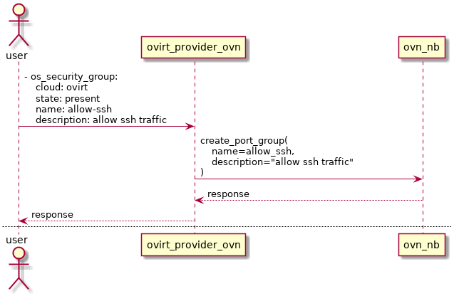
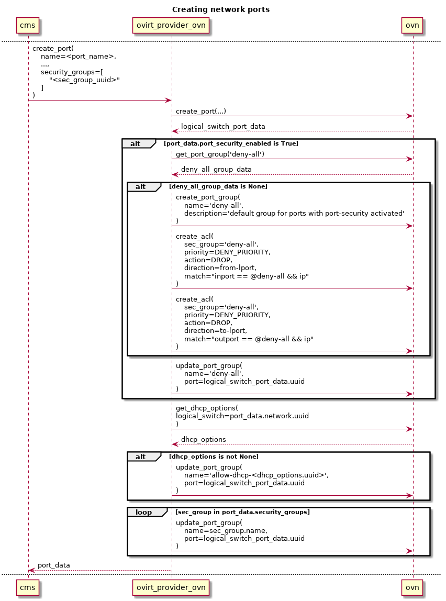

# Networking API security groups support

## Summary

This feature aims to implement the OpenStack Networking API [security group](https://developer.openstack.org/api-ref/network/v2/index.html#security-groups-security-groups)
in the ovirt-provider-ovn.

By doing so, we allow fine-grained access control to - and from - the oVirt
VMs attached to external networks.

The networking API v2 defines security groups as a white list of rules.
That means, that by default, neither incoming nor outgoing traffic is
allowed (from the VMs perspective).

A security group is applied to a logical port - a *logical switch port*
in the OVN model.

### Owner

* Feature Owner: [Miguel Duarte Barroso](https://github.com/maiqueb) (mbarroso on IRC)
* Email: <mdbarroso@redhat.com>

### Terminology

* Networking API: [OpenStack RESTful Networking API](https://developer.openstack.org/api-ref/network/v2/)
* OVN: Open Virtual Network. OVN is an OVS (Open vSwitch) extension that
brings Software Defined Networking to OVS.
* oVirt OVN provider: a proxy that implements a subset of the Networking API
and interacts with OVN.
* Security group: container for security group **rules**; networking API
entity
* Security group rules: specify the access to a network resource;
networking API entity

### Benefit to oVirt

Currently, the only security mechanisms present for oVirt VMs attached to
external networks are quite crude L2 and L3 protections - MAC
spoofing, and IP spoofing - implemented directly by Open vSwitch. It is worth
mentioning that IP spoofing protection is only applied when a subnet is defined
on top of the Networking API network.

Security groups, which are a traffic white list, complement provided security
by specifying which traffic is allowed to *and* from the resources - e.g. ports
- using high level abstraction L3 and L4 semantics.

Furthermore, security groups allow these rules to be applied in fine
grained fashion - e.g. the user can specify which rules apply to which
ports.

Below, you can find some examples of goals for this feature:
* **only** allow incoming traffic to a specific VM from a specific
CIDR
* **only** allow incoming access to a range of destination ports in a
set of VMs
* **only** allow outgoing traffic to a specific port on a set of VMs

Having said that, and highlighting that L2 protection is **outside of
scope** of security groups, it could be further enhanced by implementing the
[Allowed address pairs](https://developer.openstack.org/api-ref/network/v2/#allowed-address-pairs)
Networking API extension.

## Objectives

* Provide a security group implementation, using OVN as the backend.
No additional backend / database should be used other than ovn's
northbound database.

* When possible, Openstack neutron's behavior should be mimicked: by
default, all VM incoming IP *and* outgoing traffic is dropped. This behavior
is better specified in the [requirements](#requirements) section.

### Requirements

* For ingress traffic (to an instance)
  + Only traffic matched with security group rules are allowed.
  + When there are no rules defined, all ingress traffic is dropped.
* For egress traffic (from an instance)
  + Only traffic matched with security group rules are allowed.
  + When there are no rules defined, all egress traffic is dropped.
  + When a new security group is created, rules allowing all egress traffic are
automatically added.
* The DHCP traffic traffic for OVN subnets will have to be explicitly allowed,
otherwise, it will be automatically dropped, as a consequence to the above requirements.

### Security groups description

Security groups, in the general sense, are nothing more than containers
for [security group rules](https://developer.openstack.org/api-ref/network/v2/#security-group-rules-security-group-rules). 
They are applied to logical ports, and thus are used to associate a set of 
rules to a port.

They are are indeed a white list - e.g. everything is *denied* by
default, and the user adds rules that allow traffic. As long as *one*
rule is matched, the traffic is allowed.

Security group rules can match on L3 and L4 parameters, specifically on
the protocol (L3), the IP protocol (L4), and destination ports. The remote IP
address is also a subject for the match conditions, and rules can be
added to allow *incoming* and *outgoing* traffic.

The API of security group rules can be found [here](https://developer.openstack.org/api-ref/network/v2/#security-group-rules-security-group-rules).

### User perspective

The user is meant to provision security group(s) and rule(s) through ansible,
or using a REST client.

This greatly reduces the oVirt-engine impact, since there's no need to 
implement the REST client side of the API, nor implement these changes in the
GUI.

Throughout the remainder of the document, ansible will be assumed as the client, given its descriptive yaml syntax. The [os_security_group](https://docs.ansible.com/ansible/2.5/modules/os_security_group_module.html)
and [os_security_group_rules](https://docs.ansible.com/ansible/2.5/modules/os_security_group_rule_module.html)
will be leveraged for this.

### Mandatory group creation

There are 2 types of required security groups:

1. the **deny-all** security group, provisioned when the first port with the
**port-security** flag activated is created. This port will be the container for
the rules that drop all IP traffic.

2. the **allow-dhcp** security group. Creating a subnet on top of an external
network will provision an **allow-dhcp** security group **for that particular
network**.

The ansible representation of these groups is:
~~~~~
- os_security_group:
    cloud: ovirt
    state: present
    name: deny-all
    description: security group to drop all IP traffic

- os_security_group:
    cloud: ovirt
    state: present
    name: allow-dhcp-<subnet_uuid>
    description: security group to allow dhcp-traffic
~~~~~

***NOTE:*** the **deny-all** security group can be provisioned through ansible,
during the engine-setup stage. the **allow-dhcp** groups will be created as
part of the subnet creation workflow.

### Initial rule creation

Since the Openstack Networking API is a white list, the **deny-all** related 
rules cannot be triggered from the API itself.

To avoid the need to create the rules beforehand, these ACLs will be
provisioned when a port having the *port-security* attribute set is first
created.

The DHCP related rules will be provisioned after the respective group is
created, and as part os the [create subnet](#creating-a-subnet-on-top-of-a-network)
workflow.

## Mapping networking API to OVN model objects

The security group data will be model as a [port group](https://github.com/openvswitch/ovs/blob/master/ovn/ovn-nb.xml#L926).
This ovn-nb table is only available on Open vSwitch 2.10, released August 20th 2018.

This new table maps a list of ACLs to a list of ports, thus eliminating
the need to replicate the same ACL over and over, having the port in the
match criteria as the only difference - this way, you match against a
group of ports. More information can be found [here](https://docs.openstack.org/networking-ovn/latest/contributor/design/acl_optimizations.html) and [here](http://dani.foroselectronica.es/ovn-profiling-and-optimizing-ports-creation-434/).

### Encoding the security group information

The security group information will be encoded in the port group object.

The security group has the following attributes:

| name                 | type   | description |
|----------------------|--------|-------------|
| tenant_id       | string | The ID of the tenant.                                                      |
| project_id      | string | The ID of the project.                                                     |
| description (*) | string | A human-readable description for the resource. Default is an empty string. |
| name            | string | Human-readable name of the resource.                                       |

(*) - optional attributes

All of the aforementioned attributes will be stored in the external_ids
of the corresponding port group.

### Encoding the security group rule information

The security group information will be encoded in the ACL object, to
which it naturally corresponds in the OVN-world.

A security group rule has the following attributes:

| name                 | type   | description |
|----------------------|--------|-------------|
| remote_group_id (**) | string | The remote group UUID to associate with this security group rule. You can specify either the  remote_group_id or remote_ip_prefix attribute in the request body. |
| direction            | string | Ingress or egress, which is the direction in which the security group rule is applied.                                                                           |
| protocol (*)         | string | Check https://developer.openstack.org/api-ref/network/v2/#create-security-group-rule                                                                             |
| ethertype (*)        | string | Check https://developer.openstack.org/api-ref/network/v2/#create-security-group-rule                                                                             |
| port_range_max (*)   | int    | The maximum port number in the range that is matched by the security group rule.                                                                                 |
| port_range_min (*)   | int    | The minimum port number in the range that is matched by the security group rule.                                                                                 |
| security_group_id    | string | The security group ID to associate with this security group rule.                                                                                                |
| remote_ip_prefix (*) | string | The remote IP prefix that is matched by this security group rule.                                                                                                |
| description (*)      | string | A human-readable description for the resource. Default is an empty string.                                                                                       |

(*) - optional attributes
(**) - optional attributes that ***will not*** be implemented.

### OVN ACL table

An OVN ACL has the following attributes:

| name      | type   | description |
|-----------|--------|-------------|
| priority  | int    | Range from 0 to 32,767. The smaller the value, the higher the priority                                                                                   |
| direction | string | Either 'from-lport' or 'to-lport'.                                                                                                                       |
| match     | string | The match criteria for the ACL. All the L3-L4 information (protocol, ether protocol, ports, ip prefix) is encoded here. Directly relates to OVS matches. |
| action    | string | Either 'allow', 'allow-related', 'drop', or 'reject'. Currently, 'reject' behaves as 'drop'.                                                             |

### Mapping the rules

Mapping is a two way game: it is needed to translate *from* a networking
API security group rule *to* an OVN ACL, ***and*** from an OVN ACL to a
networking API security group rule.

To achieve the latter, the information that is not **directly** encoded
in the ACL - e.g. protocol, ethertype, ports (both min & max), security
group id, remote ip prefix, and description - will be duplicated in the
ACL external IDs.

As the software matures, (most of) this information can eventually be
extracted from the ACL match clause, but, in the first implementation,
the plan is to duplicate it.

The security group rule **white list** behavior will be implemented
through the priority concept; throughout the code two different
priorities will be used: a lesser priority for **all** ACLs having a
deny *action* and an higher priority for **all** ACLs having *allow* or
*allow-related* actions.

## OVN ACL table & openflow pipeline relationship

Take into account that the ACLs entries will translate directly into
openflow entries in the openflow tables in openvswitch.

### Direction attribute

The ***direction*** attribute in the ACL has a very important impact in
the openflow pipeline - in which stage of the pipeline processing will
the rule be evaluated.

The OpenFlow pipeline consists of two different stages: *ingress* and *egress*.

ACLs having a 'from-lport' direction will be evaluated in the
**ingress** stage, while ACLs having a 'to-lport' direction will be
evaluated in the **egress** stage.

### Priority hard-coding side-effect

Remember that there are only two different priorities used: one for all
drop related ACLs, and another for allow related ACLs.

This means that return traffic from an allow-related flow **cannot** be
changed through an ACL - since it would have a lower priority.

### ACLs cannot be attached to all ports

Access to logical switch ports with router or localnet type **cannot**
be controlled through ACLs.

## Relevant events

The relevant events for the security group feature are listed and explained
below.

### Add security group

Adding security groups is done out of band, using either the [os_security_group](https://docs.ansible.com/ansible/2.5/modules/os_security_group_module.html) module or a REST client. Through it, the user issues a request to create a security group.

The ovirt-provider-ovn translates the security group information into a
port group object, encoding the security group information in the
external ids column.

Create/update timestamps of the security groups are also implemented,
thus enabling the [Resource timestamps](https://developer.openstack.org/api-ref/network/v2/#id367)
networking-api extension.

The security group also has a *revision_number* attribute - also stored
in the external ids - that is bumped everytime a change is made to the
security group - add / remove rules, update name or description.

A sequence diagram depicting the creation of a security group meant for
holding rules to allow incoming ssh traffic is shown below.

### Add security group rule

Adding security group rules is also done out of band, using the [os_security_group_rules](https://docs.ansible.com/ansible/2.5/modules/os_security_group_rule_module.html) or sending its correspondent REST API request.

The ACL match condition is built from the *ether_type*, *protocol*,
*port_range_max*, *port_range_min*, and *remote_ip_prefix* security
group rules attributes.

All of those attributes are then stored in the ACL external_ids column -
along with the *description* and *security group id* attributes.

The newly created ACL is then stored in the ovn-nb database, and its
data is afterwards translated back into the networking-api syntax.

The security group rules also feature the resource timestamps extension,
but the revision number will always be *one*, since we do not allow a
rule to be updated.

A sequence diagram where a user adds - through ansible - a security
group rule meant to white list ssh traffic is added to the security
group 'allow-ssh' is shown below.

### Creating a subnet on top of a network

Creating a Networking API subnet leads to the creation of its
corresponding DHCP options object in the OVN north database.

If the feature is activated - e.g. the **deny-all** port group is
present in the OVN northbound database - the DHCP related traffic will
be dropped by Open vSwitch. To prevent that, thus assuring that the VMs
can get an IP address through DHCP, a security group meant to hold the
rules white listing DHCP traffic is created, and ACLs allowing that
traffic added to it.

The following sequence diagram depicts the flow described above.

### Attach a VM to an external network.

Please refer to the sequence diagram below to better understand this
flow.

When a VM is attached to an external network, an ovn logical switch port
is created. This port concept is already implemented in the
ovirt-provider-ovn project, *but* does not allow it to be bound to
security groups. That support will need to be implemented.

Whenever a port is created, *if* it has the **port-security** flag
activated, the ovirt-provider-ovn will have to update the **deny-all**
port group data, adding the new port to its list of ports. *If* that
port group does not exist, it will have to be created, and the
corresponding ACLs added to it. This **port-security** attribute is
currently not supported in the ovirt-provider-ovn, and thus, will also
have to be added to the API.

*If* the port is attached to a network featuring a subnet, the
corresponding **allow-dhcp** port group port list will also be updated
with the new port.

It will also need to update the list of ports for each of the port
groups representing the security groups bound to the added ports.

## OVN ACLs implementing the deny-all *and* allow-dhcp security groups

### drop-all-ip ACL

To achieve the intended deny-all behavior, a port group will be created
when the ovirt-provider-ovn starts.

It will feature two ACLs, with the following data:
+ ingress rule
  * priority: DROP_PRIORITY
  * action: drop
  * direction: from-lport
  * match: inport == @<port_group> && ip
+ egress rule
  * priority: DROP_PRIORITY
  * action: drop
  * direction: to-lport
  * match: outport == @<port_group> && ip

### allow-dhcp

To allow a VM to get an IP address from the subnet on top the network
to which its port is attached, and assuming that port has port-security
active, it is required to white-list the DHCP traffic.

This will only be done *if* the VM's port is attached to a network
**having** a defined subnet.

It will feature two ACLs (one per each direction), with the following
data:
+ ingress rule
    * priority: ALLOW_PRIORITY
    * action: allow
    * direction: from-lport
    * match: inport == @allow-dhcp<subnet_uuid> && ip4 && ip4.dst == {255.255.255.255, <subnet_cidr>} && udp && udp.src == 68 && udp.dst == 67
+ egress rule
    * priority: ALLOW_PRIORITY
    * action: allow
    * direction: to-lport
    * match: outport == @allow-dhcp<subnet_uuid> && ip4 && ip4.src == <subnet_cidr> && udp && udp.src == 67 && udp.dst == 68

***Note:*** the '@' sign is a port group tag understood by OVN

## Networking API extensions implemented / not implemented

Implemented:
* [Resource timestamps](https://developer.openstack.org/api-ref/network/v2/#id367)

Not implemented:
* [Tag](https://developer.openstack.org/api-ref/network/v2/#id381)

Not sure:
* [Allowed address pairs](https://developer.openstack.org/api-ref/network/v2/#allowed-address-pairs) networking API extension.

## Feature dependencies

+ Open vSwitch 2.10 - port group table
+ python-ovsdbapp 0.12.1 - port group support, with a nice API, without
openstack dependencies

## Testing

The recommended tools to check this feature are ansible and ncat.

Ansible should be used to provision the security groups and the respective rules.

ncat should be used to check the ports on the VM are reachable.

There are 3 main tests:

+ test the default security group
  * regression testing: assure the old behavior is kept with the feature deactivate
  * incoming traffic is blocked when the feature is activated
  * outgoing traffic from a VM is blocked  when a feature is activated
  * check that a VM attached to a network without a subnet cannot be assigned a DHCP address
  * add a subnet to that network; check that a DHCP address is now assigned to the VM
+ test another group's behavior
  * create a new test group
  * assign that group to a port
  * check that no ingress traffic is allowed
  * check that egress traffic *is* allowed
+ test rule's behavior
  * add a rule allowing traffic only from a specific CIDR, to a specific port. Check that accessing that port from the source CIDR is possible, but, doing so from another one is not.
  * TODO - this will involve more than 1 network *and* a router. get that done.

## References

TODO
