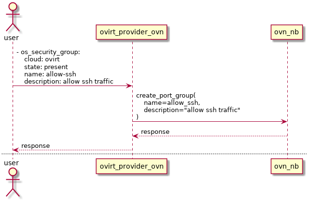
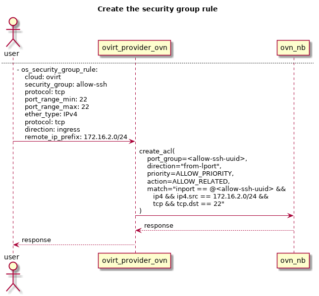
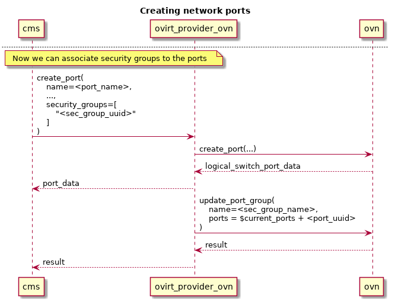

# Ovirt-provider-ovn security groups


## Summary

This feature aims to implement the OpenStack Networking API [security group](https://developer.openstack.org/api-ref/network/v2/index.html#security-groups-security-groups)
in the ovirt-provider-ovn.

By doing so, we allow fine-grained access control to - and from - the oVirt
VMs attached to external networks.

The Networking API v2 defines security groups as a white list of rules - the
user specifies in it **which traffic is allowed**.
That means, that when the rule list is empty, neither incoming nor outgoing
traffic is allowed (from the VMs perspective).

A security group is applied to a logical port - a *logical switch port*
in the OVN model.

### Owner

* Feature Owner: [Miguel Duarte Barroso](https://github.com/maiqueb) (mbarroso in #ovirt)
* Email: <mdbarroso@redhat.com>

### Terminology

* Networking API: [OpenStack RESTful Networking API](https://developer.openstack.org/api-ref/network/v2/)
* OVN: Open Virtual Network. OVN is an OVS (Open vSwitch) extension that
brings Software Defined Networking to OVS.
* oVirt OVN provider: a proxy that implements a subset of the Networking API
and interacts with OVN.
* Security group: container for security group **rules**; networking API
entity
* Security group rules: specify the access to a network resource;
networking API entity

### Benefit to oVirt

Currently, the only security mechanisms present for oVirt VMs attached to
external networks are quite crude L2 and L3 protections - MAC
spoofing, and IP spoofing - implemented directly by Open vSwitch.

Security groups, which are a traffic white list, complement provided security
by specifying which traffic is allowed to *and* from the resources - e.g. ports - using high level abstraction L3 and L4 semantics.

Furthermore, security groups allow these rules to be applied in fine
grained fashion - e.g. the user can specify which rules apply to which
ports.

Below, you can find some use cases of this feature:
* **only** allow incoming traffic to a specific VM from a specific
CIDR
* **only** allow incoming access to a range of destination ports in a
set of VMs
* **only** allow outgoing traffic to a specific port on a set of VMs

L2 protection is **not in scope** of the Networking API security groups.

## Objectives

* Provide a security group implementation, using OVN as the backend.
No additional backend / database should be used other than ovn's
northbound database.

* When possible, Openstack neutron's behavior should be mimicked: by
default, all VM incoming IP *and* outgoing traffic is dropped. This behavior
is better specified in the [requirements](#requirements) section.

### Requirements

* For ingress traffic (to a guest / VM)
  + Only traffic matched with security group rules is allowed.
  + When there are no rules defined, all ingress traffic is dropped.
* For egress traffic (from a guest / VM)
  + Only traffic matched with security group rules is allowed.
  + When there are no rules defined, all egress traffic is dropped.
  + Rules allowing all egress IP traffic are automatically added to all groups.

### Security groups description

Security groups, in the general sense, are meant to group together a list of
[security group rules](https://developer.openstack.org/api-ref/network/v2/#security-group-rules-security-group-rules). 
They are applied to logical ports, and thus are used to associate a set of 
rules to a port.

They are indeed a white list - meaning that everything is *denied* when the
list is empty - to which the user adds rules allowing specific traffic. As
long as *one* rule is matched, that particular traffic is allowed.

Security group rules can match on L3 and L4 parameters, specifically on
the L3 protocol, the L4 protocol, and destination ports. The remote IP
address is also a subject for the match conditions, and rules can be
added to allow *incoming* and *outgoing* traffic.

The API of security group rules can be found [here](https://developer.openstack.org/api-ref/network/v2/#security-group-rules-security-group-rules).

Security group filters are **only applied to** ports whose
**port_security_enabled** attribute is set. By default, when a new port is
created, and the user does not specify this attribute, it is created set
to 'True', meaning that security group filters will be applied to it.

This causes all incomming traffic to the port to be dropped, until the user
white-lists the intended traffic for that port.

To mimic openstack's behavior, oVirt provides the *Default* security group.
When the user creates a port having port security activated, but doesn't
feature security groups, the *Default* security group is automatically assigned
to the port. This group allows all egress IP traffic from the VMs, as well as
all ingress traffic from instances also belonging to the *Default* security
group. This way, connectivity between the user VMs is assured for the default
setting.
Check the [default security group](#default-security-group) ACL description for more information.

### User interface

The user is meant to provision security group(s) and rule(s) through ansible,
or using a REST client, targeting the ovirt-provider-ovn.

This greatly reduces the oVirt-engine impact, since there's no need to 
implement the REST client side of the API, nor implement these changes in the
GUI.

Throughout the remainder of the document, ansible will be assumed as the client, given its descriptive yaml syntax. The [os_security_group](https://docs.ansible.com/ansible/2.5/modules/os_security_group_module.html)
and [os_security_group_rules](https://docs.ansible.com/ansible/2.5/modules/os_security_group_rule_module.html)
will be leveraged for this.

Despite the above, [ManageIQ](http://manageiq.org/) can be used as GUI to
provision security groups and rules.

## Activating the feature

The feature will be always active, and it is a matter of identifying the
ports that will be subject to the security group filters.

As previously mentioned, the **port-security** attribute will be used to
know if a port will be added to the **deny-all** port group, having all
ingress IP traffic dropped as a consequence.

The **port-security** attribute is set at port creation time, and its value will
be inherited from the corresponding *network* entity when not defined at port
level. Afterwards, it can be updated through the API - at port *or* network
levels.

The default behavior for the network's **port-security** attribute would be
defined in the configuration file, through the ***port-security-enabled***,
property, located in a new section, called **NETWORK**. As stated in the
[provider configuration README](https://github.com/oVirt/ovirt-provider-ovn#section-network), the default value for that attribute is **true**.

Existing ports can later be updated, disabling the **port-security** attribute,
which would remove the ACLs that drop all IP traffic to the VM.

As defined in the [network port security attribute definition](https://developer.openstack.org/api-ref/network/v2/#port-security), updating the **port-security** attribute on a network object **does not** cascade the value to ports attached to that network - meaning that effect would only apply to ports created *after* that update. Check the [upgrade](#installation/upgrade) section for the consequences of this requirement on ovirt-provider-ovn upgrades.

## User workflow

Since the feature is active by default, the intended workflow - from the oVirt
engine user's perspective - is:

* create an external network on the ovirt-provider-ovn - its default
*port_security_enabled* value is true.
* create VMs attached to this external network - they will inherit the
*port_security_attribute* from the network, which will result in dropping all
IP traffic to that VM.
* the intended traffic will have to be white-listed. Assuming the user is
interested in allowing ssh traffic, the following ansible tasks should be
used, which creates one security group - for which a security group rule
allowing all **egress** traffic is automatically created - plus one security
group rule allowing **ingress** tcp traffic meant for port 22:


~~~~~~

- os_security_group:
    cloud: ovirt
    state: present
    name: my_app_default
    description: allow ssh
    register: my_app_default_security_group

- os_security_group_rule:
    cloud: ovirt
    state: present
    security_group: "{{ my_app_default_security_group.id }}"
    direction: ingress
    protocol: tcp
    port_range_min: 22
    port_range_max: 22

~~~~~~


* finally, the user is required to update the ports, indicating which security
groups apply to it. The following ansible task shows how a single port, referenced
by name, is updated:


~~~~~~

- os_port:
    cloud: ovirt
    state: present
    name: <port_name>
    security_groups:
        - "{{ my_app_default_security_group.id }}"

~~~~~~


### Installation/Upgrade

The install time required updates are described in the section [below](#engine-setup).

After the upgrade, the newly created network's **port_security_enabled**
attribute will default to what's set in the configuration file, which, unless
changed by the user, is *True*.

On upgrades with existing VMs - having attachments to external networks -
the ports will **not** be updated, and it will be up to the administrator to
manually activate port security in the existent ports.

An existing external network's **port_security_enabled** attribute will default
to *False*, meaning that security groups will **not** be applied to newly
created VMs attached to existing networks.

Updating the network's port-security-enabled attribute **will not** cascade to
the existent ports, as defined [in the Networking API](https://developer.openstack.org/api-ref/network/v2/#port-security).

## Design feature description

### Mandatory security group creation

There are 2 types of required security groups, that are created automatically
by the ovirt-provider-ovn, when certain events occur. They are:

1. the **deny-all** security group, provisioned when the first port with the
**port-security** flag activated is created, thus avoiding the need to create
it beforehand, or during deployment. This group will contain the rules that
drop all IP traffic. More information can be found in
[Activating the feature](#activating-the-feature).

The ansible representation of this group is:
~~~~~
- os_security_group:
    cloud: ovirt
    state: present
    name: deny-all
    description: security group to drop all IP traffic
~~~~~

### Initial rule creation

Since the Openstack Networking API is a white list, the **deny-all** related 
rules cannot be triggered from the API itself.

To avoid the need to create the rules beforehand, these ACLs will be
provisioned when the first port having the *port-security* attribute enabled is
created.

## Missing pieces

### Ansible port module missing port_security_enabled attribute

The [ansible module](https://docs.ansible.com/ansible/2.5/modules/os_port_module.html) currently does not support updating the *port_security_enabled* attribute for a port.

To provide the user an integrated experience, ansible should allow for that attribute to be updated.

A bug has been created to track this feature request. Its state can be followed
[here](https://bugzilla.redhat.com/1623993).

## Mapping networking API to OVN model objects

The security group data will be modeled as a [port group](https://github.com/openvswitch/ovs/blob/master/ovn/ovn-nb.xml#L926).
This ovn-nb table is only available on Open vSwitch 2.10, released upstream
August 20th 2018.

This new table maps a list of ACLs to a list of ports, thus eliminating
the need to replicate the same ACL over and over, having the port in the
match criteria as the only difference - this way, you match against a
group of ports. More information can be found [here](https://docs.openstack.org/networking-ovn/latest/contributor/design/acl_optimizations.html) and [here](http://dani.foroselectronica.es/ovn-profiling-and-optimizing-ports-creation-434/).

### Encoding the security group information

The security group information will be encoded in the port group object.

The description of the security group parameters is located at the [networking api](https://developer.openstack.org/api-ref/network/v2/index.html#security-groups-security-groups).

All the security group attributes will be stored in the corresponding port
group external ids.

### Encoding the security group rule information

The security group information will be encoded in the ACL object, to
which it naturally corresponds in the OVN-world.

The description of the security group rules is located at the [networking api](https://developer.openstack.org/api-ref/network/v2/index.html#security-group-rules-security-group-rules).

### OVN ACL table

An OVN ACL has the following attributes:

| name      | type   | description |
|-----------|--------|-------------|
| priority  | int    | Range from 0 to 32,767. The smaller the value, the higher the priority                                                                                   |
| direction | string | Either 'from-lport' or 'to-lport'.                                                                                                                       |
| match     | string | The match criteria for the ACL. All the L3-L4 information (protocol, ether protocol, ports, ip prefix) is encoded here. Directly relates to OVS matches. |
| action    | string | Either 'allow', 'allow-related', 'drop', or 'reject'. Currently, 'reject' behaves as 'drop'.                                                             |

### Mapping the rules

Mapping is a two way game: it is needed to translate *from* a networking
API security group rule *to* an OVN ACL, ***and*** from an OVN ACL to a
networking API security group rule.

To achieve the latter, the information that is **not** directly encoded
in the ACL - e.g. protocol, ethertype, ports (both min & max), security
group id, remote ip prefix, and description - will be duplicated in the
ACL external IDs.

As the software matures, (most of) this information can eventually be
extracted from the ACL match clause, but, in the first implementation,
the plan is to duplicate it.

The security group rule **white list** behavior will be implemented
through the priority concept; throughout the code two different
priorities will be used: a lesser priority for **all** ACLs having a
deny *action* and an higher priority for **all** ACLs having *allow* or
*allow-related* actions.

## OVN ACL table & openflow pipeline relationship

Take into account that the ACLs entries will translate directly into
openflow entries in the openflow tables in openvswitch.

### Direction attribute

The ***direction*** attribute in the ACL has a very important impact in
the openflow pipeline - in which stage of the pipeline processing will
the rule be evaluated.

The OpenFlow pipeline consists of two different stages: *ingress* and *egress*.

ACLs having a 'from-lport' direction will be evaluated in the
**ingress** stage, while ACLs having a 'to-lport' direction will be
evaluated in the **egress** stage.

### Priority hard-coding side-effect

Remember that there are only two different priorities used: one for all
drop related ACLs, and another for allow related ACLs.

This means that return traffic from an allow-related flow **cannot** be
changed through an ACL - since it would have a lower priority.

### ACLs cannot be attached to all ports

Access to logical switch ports with router or localnet type **cannot**
be controlled through ACLs.

## The remote_group_id parameter mapping

The **remote_group_id** security group rule parameter provides the user a
way to allow ingress/egress traffic for all the VMs attached to ports having
that security group. It enables the user to leverage semantics like a rule
allowing all ssh ingress traffic for members of the *ops* security group.

Furthermore, the default Openstack behavior is to create rules allowing ingress
for all members of the security group at group creation time - including the
default group. This implies that this parameter is key to fully mimicking how
openstack behaves.

### How to encode the remote_group_id parameter

The OVN **address set** tables will be used to encode the remote group id
information.

The OVN address sets are - as per [OVN documentation](http://www.openvswitch.org/support/dist-docs/ovn-nb.5.html) - a 'a named set of addresses'.

Each address set can only feature **one** type of addresses - eth, ipv4, ipv6 -
and will be used in the ACL match column. Examples of address sets being used in the match conditions can be seen below.

```
IPv4 match using address sets
match="ip4 && ip4.src == $set1"

IPv6 match using address sets
match="ip6 && ip6.src == $set2"
```

The address sets referenced above would look like:
```
ovn-nbctl create Address_Set name=set1 addresses='10.0.0.1 10.0.0.2 10.0.0.3'
ovn-nbctl create Address_Set name=set2 addresses='2001:db8:0:0:0:0:2:1 2001:db8:0:0:0:0:3:1 2001:db8:0:0:0:0:14:1'
```

A reference to the associated port group will be stored on the address set's
external ids.

### Remote group ID relevant events

The relevant events for the remote_group_id parameter - and the actions that take place on each event - are summarized below:

- create security group
  + create address sets for the security group - one for ipv4, another for ipv6
  + create 2 ACLs allowing ingress IP traffic from that group
- delete security group
  + the associated address sets are deleted
- add port
  + add the port's IP address to each of the security groups
- update port
  + update the port's IP in each of the security groups
    * remove from old groups, add to new groups
  + if ip changes, update the IP in all of the current groups
- remove port
  + remove the port's IP address from all security groups attached to it

These event will not be integrated in the following section, for simplicity
reasons.

## Relevant events

The relevant events for the security group feature are listed and explained
below.

### Add security group

Adding security groups is done out of band, using either the [os_security_group](https://docs.ansible.com/ansible/2.5/modules/os_security_group_module.html) module or a REST client. Through it, the user issues a request to create a security group.

The ovirt-provider-ovn translates the security group information into a
port group object, encoding the security group information in the
external ids column.

Create/update timestamps of the security groups are also implemented,
thus enabling the [Resource timestamps](https://developer.openstack.org/api-ref/network/v2/#id367)
networking-api extension.

The security group also has a *revision_number* attribute - also stored
in the external ids - that is bumped everytime a change is made to the
security group - add / remove rules, update name or description.

A sequence diagram depicting the creation of a security group meant for
holding rules to allow incoming ssh traffic is shown below.



### Add security group rule

Adding security group rules is also done out of band, using the [os_security_group_rules](https://docs.ansible.com/ansible/2.5/modules/os_security_group_rule_module.html) or sending its correspondent REST API request.

The ACL match condition is built from the *ether_type*, *protocol*,
*port_range_max*, *port_range_min*, and *remote_ip_prefix* security
group rules attributes.

All of those attributes are then stored in the ACL external_ids column -
along with the *description* and *security group id* attributes.

The newly created ACL is then stored in the ovn-nb database, and its
data is afterwards translated back into the networking-api syntax.

The security group rules also feature the resource timestamps extension,
but the revision number will always be *one*, since we do not allow a
rule to be updated.

A sequence diagram where a user adds - through ansible - a security group rule
meant to white list ssh traffic to the security group 'allow-ssh' is shown
below.



### Attach a VM to an external network.

Please refer to the sequence diagram below to better understand this
flow.

When a VM is attached to an external network, an ovn logical switch port
is created. This port concept is already implemented in the
ovirt-provider-ovn project, *but* does not allow it to be bound to
security groups. That support will need to be implemented.

Whenever a port is created, *if* it has the **port-security** flag
activated, the ovirt-provider-ovn will have to update the **deny-all**
port group data, adding the new port to its list of ports. *If* that
port group does not exist, it will have to be created, and the
corresponding ACLs added to it. This **port-security** attribute is
currently not supported in the ovirt-provider-ovn, and thus, will also
have to be added to the API.

The list of ports for each of the port groups representing the security groups
bound to the added ports will also have to be updated.



## OVN ACLs on pre-set security groups

### drop-all-ip implementing the deny-all security group

To achieve the intended deny-all behavior, a port group will be created
when the ovirt-provider-ovn starts.

It will feature two ACLs, with the following data:
+ ingress rule
  * priority: DROP_PRIORITY
  * action: drop
  * direction: to-lport
  * match: inport == @<port_group> && ip
+ egress rule
  * priority: DROP_PRIORITY
  * action: drop
  * direction: from-lport
  * match: outport == @<port_group> && ip

**NOTE:** these rules will be filtered out by the API, because they are simply
not featured in the Networking API. This means that a user listing all security
group rules **will not** see the rules corresponding to the ACLs defined above.

### Default security group

This group enables connectivity between all the VMs whose ports have this
group set.

To do so, it features 2 ingress rules - allowing traffic from all the VMs whose
ports belong to the *Default* security group - and 2 egress rules - allowing
ip traffic to leave the VM.

To implement the ingress rules, the [remote_group_id](#how-to-encode-the-remote_group_id-parameter) parameter is used.

Two rules are created for each direction: one for IPv4, another for IPv6.

It features four ACLs, with the following data:
+ ingress rules
  * rule #1 - IPv4
    - priority: ALLOW_PRIORITY
    - action: ALLOW
    - direction: to-lport
    - match: inport == @Default && ip4 && ip4.src == $pg_ip4_Default
  * rule #1 - IPv6
    - priority: ALLOW_PRIORITY
    - action: ALLOW
    - direction: to-lport
    - match: inport == @Default && ip6 && ip6.src == $pg_ip6_Default
+ egress rules
  * rule #1 - IPv4
    - priority: ALLOW_PRIORITY
    - action: ALLOW
    - direction: from-lport
    - match: outport == @Default && ip4
  * rule #1 - IPv6
    - priority: ALLOW_PRIORITY
    - action: ALLOW
    - direction: from-lport
    - match: outport == @Default && ip6

## ovirt-provider-ovn API update

The following updates to the entities of the current API are required:

* network
  + add the **port_security_enabled** attribute
* port
  + implement the **port_security_enabled** attribute
  + implement the **security_groups** attribute
* security groups
  + implement this entity, as described [here](#encoding-the-security-group-information)
* security group rules
    + implement this entity, as described [here](#encoding-the-security-group-rule-information)

## Networking API extensions implemented

Implemented:
* [Resource timestamps](https://developer.openstack.org/api-ref/network/v2/#id367)
* [Port security](https://developer.openstack.org/api-ref/network/v2/#id35)

## Feature dependencies

+ Open vSwitch 2.10 - port group table
+ python-ovsdbapp 0.12.1 - port group support, without openstack dependencies

## Testing

The recommended tools to check this feature are ansible and [ncat](http://man7.org/linux/man-pages/man1/ncat.1.html).

Ansible should be used to provision the security groups and the respective rules.

ncat should be used to check the ports on the VM are reachable.

There are 3 main tests:

+ test the default security group - deny all behavior
  * regression testing: assure the old behavior is kept when the feature is deactivated
  * incoming traffic is blocked when the feature is activated
+ test a user created security group - open ingress tcp port 22
  * create a new security group
  * create a new security group rule, similar to the one described in
  [the user workflow](#user-workflow) section
  * assign that group to a port, as described in the
  [the user workflow](#user-workflow) section
  * check that the only ingress traffic allowed is to port 22, protocol tcp.
+ test rule's behavior
  * provision 3 different networks, and create one VM in each of those networks - e.g. Vm1 in net1, Vm2 in net2, Vm3 in net3.
  * each of the networks must have a subnet; define appropriate CIDRs in each subnet - e.g. sub1, sub2, sub3.
  The CIDRs should be 192.168.14.0/24, 192.168.15.0/24, and 192.168.16.0/24, respectively.
  * provision a router, adding the 3 networks to it.
  * add a rule allowing ICMP traffic only from the 192.168.14.0/24 CIDR, and add
  it to the port belonging to Vm3. Vm3 will be the 'destination' VM, whereas
  VMs 1 and 2 will be the ICMP ping sources. Check that Vm1 is able to ping the
  destination VM, while Vm2 is not - because its source IP address does not
  belong to the allowed CIDR specified in the rule.

## Documentation & External references

[OpenStack Networking API specification](https://developer.openstack.org/api-ref/network/v2/)

[oVirt OVN integration](https://ovirt.org/develop/release-management/features/network/external-network-provider/)

[oVirt Provider OVN](/develop/release-management/features/network/ovirt-ovn-provider/)

[RFE Provide support for adding security groups and rules using ovirt-provider-ovn](https://bugzilla.redhat.com/1539829)

