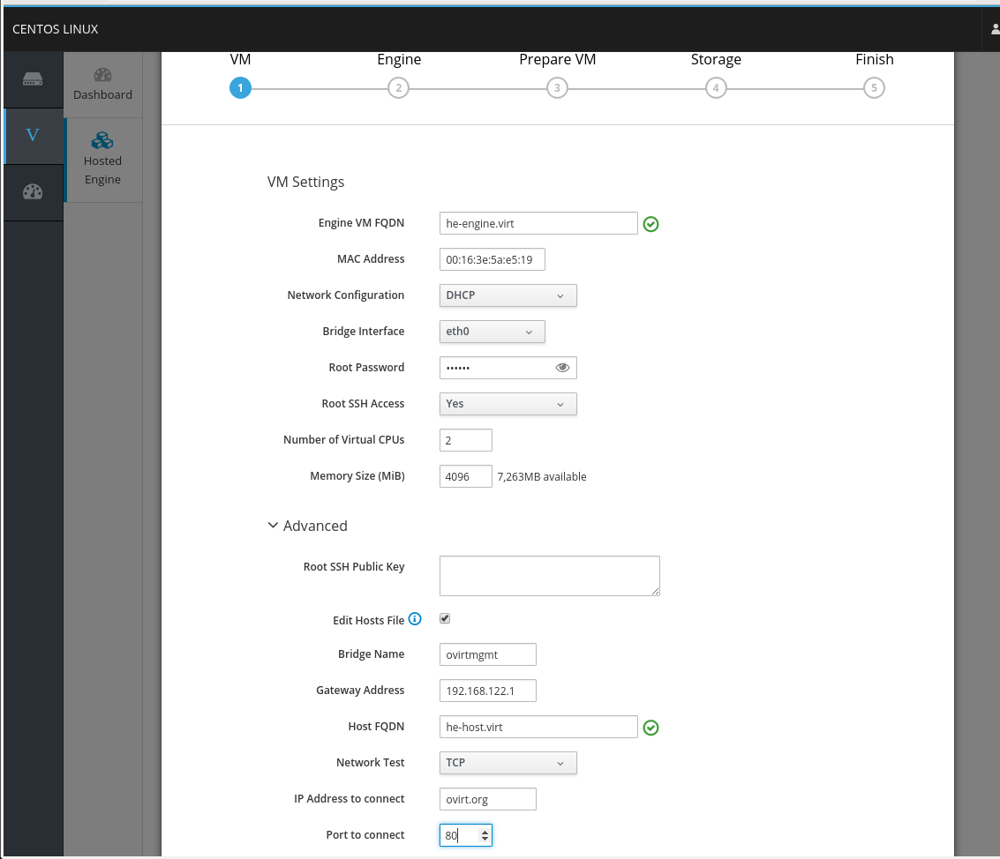

# Configurable Network Check for Self Hosted Engine

## Summary

Currently ovirt-hosted-engine-ha, the agent running on potential hosts to host
the Self Hosted Engine VM, checks his network liveliness by pinging the
gateway.
This feature adds alternative ways to check network liveliness, to enable
Self Hosted Engine in networks which does not allow pinging the gateway.

The progress of the implementation and testing of this feature is tracked on
[Bug 1659052 - [RFE] Consider alternative to ICMP ping for hosted engine network test](https://bugzilla.redhat.com/1659052)

## Owner

*   Name: [Dominik Holler](https://github.com/dominikholler)

*   Email: <dholler@redhat.com>

## Detailed Description

Additional ways to check the network liveliness to be added are DNS, TCP and
none.

DNS means that an NS query for "." (the root) will be performed, if this
succeeds, network is considered as alive.

TCP means, that a TCP connection to a given host and port combination will be
created. If this succeeds, network is considered as alive.
The configuration of this given host is out of scope of this feature.

None means, that the network is always considered alive.

Like ping, the DNS and TCP check should work for IPv4 and IPv6.
This feature requires that on deployment of the self hosted engine up to three
additional parameters:

- The desired way of checking network liveliness.
- The destination host for the TCP liveliness check.
- The destination port for the TCP liveliness check.

## Benefit to oVirt

This feature will enable the usage of Self Hosted Engine in networks which does
not allow pinging the gateway.

## Modification of ovirt-hosted-engine-setup

`hosted-engine --deploy` is going to be extended to ask and check the additional
parameters like this:

~~~~
          Please specify which way the network connectivityshould be checked (ping, dns, tcp, none) [dns]: tcp
          Please specify the desired destination IP addressof the TCP connection test: sdf
          Please specify the desired destination TCP portof the TCP connection test: 434
[ ERROR ] Failed to connect via TCP
~~~~

The related variables in the answer file will be
`OVEHOSTED_NETWORK/network_test`, `OVEHOSTED_NETWORK/network_test_tcp_address`
and `OVEHOSTED_NETWORK/network_test_tcp_port`, while the latter two are only
relevant if the value of `OVEHOSTED_NETWORK/network_test` is `tcp`.

The related input is validated instantly. On invalid input, an error is
reported. If the invalid input is read from the answer file, the deployment will
stop, if the invalid input is provided interactively, the wizard repeats the
question after presenting the error message.

## Modification of cockpit-ovirt

cockpit-ovirt is going to be extended to ask and check the additional
parameters like this:

`DNS` has to be the pre-selected default value.

## Modification of ovirt-ansible-hosted-engine-setup

ovirt-hosted-engine-setup and cockpit-ovirt will provide the three additional
options as the inputs `he_network_test`, `he_tcp_t_address`, `he_tcp_t_port` to
ovirt-ansible-hosted-engine-setup.
ovirt-ansible-hosted-engine-setup will transform them into the three parameters
`network_test`, `tcp_t_address`, `tcp_t_port` in `hosted-engine.conf`.

## Modification of ovirt-hosted-engine-ha

ovirt-hosted-engine-ha will perform the liveliness check according to the three
parameters in `hosted-engine.conf`

## Upgrade

On upgrade the new option `network_test` is missing in `hosted-engine.conf`.
In this case ovirt-hosted-engine-ha will still ping the gateway, which will
ensure backward capability.

## Configuration of existing Deployments

If the option `network_test` should set on a specific host,
this can be done like in the following example:
~~~~
hosted-engine --set-shared-config network_test dns --type=he_local
~~~~

If the default setting in the template for new hosts to be added in the future
should be modified, the option has to be set on the shared storage like this:
~~~~
hosted-engine --set-shared-config network_test dns --type=he_shared
~~~~

A full example of an update of `network_test` to `tcp` on a specific host looks
like this:
~~~~
[root@c76he20190415h1 ~]# hosted-engine --set-shared-config network_test tcp --type=he_local
[root@c76he20190415h1 ~]# hosted-engine --set-shared-config tcp_t_port 192.168.1.115 --type=he_local
[root@c76he20190415h1 ~]# hosted-engine --set-shared-config tcp_t_port 22 --type=he_local
[root@c76he20190415h1 ~]# systemctl restart ovirt-ha-broker ovirt-ha-agent
[root@c76he20190415h1 ~]# tail -f /var/log/ovirt-hosted-engine-ha/broker.log
Listener::INFO::2019-04-17 14:13:02,712::monitor::78::ovirt_hosted_engine_ha.broker.monitor.Monitor::(start_submonitor) Started submonitor storage-domain
Thread-5::INFO::2019-04-17 14:13:02,913::engine_health::94::engine_health.EngineHealth::(action) VM not on this host
Listener::WARNING::2019-04-17 14:13:03,029::status_broker::153::ovirt_hosted_engine_ha.broker.status_broker.StatusBroker::(lock_host_id) Host id is not locked, trying to lock
Thread-3::INFO::2019-04-17 14:13:03,041::mem_free::51::mem_free.MemFree::(action) memFree: 5084
Thread-2::INFO::2019-04-17 14:13:03,637::mgmt_bridge::62::mgmt_bridge.MgmtBridge::(action) Found bridge ovirtmgmt with ports
Thread-1::INFO::2019-04-17 14:13:04,894::network::88::network.Network::(action) Successfully verified network status
Thread-4::INFO::2019-04-17 14:13:12,725::cpu_load_no_engine::110::cpu_load_no_engine.CpuLoadNoEngine::(calculate_load) VM not on this host
Thread-4::INFO::2019-04-17 14:13:12,726::cpu_load_no_engine::126::cpu_load_no_engine.CpuLoadNoEngine::(calculate_load) System load total=0.0380, engine=0.0000, non-engine=0.0380
Thread-5::INFO::2019-04-17 14:13:12,927::engine_health::94::engine_health.EngineHealth::(action) VM not on this host
Thread-2::INFO::2019-04-17 14:13:13,585::mgmt_bridge::62::mgmt_bridge.MgmtBridge::(action) Found bridge ovirtmgmt with ports
Thread-1::INFO::2019-04-17 14:13:15,072::network::88::network.Network::(action) Successfully verified network status
~~~~

## User work-flows

The user has to configure the desired way of checking network liveliness
on graphical installation as described in
[cockpit-ovirt](#modification-of-cockpit-ovirt), or interactively as described
in [ovirt-hosted-engine-setup](#modification-of-ovirt-hosted-engine-setup), or
in the answer file as described in
[ovirt-hosted-engine-setup](#modification-of-ovirt-hosted-engine-setup).
)
If the TCP check is chosen, the user has to define the destination host and
port in the same way. If the destination host and port are missing in the answer
file, ovirt-hosted-engine-setup will ask interactively.

## Testing

It should be checked if the three possible inputs (ovirt-hosted-engine-setup interactivly and by answer file, and cockpit-ovirt) rejects wrong values and passes correct values correctly to `hosted-engine.conf`.

Additionally, the ovirt-hosted-engine-ha reacts on the related condition for
all 4 (none, ping, dns and tcp) possible values in for `network_test` in
`hosted-engine.conf`.

Even there is nothing special about IPv6 in this feature, it might be useful to
verify on IPv6.
