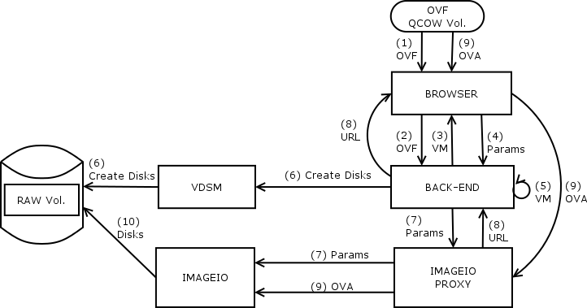
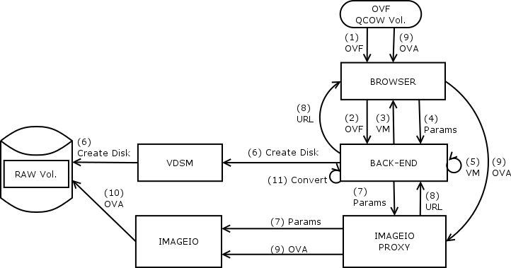
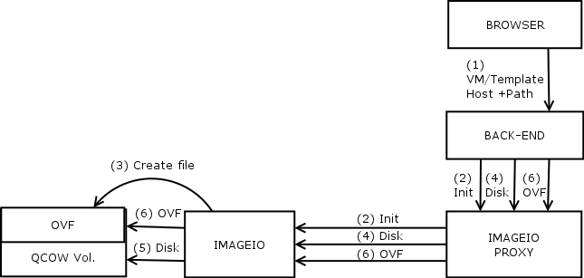
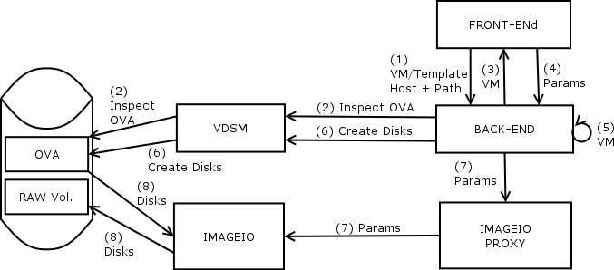
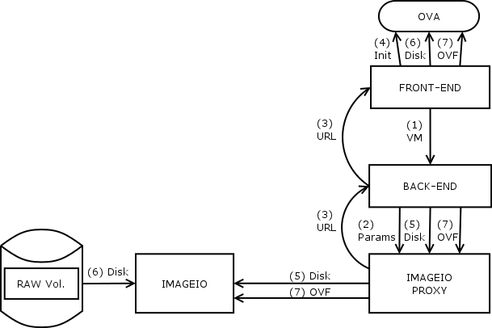

# Background
Open Virtual Appliance (OVA) is a package that contains the different
elements of a virtual machine (VM). OVA is typically a tar archive file
that includes the configuration of the VM in the form of the Open
Virtualization Format (OVF) as well as virtual disks and other
VM-related data.

OVF is a known format that is used by different organizations and
virtualization platforms. Its specification can be found
[here](http://www.dmtf.org/standards/ovf). The
[OVF standard](https://en.wikipedia.org/wiki/Open_Virtualization_Format)
provides an open, secure, portable, efficient and extensible format for
the packaging and distribution of software to be run in virtual
machines.

Recently, oVirt was enhanced with support for importing OVAs that were
generated by VMware. oVirt also makes extensive use of the OVF standard
to describe VM configurations, such as VM snapshots and exported VMs.

The ability to package all the VM data, optionally compressed, in one
file eases the processes of backing up a VM and porting a VM to a
different platform or hypervisor. Unfortunately, the portability is
limited by compatibility issues. Different disk formats, drivers,
guest-agents, and OVF structure, hinder the ability to import any OVA to
any platform. Therefore, different organizations develop their own
conversions tools, like Red Hat's
[virt-v2v](http://libguestfs.org/virt-v2v.1.html), for converting VMs
from other platforms to their platform.

# Scope
This feature enhances import VM and export VM processes in oVirt, by
making a broader use of the OVA format.

## Uploading an OVA
Today, the process of importing an OVA is limited to OVA files
compatible with those produced by VMware and requires to make the OVA
file accessible, with the right file permissions (vdsm:kvm), to one of
the hosts managed by oVirt. It is a cumbersome and error-prone process.

This feature provides a broader and more user-friendly alternative that
enables one to upload a local OVA file directly from a client (the
client can be a browser or based on rest-api, like the clients supported
for the upload-image functionality that was recently added to oVirt).

This feature allows the uploading of OVA files that were generated
either by oVirt or by external sources. Officially, the only external
source being supported is VMware. In practice, the process could work
with OVA files generated by other source, as long as their OVF
configuration contains the data oVirt consumes (in the expected form),
and virt-v2v knows how to convert them.

## Exporting a VM or Template as an OVA
Currently, users are provided with two ways to migrate VMs and templates
between environments. One option is to use an export domain. However,
this approach is suitable only for migration between separated oVirt
environments. Moreover, there is a plan to drop the support for export
domains. A second option is to detach a data domain and attach it to
another setup. This option was desiged with disaster recovery in mind.
However, because of the side effects associated with detaching a data
domain, it is less suited to this migration flow.

This feature provides an alternative way for a migration between
environments by generating an OVA from an existing VM or template. By
encapsulating all VM/template data in a single file, we achieve an
improved portability. By being aligned with the common OVA specification
(rather than our unique structure of a storage domain), we achieve
better compatibility with other platforms.

The OVA file would be stored on a variety of locations: path on host 
in the data-center, NFS share, etc (we don't handle mounting the path).
TBD: build the OVA on the fly and stream its content using ovirt-imageio.
in addition, it will include neither snapshots nor the template that the 
VM may be based on.

Moreover, this feature enables a running VM to be exported without the
need for any downtime. Today, VM shutdown is required.

## An Enhancement for Importing OVAs
This feature enhances the existing support for importing OVA files that
are accessible to the host, by enabling to specify a path to an OVA file
that was generated by oVirt. Importing an OVA file that was generated by
oVirt does not involve the adaptation needed for OVA files generated by
other platforms (e.g., installing kvm-specific drivers) and thus, should
be faster than importing of such OVA files.

## Downloading an OVA
This feature will leverage the implementation of the planned
download-image to provide similar functionality for OVA files (i.e.,
download a VM/template as OVA on the client's machine).

# Design
The following section describes the high-level design for the different
aspects described in the previous section.

## Uploading an OVA
In principle, uploading an OVA is similar to uploading an image.
However, it is more challenging because OVA is a more complex resource
than an image.

The upload process would be implemented differently depending on whether
the OVA was generated by oVirt (or more accurately, that the disks
within the OVA are of type raw or qcow) or by other source (and thus
requires adaptation). In both cases, the user will be able to select
a file and then be provided with the VM configuration that allows him to
configure the parameters for the import process.

### Uploading an OVA Generated by oVirt
The following figure depicts the import process of an OVA that was
generated by oVirt:

1. The front end retrieves the OVF configuration from the OVA.
2. The front end sends the OVF configuration to the back end.
3. The back end parses the OVF configuration and returns a VM object
   to the front end.
4. The front end sends back the VM (optionally customized) to the back end.
5. The back end persists the VM into the database and lock it.
6. The back end sends the list of disks metadata to the front end,
   which starts the process of uploading the disks.
7. From this point the disks upload is identical the regular image
   upload process (the upload process creates the target disks).
8. Upon finishing the last disk upload, releases the VM lock.

Notes:

1. The described process assumes that the disks are not compressed
   within the OVA. In order to support this, the back end would need to
   pass an indication to the front end as to whether or not each disk is
   compressed (step 6), so the ovirt-imageio-daemon can decompress the
   data on-the-fly while streaming it to the destination volume (step 7).
2. The upload process supports handling both raw and qcow images in the OVA.
3. Currently, we support resuming a single image upload. 
   TBD: whether to support resuming for upload OVA. 
4. The upload OVA flow can be implemented using ovirt SDK, so it will be 
   possible to integrate it with Ansible.
5. This process streams data directly from OVA file from the machine without
   creating any temp files.

### Uploading an OVA Generated by an External Source
The following figure depicts the import process of an OVA file that was
generated by an external source:

The process is similar to importing an OVA file generated by oVirt,
except for the following steps:
1. Only one temporary disk is created on the storage domain.
2. The complete OVA file is streamed into the disk that has just been
   created.
3. Convert the temporary disk to a VM, using virt-v2v.
4. Remove the temporary disk.

Note:

1. This process is not efficient in time and space, due to the creation
   of the temporary disk. Therefore, we suggest to make the OVA
   accessible to the host instead, especially in the case of mass import
   of OVA files. However, this process can be handy for importing one
   OVA file with loose time and space constraints.
2. Therefore, it is a second-priority task.

## Exporting a VM or Template as an OVA
The user will be able to select a VM (or a template) to be exported as
an OVA file. In such cases, the user needs to specify a path on a host
or a disk on shared storage where the OVA file will be created.

The following figure depicts the process of exporting a VM with a single
disk as an OVA file:

1. The front end sends the back end a VM and an export destination.
2. The back end creates new disk (for the ova) if the destination requires,
   and prepares the VM source disks.
3. The back end asks VDSM to create an OVA file with the complete OVF 
   specification and export destination.
4. VDSM runs ovirt-ova tool - creates the OVA in the destination
   (using qemu-img convert which may include file format conversion).
5. The back end teardowns the VM source disks.
   
Notes:

1. Step 4 is equivalent to `qemu-img convert` with the collapse option
   set and the target format set to QCOW.
2. Only after building the OVA file we could update the OVF with the
   export size.
3. If possible, we'll consider using streaming the disk data directly
   from the qemu chain into OVA.
4. In future openshift env we could use the ovirt-ova tool to run it
   as an openshift job witout depending on VDSM, or using ansible.

## An Enhancement for Import OVAs
Importing an OVA that was generated by oVirt won't involve virt-v2v and
will be similar to the upload-ova process:

1. The front end sends the back end a VM and a path on a host.
2. The back end retrieves the OVF configuration from the OVA using vdsm.
   vdsm will run the ova-ovirt tool.
3. The back end parses the OVF configuration and returns a VM to the
   front end.
4. The front end sends (optionally customized) parameters of the import
   process to the back end.
5. The back end persists the VM into the database.
6. The back end triggers the creation of the target VM disks on the
   storage domain.
7. The back end sends the import parameters, including the destination
   disks to vdsm.
8. vdsm runs the ova-ovirt tool that reads the disks from the OVA and
   according to the import parameters streams the data into the 
   corresponding target disks.

## Downloading an OVA
This part depends on the implementation of the download-image flow. In
theory, it should look like this:

1. The front end passes the back end a VM (or template) to download.
2. The back end starts exporting to OVA flow (as described in 
   'Exporting a VM or Template as an OVA')
3. The front end displays a link for downloading the OVA.
   TODO: discuss UX regarding progress indication.
4. Press on the download link will start an ovirt-imageio download
   to the browser (not implemented yet in the front end).

Notes:

1. It's not possible so we don't do that at the moment.
   TBD: to allow that (using streaming the disk data directly
   from the qemu chain to the browser).
2. The flow would be created as a reusable component (e.g. for future
   automation using Ansible).
3. This solution should allow resuming a download at any point.
 

## TBD: Streaming
We want to avoid unneeded data copy, to minimize upload/download time.
We prefer QCOW as the format for OVA.

### Upload use-cases

* OVA with qcow disks to qcow disks
  - planned
* OVA with qcow disks to raw disks - for enhanced performance
  - May be supported if NBD supports it.
* OVA with raw disks to raw disks - possible but probably irrelevant.
  - supported as image upload can upload any format

### Download use-cases

* VM with raw disks to OVA with qcow disks (for more compact OVA).
  - Not supported, as qemu-img convert doesn't support
    streaming to qcow format.
* VM with qcow disks with chain of snapshots to OVA with qcow
  - Not supported, as qemu-img convert doesn't support
    streaming to qcow format.
* VM with qcow disks without snapshots to OVA with qcow disks
  - Possible
* VM with raw disk to OVA with raw disks
  - Possible but not interesting (qcow format is preferred)
* VM with qcow disks with chain of snapshots to OVA with raw disks
  - Not interesting (qcow format is preferred), maybe be possible
    if NBD supports this.