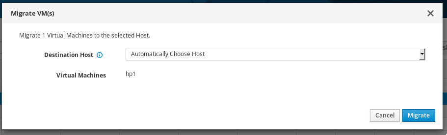
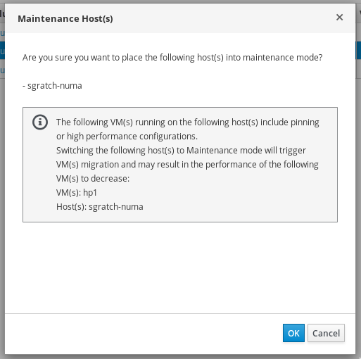

# Live migration for High Performance VMs

## Summary
In oVirt 4.2 we added a new “High Performance” VM profile type. 
By choosing This High Performance (HP) VM type, the VM is pre-configured with a set of suggested and recommended configuration settings for reaching the best efficiency.

This required configuration settings includes pinning the VM to a host based on the host specific configuration. Due to that pinning settings, the migration option for the HP VM type was automatically forced to be disabled.

This feature provides the ability to enable the live migration for those HP VMs (and in general for all VM types with pinning settings).

## Owner
*   Name: Sharon Gratch (sgratch)
*   Email: <sgratch@redhat.com>

## Usage
 1.  Setting a new or an existing VM to run as a HP VM, by selecting the "High Performance" type in the "Optimized for" pull down menu field displayed in VM new/edit dialog, will now automatically set the migration mode to be "Allow manual migration only".
 
 2.  Setting a new or an existing VM to run as Server/Desktop type with pinning configuration, will now automatically set the migration mode to be "Allow manual migration only". 
 A VM with pinning configuration (aka "a pinned VM") is referring to any VM that is configured with at least one of the following settings: Pass-Through Host CPU enabled, CPU Pinning topology setting, or NUMA nodes pinning setting for that VM. 

 3. For both HP/pinned VMs - All migration modes are now supported. The default is set to manual migration but the user can manually change the migration to automatic (by changing migration mode to "Allow manual and automatic migration"). 
 
    Nevertheless, doing that should be considered with a great care since auto migration means that migration triggered by internal events like Load Balancer or non-operational hosts/High Availability may occur for those VMs and since migration of HP/pinned VMs may result in performance decreasing of those VMs, the user may want to control it by leaving the manual migration option.

 4. A HP/pinned VM Template or Pool will be created in the same way as a VM and the migration option will be manually enabled as default for those also. In case the user wants to create a HP/Pinned migratable VM, he can also choose a Template or a Pool which are configured as HP type and "inherit" this property for that specific VM.

 5.  When a user will chose to migrate the HP/pinned VM, he will need to manually activate the migration (click "Migrate" on the VMs tab) and then via the “Migrate VM(s)” popup dialog to choose the destination host to migrate to, or let the engine to auto select it for him. This is the same as done for all other VM types.

      

       The displayed list of destination hosts to choose from in the “Migrate VM(s)” popup dialog is filtered by the scheduler policies to fit the HP/pinned VM required settings, so that it will include only hosts the have the configuration required for running this specific HP/pinned VM.

      However, not all hosts in that list will supply the same level of performance results for the HP/pinned VM running on it, so the user is recommended to let the scheduler choose the most preferable host by choosing the "Automatically choose host" option. Since A fully automatic destination host selection is now supported for those HP/pinned VMs then it is the preferable way.
  
     By choosing the "Automatically choose host" option, the destination host will be chosen to fit the migrated VM and in case no such host existed in the cluster, the most suitable, less loaded (CPU and memory) and less pinned one will be chosen. Both source and destination hosts should not be necessarily identical.

 6.  Another scenario that may trigger migration of HP/Pinned VMs that are configured to run with manual/auto migration mode  is when the host they are running on is manually set to maintenance mode by the user. A new behavior added in 4.3 is that In that case all migrateable VMs running on that host, including the ones configured as manual migration,  will be migrated. 

     For letting the user know about the existence of HP/Pinned VMs that are going to be migrated in that scenario, a new notification message will be displayed in the "Maintenance host(s)" dialog, only in case such such VMs run on selected hosts. This message warns that after migration of those VMs, their performance may be decreased. The user can choose if to ignore or continue the switching to maintenance process and migrating those VMs as a result:

     

## Detailed Description

### Migration constraints removal

##### The following constraints, existed in oVirt 4.2, were changed in UI and backend for supporting HP/pinned VMs migration:

- A VM set with “Pass-Through Host CPU” can now be migrateable.

- A VM set with virtual NUMA nodes topology can now be migratable.

- A VM set with CPU pinning can now be migratable.

- A VM set with High-Availability enabled can now be manually migratable (manual migration was not allowed in 4.2 because High-Availability requires the ability to automatically migrate the VM).

- A limitation that only one host (and not more than one) can be assigned to a VM,  in case of NUMA nodes pinning enabled, was removed:

    The HP/pinned VM can now be configured to run on a set of assigned/pinned hosts, one or more (by selecting the "Start running on: Specific Host" in "Host" side-tab). Each one of this hosts is verified by the user so that the VM configuration fits the host configuration for pinning settings.
This change is crucial for supporting High Availability since if  the VM is assigned to only one host then the VM can be highly available (restart/rerun) only on that host and If that host is in maintenance/shutted down then the VM can’t run - so there is no real HA support.

##### The following flags, existed in oVirt 4.2, were totally removed from vds_options table in DB:

- The “SupportNUMAMigration” flag.

- The “CpuPinMigrationEnabled” flag. 

### Scheduler requirements

The requirements from the scheduler manager for enabling HP/Pinned VMs migration are to schedule a destination host that will support all HP/pinned VM’s settings, including pinning setting. 

That doesn't mean that both source and destination hosts must have identical settings but it does mean that they should have suitable number of CPUs (sockets, cores, threads), suitable CPU pinning capacity, suitable declaration of huge pages and memory, suitable NUMA nodes topology and suitable host CPU model and hardware. 

All those checks are done by the scheduler, including verifying that the destination host current existing load and pinning status fits the migrated HP/pinned VM. In case more than one host fits, we set the weights so that the most appropriate, less loaded host is chosen.

We added new policy units and updated existing ones for checking that the source and destination hosts have a suitable (not necessarily identical) hardware and configuration for supporting HP/pinned VMs migration:

- CpuLevelFilterPolicyUnit - was updated for running VMs with Pass-Through Host CPU enabled only on hosts with a proper CPU level.

- NumaPolicyUnit - added for running VMs with at least one possible assignment of VM's NUMA nodes pinned to host nodes in away that satisfies pinning and memory requirements.

- CpuAndNumaPinningWeightPolicyUnit -added for preferring running VMs on hosts where CPU pinning is compatible with NUMA node pinning.

- HighPerformanceCpuPolicyUnit - added for preferring running HP/pinned VMs on hosts that have more or equal number of sockets, cores and threads.

### Live Migration process

No changes were required.

### WebAdmin UI

The following main changes were done in web-admin UI:

- The migration mode default for HP/Pinned VMs was changed to manual migration mode. 

- All migration constraints were removed as described above and defaults/ validations/ tool-tips/ messages were changed or added accordingly.

- A notification message was added to the "Maintenance host(s)" dialog for informing the user on HP/Pinned VMs that are going to be migrated as a result of switching selected host(s) status to "Maintenance".

- Changing the "NUMA Topology" dialog for enabling pinning the VM to more than one host and displaying only relevant VMs in that dialog. 
The "NUMA pinning" dialog is now displaying the configuration relevant to the first host in "Specific Host(s)" list, in case there is more than one host, but the NUMA configuration is anyway relevant for all hosts in list since all hosts should have similar NUMA configuration. 

### REST API

No changes were required.
    
## Status

*   Target Release: Ovirt 4.3
*   Status: Merged

## Limitations

- Setting the migration mode to be "Allow manual migration only" for HP/pinned VMs via REST api is not done automatically. The default value for those VMs set via REST api is "Allow manual and automatic migration", so the user should explicitly change it to manual migration if required.

- In case of a VM set with NUMA pinning but without specifically setting the CPU pinning policy, migrating the VM to a destination host with less CPUs then in source host will always fail. 
The reason is that in case the NUMA pinning policy is set and CPU pinning policy is not specifically mentioned by the user then an automatic CPU pinning is calculated, using all CPUs in host. 
The workaround for this issue, which is anyway the recommended option, is 
to always set CPU pinning manually to override the automatic pinning.
 
- No special support for easy creation of Affinity Groups for HP/Pinned VMs via the UI. Since HP VMs are limited by the hosts to run on and by the number of VMs to run together on the same host (due to enabling Pass-Through Host CPU, CPU pinning, NUMA pinning, IO thread pinning, huge pages..etc) then it is required to apply affinity rules on those VMs. 
Currently the user will need to manually apply that since there is no automatic filtering in Affinity UI dialog for that.
This will be implemented in future versions.
	
- Templates and Pools can't be set as HP but can't be set as pinned since pinning configuration (Pass-Through Host CPU, CPU Pinning topology and NUMA nodes pinning) is missing for those entities in both UI and REST api.
This will be implemented in future versions.

## Dependencies / Related Features
[High Performance VM](/develop/release-management/features/virt/high-performance-vm.html)

