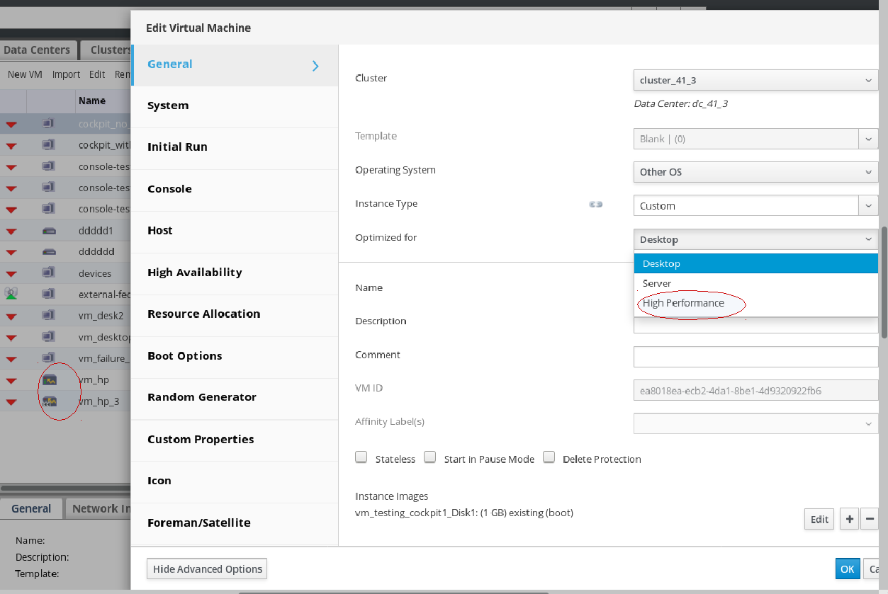

# High Performance VM

## Summary

Support a new type of VM in oVirt destined for running a VM with highest possible performance and performance metrics as close to bare metal as possible. 

For setting a VM as High Performance, a new VM profile type named "High Performance" will be added in addition to existing "Server", "Desktop" types.  By choosing This new High Performance VM type,  the VM will be pre-configured with a set of suggested and recommended configuration settings for reaching the best efficiency.

## Owner
*   Name: Sharon Gratch (sgratch)
*   Email: <sgratch@redhat.com>

## Benefit to oVirt

Before this feature was implemented, configure a VM to run with high performance workloads was not an easy straightforward mission to do and required the user to manually set the VM as such by going over all settings and check what is relevant and how to configure it. 

Furthermore, few required features essential for improving VM performance were not supported at all by oVirt (for example: using huge pages, IO Thread pinning and CPU cache layer 3) and new features as Headless VMs can now be leveraged to suggest one solution of the best recommended configuration according to VM usage requirements.

This feature introduces a simple to manage solution for running a new/existing VM as High Performance via WebAdmin or REST api, while the user can still keep an option to manually change or ignore the suggested configuration for his own tuning and requirements. 

## Usage

 -  Setting a VM to run as a High Performance VM can be done to a new or existing VM via UI by selecting the "High Performance" type in the "Optimized for" pull down menu field displayed in VM new/edit dialog. 
This new VM type is added in addition to already existed VM types: "Server", "Desktop". 
 
 - In case of changing the VM type for a running VM, part of the required configuration changes will require a VM restart after saving. In case of changing the VM type for a new/existed VM, part of the required/suggested configuration may require manually changes of the VM's cluster configuration prior to setting the VM as High-performance, and part of the required/suggested configuration may require changing of the specific pinned host configuration prior to setting the VM as High-performance.

 -  A High Performance Template or Pool can be created in the same way as a VM. In case the user wants to create a High Performance VM, he can also choose a Template or a Pool which are configured as High Performance type and "inherit" this property for that specific VM.

 -  Note that if an Instance Type is chosen for a VM, it has no influence on the VM high performance type and configuration. Nevertheless, configuration changed by the Instance Type may override the VM High Performance configuration.

 - Once the "High Performance" VM type was chosen in the VM/Template/Pool dialog,  a set of automatic configuration changes, and suggested manual configuration changes are proposed to the user in order to suggest the user with the optimal configuration setting:
	 - A list of validations and suggested manual configuration changes are displayed in a pop-up window on save and the user can choose if to accept and perform before saving or ignore them.
	 
	 - A list of configuration changes will be applied automatically (and the user can cancel before saving via WebAdmin UI).

 -  Once the user accepts the configuration and clicks the OK button within the pop-up dialog, the configuration is changed accordingly and the VM becomes a High Performance VM.

 - a new icon is displayed for this new High Performance VM type, left to the VM name, and the VM type will also be displayed in the "General" sub-tab (it is required since no icons are displayed for Pools and Templates).
      
 - This feature doesn't work on all cluster levels (since huge pages are not supported before oVirt 4.2).
 
 - Note that all of the scenarios described above can be done in UI only via oVirt WebAdmin and not via the UserPortal.

## Detailed Description

As described above, the configuration settings is divided into configuration changes done automatically (and the user can change before saving) and suggested configuration changes/warnings which are proposed to the user to perform before saving.

### List of automatic configuration settings for High Performance VM

#### **Enable Headless Mode and enable Serial console**
Displayed in console side-tab of the VM dialog.

For Headless VM handling please see [headless vm](/develop/release-management/features/virt/headless-vm.html)

#### **Disable all USB devices**
Displayed in console side-tab of the VM dialog.

This is a new configuration setting added for oVirt 4.2.

#### **Disable the Sound Card device**
Displayed in console side-tab of the VM dialog

#### **Disable the Smart Card device**
Displayed in console side-tab of the VM dialog

#### **Enable Pass-Through Host CPU**
Displayed in Host side-tab of the VM dialog.

This option can only be enabled when VM live migration is disabled.

#### **Disable VM migration**
Displayed in 'Host' side-tab of the VM dialog.

The VM cannot be migrated, either automatically or manually for oVirt 4.2. 
Support migration is planned for oVirt 4.3 . See https://bugzilla.redhat.com/show_bug.cgi?id=1457250.

#### **Enable IO Threads, Num Of IO Threads = 1**
Displayed in 'Resource Allocation' side-tab of the VM dialog.

Current configuration is changed by removing the 'Num Of IO Threads' field from the UI so that in case enabled, only one IO thread is always created.  For REST api the configuration remains unchanged so the user can still set the number of IO threads to be >= 1.

#### **Disable the Memory Balloon Device**
Displayed in 'Resource Allocation' side-tab of the VM dialog.

This option can also be set manually by the user for the cluster of that VM (add/edit Cluster dialog->Optimization side-tab).

#### **Enable High availability only for pinned hosts**
Displayed in 'High Availability' side-tab of the VM dialog.

Currently High availability is not supported when migration is disabled.

High Performance VMs will be treated differently and will support High availability, but only for the VM's pinned host(s). This will allow re-running of the VM on the same pinned host or the next pinned host in case there are more than one.
 The High availability support will be expanded to all cluster hosts as part of the solution for supporting migration in oVirt 4.3.

#### **Disable the Watchdog device**
Displayed in 'High Availability' side-tab of the VM dialog.

#### **Enable paravirtualized Random Number Generator PCI (virtio-rng) device** 
Displayed in 'Random Generator' side-tab of the VM dialog.

This option is automatically set using libvirt defaults ("Period duration"=1000 milliseconds) and can be changed by the user before saving.

#### **Enable Multi Queues per Virtual Interface**
This is a new configuration setting added for oVirt 4.2.

Displayed in 'Resource Allocation' side-tab of the VM dialog.

#### **Set the IO and Emulator threads pinning topology**
This is a new configuration setting added for oVirt 4.2.

This option will be automatically configured and calculated in engine side and the recommended calculated pinning topology will be sent to the host in libvirt xml.
No UI settings are required for this option.

The automatic calculated pinning topology for IO and emulator threads will assume the following:

 - It is requires that IO threads, CPU pinning topology and vNUMA and NUMA pinning are enabled and set for the VM. In case not, a warning will be displayed in a pop-up and the user will be asked to set it.
  
 - The automatic IO thread pinning will be done by pinning to CPUs (of the pinned NUMA node) that are responsible for the IO in the host, or alternatively pinned to CPU#0 as this is typically the one.
 
 - The first two CPUs per NUMA node will be reserved for IO+Emulator threads. The default value will be set to "0,1". Such configuration would imply that two CPUs, 0th and 1st in each NUMA node, will be used for IO + Emulator thread pinning for each High Performance VM.

	If all VM's CPUs fit to one NUMA node of the host, then those first two CPUs are reserved for emulator + IO pinning and the rest will be used for vCPU pinning.

 - Additional logic is required to avoid wasting CPUs for large single High Performance VMs that span more then one NUMA node. For such VMs, the engine will find the most pinned NUMA node (i.e. the NUMA node that most vCPUs are pinned to), pins the IO and emulator to the first two CPUs of that NUMA node and leaves the next pinned NUMA node(s) to be used for vCPU pinning only.

 - In case the list of CPUs pinned to vCPUs and the list of CPUs pinned to IO+emulator threads are overlapping, a warning will be displayed in the log and the user will be asked to fix it.

 - Note that Pools are not supporting IO+Emulator threads pinning (since NUMA pinning is not supported for Pools, see "Enable virtual NUMA and set NUMA pinning topology" section for details).

### List of manual configuration settings/warnings for High Performance VM

#### **Set the CPU Pinning topology**
Displayed in 'Resource Allocation' side-tab of the VM dialog.

In case the CPU Pinning topology is not set upon VM saving, a recommendation/warning will be displayed in a pop-up and the user will be asked to pin the VM to a host (by selecting the "Start running on: Specific Host" in "Host" side-tab) and verify if VM configuration fits the host configuration (i.e. guest_number_of_cores_per_socket <= host_number_of_cores_per_socket,  guest_threads_per_core <= host_threads_per_core and guest_number_of_sockets <= host_number_of_sockets).

Ideally the CPU pinning should be done automatically and not manually by the user, but in first phase we will not support it.  

Note that since this configuration option can be set for VMs and Pools and not for Templates, then the user should always set this field when creating a VM or a Pool, even if it is based on a High Performance Template.

#### **Enable virtual NUMA and set NUMA pinning topology**
Displayed in 'Host' side-tab of the VM dialog.

In case the virtual NUMA and the NUMA pinning topology are not set upon VM saving, a recommendation/warning will be displayed in a pop-up and the user will be asked to pin the VM to a host that supports NUMA topology and verify the VM NUMA topology fits the host's NUMA topology.

Ideally the NUMA pinning should be done automatically according to the exposed host's NUMA topology and not manually by the user, but in first phase we will not support it.

Note that this configuration option can be set for VMs and not for Templates or Pools. Therefore, the user should always set NUMA configuration when creating a VM based on a Template, while for Pools NUMA pinning is not supported at all.

#### **disable kernel same page merging (KSM)**
This is currently implemented in engine only for cluster level (new/edit cluster dialog->'Optimization side-tab). 

KSM can be manually deactivated in host level by stopping the ksmtuned and the ksm service on the hypervisor.

Disabling the KSM for the specific VM may be implemented for oVirt 4.3 if required. This should be implemented by adding a check-box to the 'Resource Allocation' side-tab of the VM dialog and implemented by setting the "nosharepages" domain property in libvirt xml (requires  VDSM changes).

In case that KSM in cluster level or host level is not disabled upon VM saving, a recommendation/warning will be displayed in a pop-up and the user will be asked to disable it either in cluster level, host level or for the specific VM.

#### **Enable  memory backing with huge pages**
This is a new configuration setting added for oVirt 4.2. 
This feature includes host side changes in addition to engine and UI changes. The UI changes will be added as a predefined new key option in the 'Custom Properties' side-tab of the VM dialog. 
This new "hugepages" key will allow to set the size of the huge page in kB.

In case that huge pages configuration is not set upon VM saving, a recommendation/warning will be displayed in a pop-up and the user will be asked to set it and verify it fits the host configuration (i.e. guest huge pages selected size should be supported by the pinned host, recommending to set the biggest pages available and also checking that guest_number_of_huge_pages_for_selected_size <= host_number_of_huge_pages_for_selected_size).

For more information please see https://trello.com/c/ABUiJgWR/62-hugepages

### WebAdmin/UserPortal UI

 *   A new "High Performance" type is added to the "Optimized for" pull down menu field displayed in VM/Template/Poll for new and edit dialogs.

 * New icons are added to display this new VM type + modes (Stateless/Stateful, with/without new configuration, Vm in a Pool/regular VM).

 * The VM/Template/Pool "optimized for" type (values: "Server", "Desktop" or "High Performance") will be displayed in the "General" sub-tab.

 * The 'Num Of IO Threads' field was removed from 'Resource Allocation' side-tab of the VM dialog

 * A list of validations and suggested manual configuration changes are displayed in a new pop-up window on save of a High Performance VM/Template/Pool, and the user can choose if to accept and perform those changes before saving or ignore them.

### REST API

 - a new 'High Performance' VM type should be added to VM/pool/Template creation/editing APIs.

 - All relevant configuration changes mentioned above should be exposed in APIs, including the new features like huge pages configuration.

 - There is no automatic settings for High Performance VM/Pool/Template via REST API and the user should set the configuration manually (except for IO+Emulator threads pinning, USB disabling and CPU cache layer 3 enabling which are set automatically in back-end).

 - For creating a fully configured High Performance VM via REST API, the following set of API's should be called:
1. Create a new VM based on pre-created High Performance Template and set 'host_passthrough' and host pinning since it is not part of the template.
Alternatively, if the new VM is based on a 'Blank' Template then the user should set the following required/recommended high performance configuration as part of the API request:
Enable host_passthrough, set cpu_pinning, disable soundcard, disable migration, disable balloon, enable serial console, enable huge pages, enable high availability, set io threads number to 1.

     An Example for creating a VM based on a high perfomance template:
     
     POST .../api/vm

     \<vm\>
     
     \<cluster\>\<name\>cluster_name\</name\>\</cluster\>
     
     \<name\>vm_name\</name\>
     
     \<template\>\<name\>hp_template\</name\>\</template\>
     
     \<type\>HIGH_PERFORMANCE\</type\>\
     
     \<cpu\>
     
     \<mode\>host_passthrough\</mode\>
    
     \<cpu_tune\>\<vcpu_pins\>\<vcpu_pin\>\<vcpu\>0\</vcpu\>\<cpu_set\>0\</cpu_set\>\</vcpu_pin \</vcpu_pins\>\</cpu_tune\>
    
    \</cpu\>
    
    \</vm\>

2. For setting the VM as Headless and disable all USB devices, the user need to delete all graphic consoles by calling for each graphic console device:

	  DELETE .../api/vms/\<vm-id\>/graphicsconsoles/\<console-id\>

3.  Set virtual NUMA nodes and NUMA pinning topology by calling:

	 POST .../api/vms/\<vm-i\>d/numanodes

4. Disable KSM for the VM's Cluster.

The same goes for Templates and Pools.
    
## Status

*   Target Release: Ovirt 4.2
*   Status: Merged

## Limitations

## Dependencies / Related Features
Headless VM

VM memory backing with huge pages
