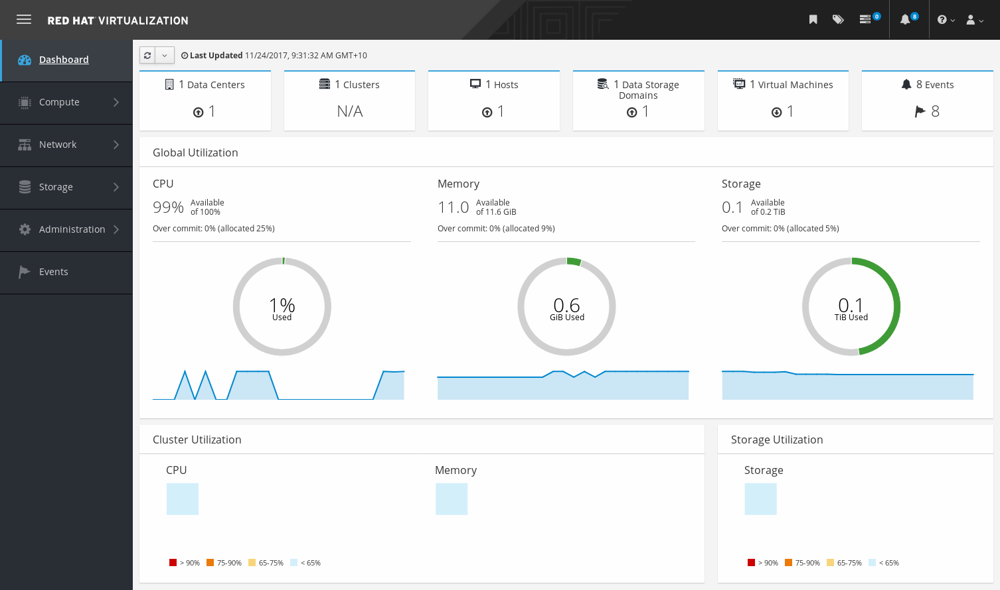
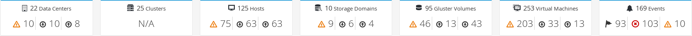
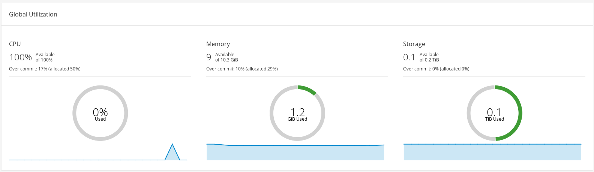
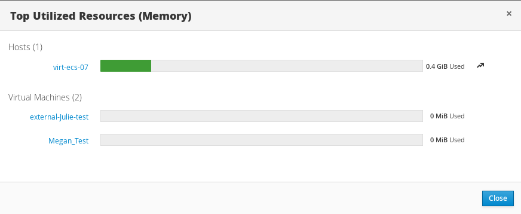
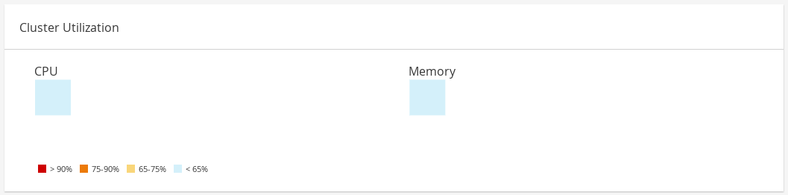
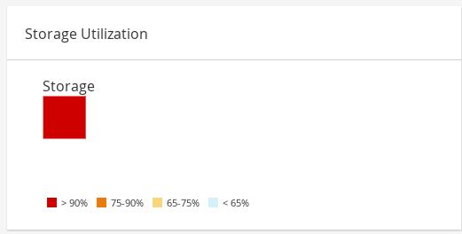

[[chap-System_Dashboard]]
== Dashboard

The Dashboard provides an overview of the {virt-product-fullname} system status by displaying a summary of {virt-product-fullname}'s resources and utilization. This summary can alert you to a problem and allows you to analyze the problem area.

The information in the dashboard is updated every 15 minutes by default from Data Warehouse, and every 15 seconds by default by the {engine-name} API, or whenever the Dashboard is refreshed. The Dashboard is refreshed when the user changes back from another page or when manually refreshed. The Dashboard does not automatically refresh. The inventory card information is supplied by the {engine-name} API and the utilization information is supplied by Data Warehouse. The Dashboard is implemented as a UI plugin component, which is automatically installed and upgraded alongside the {engine-name}.

.The Dashboard

[[sect-Prerequisites]]
=== Prerequisites

The Dashboard requires that Data Warehouse is installed and configured. See link:{URL_virt_product_docs}{URL_format}data_warehouse_guide/index#chap-Installing_and_Configuring_Data_Warehouse[Installing and Configuring Data Warehouse] in the _Data Warehouse Guide_.

[[sect-Global_Inventory]]
=== Global Inventory

The top section of the Dashboard provides a global inventory of the {virt-product-fullname} resources and includes items for data centers, clusters, hosts, storage domains, virtual machines, and events. Icons show the status of each resource and numbers show the quantity of the each resource with that status.

.Global Inventory

The title shows the number of a type of resource and their status is displayed below the title. Clicking on the resource title navigates to the related page in the {virt-product-fullname} {engine-name}. The status for *Clusters* is always displayed as N/A.

.Resource Status
[options="header"]
|===
|Icon |Status
| |None of that resource added to {virt-product-fullname}.
| a|Shows the number of a resource with a warning status. Clicking on the icon navigates to the appropriate page with the search limited to that resource with a warning status. The search is limited differently for each resource:

* *Data Centers*: The search is limited to data centers that are not operational or non-responsive.

* *Gluster Volumes*: The search is limited to gluster volumes that are powering up, paused, migrating, waiting, suspended, or powering down.

* *Hosts*: The search is limited to hosts that are unassigned, in maintenance mode, installing, rebooting, preparing for maintenance, pending approval, or connecting.

* *Storage Domains*: The search is limited to storage domains that are uninitialized, unattached, inactive, in maintenance mode, preparing for maintenance, detaching, or activating.

* *Virtual Machines*: The search is limited to virtual machines that are powering up, paused, migrating, waiting, suspended, or powering down.

* *Events*: The search is limited to events with the severity of warning.

| |Shows the number of a resource with an up status. Clicking on the icon navigates to the appropriate page with the search limited to resources that are up.
| a|Shows the number of a resource with a down status. Clicking on the icon navigates to the appropriate page with the search limited to resources with a down status. The search is limited differently for each resource:

* *Data Centers*: The search is limited to data centers that are uninitialized, in maintenance mode, or with a down status.

* *Gluster Volumes*: The search is limited to gluster volumes that are detached or inactive.

* *Hosts*: The search is limited to hosts that are non-responsive, have an error, have an installation error, non-operational, initializing, or down.

* *Storage Domains*: The search is limited to storage domains that are detached or inactive.

* *Virtual Machines*: The search is limited to virtual machines that are down, not responding, or rebooting.

| |Shows the number of events with an alert status. Clicking on the icon navigates to *Events* with the search limited to events with the severity of alert.
| |Shows the number of events with an error status. Clicking on the icon navigates to *Events* with the search limited to events with the severity of error.
|===

[[sect-Global_Utilization]]
=== Global Utilization

The *Global Utilization* section shows the system utilization of the CPU, Memory and Storage.

.Global Utilization

* The top section shows the percentage of the available CPU, memory or storage and the over commit ratio. For example, the over commit ratio for the CPU is calculated by dividing the number of virtual cores by the number of physical cores that are available for the running virtual machines based on the latest data in Data Warehouse.

* The donut displays the usage in percentage for the CPU, memory or storage and shows the average usage for all hosts based on the average usage in the last 5 minutes. Hovering over a section of the donut will display the value of the selected section.

* The line graph at the bottom displays the trend in the last 24 hours. Each data point shows the average usage for a specific hour. Hovering over a point on the graph displays the time and the percentage used for the CPU graph and the amount of usage for the memory and storage graphs.

[[sect-Top_Utilized_Resources]]
==== Top Utilized Resources

.Top Utilized Resources (Memory)

Clicking the donut in the global utilization section of the Dashboard will display a list of the top utilized resources for the CPU, memory or storage. For CPU and memory the pop-up shows a list of the ten hosts and virtual machines with the highest usage. For storage the pop-up shows a list of the top ten utilized storage domains and virtual machines. The arrow to the right of the usage bar shows the trend of usage for that resource in the last minute.

[[sect-Cluster_Utilization]]
=== Cluster Utilization

The *Cluster Utilization* section shows the cluster utilization for the CPU and memory in a heatmap.

.Cluster Utilization

[[sect-Cluster_CPU_Utilization]]
==== CPU

The heatmap of the CPU utilization for a specific cluster that shows the average utilization of the CPU for the last 24 hours. Hovering over the heatmap displays the cluster name. Clicking on the heatmap navigates to menu:Compute[Hosts] and displays the results of a search on a specific cluster sorted by CPU utilization. The formula used to calculate the usage of the CPU by the cluster is the average host CPU utilization in the cluster. This is calculated by using the average host CPU utilization for each host over the last 24 hours to find the total average usage of the CPU by the cluster.

[[sect-Cluster_Memory_Utilization]]
==== Memory

The heatmap of the memory utilization for a specific cluster that shows the average utilization of the memory for the last 24 hours. Hovering over the heatmap displays the cluster name. Clicking on the heatmap navigates to menu:Compute[Hosts] and displays the results of a search on a specific cluster sorted by memory usage. The formula used to calculate the memory usage by the cluster is the total utilization of the memory in the cluster in GB. This is calculated by using the average host memory utilization for each host over the last 24 hours to find the total average usage of memory by the cluster.

[[sect-Storage_Utilization]]
=== Storage Utilization

The *Storage Utilization* section shows the storage utilization in a heatmap.

.Storage Utilization

The heatmap shows the average utilization of the storage for the last 24 hours. The formula used to calculate the storage usage by the cluster is the total utilization of the storage in the cluster. This is calculated by using the average storage utilization for each host over the last 24 hours to find the total average usage of the storage by the cluster. Hovering over the heatmap displays the storage domain name. Clicking on the heatmap navigates to menu:Storage[Domains] with the storage domains sorted by utilization.
