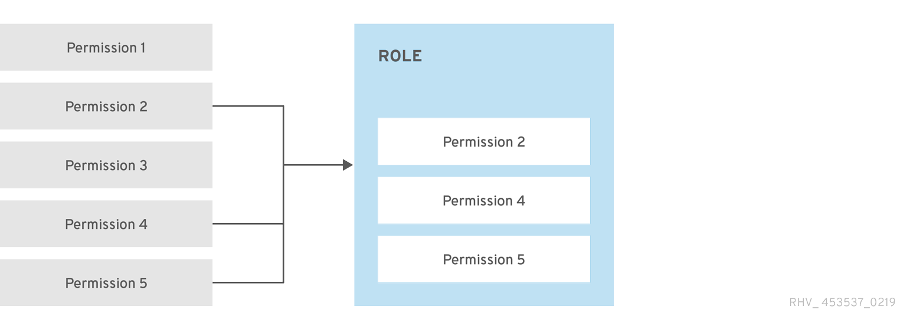
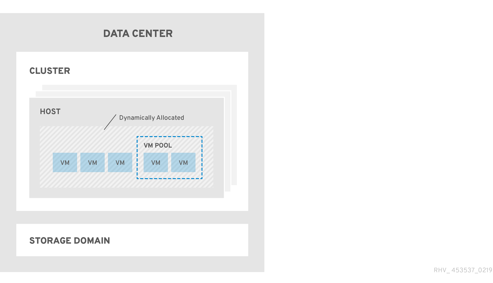
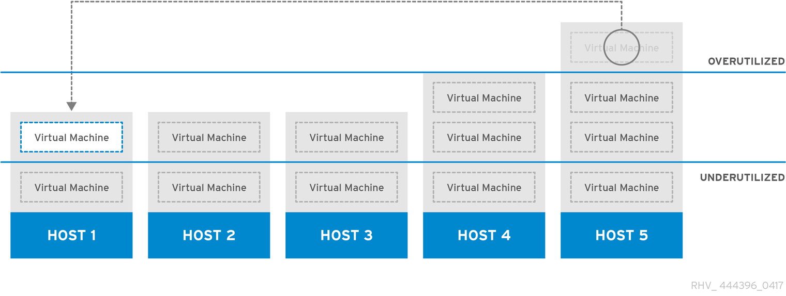
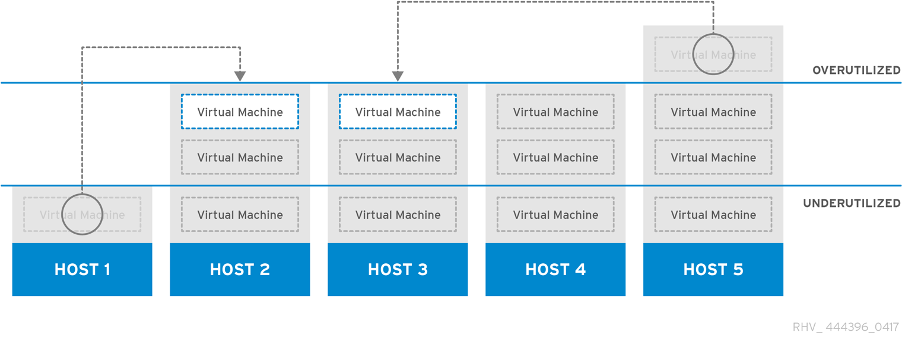

:_content-type: ASSEMBLY
[id="chap-Global_Configuration"]
= Global Configuration

Accessed by clicking menu:Administration[Configure], the *Configure* window allows you to configure a number of global resources for your {virt-product-fullname} environment, such as users, roles, system permissions, scheduling policies, instance types, and MAC address pools. This window allows you to customize the way in which users interact with resources in the environment, and provides a central location for configuring options that can be applied to multiple clusters.

[id="sect-Roles"]
== Roles

Roles are predefined sets of privileges that can be configured from {virt-product-fullname} {engine-name}. Roles provide access and management permissions to different levels of resources in the data center, and to specific physical and virtual resources.

With multilevel administration, any permissions which apply to a container object also apply to all individual objects within that container. For example, when a host administrator role is assigned to a user on a specific host, the user gains permissions to perform any of the available host operations, but only on the assigned host. However, if the host administrator role is assigned to a user on a data center, the user gains permissions to perform host operations on all hosts within the cluster of the data center.

include::topics/Creating_a_new_role.adoc[leveloffset=+2]

include::topics/Editing_a_role.adoc[leveloffset=+2]

include::topics/Authorization_examples.adoc[leveloffset=+2]

[id="sect-System_Permissions"]
== System Permissions

Permissions enable users to perform actions on objects, where objects are either individual objects or container objects. Any permissions that apply to a container object also apply to all members of that container.

[id="rhev-roles-permissions"]
.Permissions &amp; Roles

[id="rhev-object-hierarchy-2"]
.{virt-product-fullname} Object Hierarchy

include::topics/User_properties.adoc[leveloffset=+2]

include::topics/User_properties_roles.adoc[leveloffset=+2]

include::topics/User_Roles_Explained.adoc[leveloffset=+2]

include::topics/Administrator_Roles_Explained.adoc[leveloffset=+2]

include::topics/Assigning_an_Administrator_or_User_Role_to_a_Resource.adoc[leveloffset=+2]

include::topics/Removing_an_Administrator_or_User_Role_from_a_Resource.adoc[leveloffset=+2]

include::topics/Data_center_system_permissions.adoc[leveloffset=+2]

include::topics/Data_center_permissions_entities.adoc[leveloffset=+2]

include::topics/Managing_system_permissions_for_a_cluster.adoc[leveloffset=+2]

include::topics/Cluster_permissions_entities.adoc[leveloffset=+2]

include::topics/Managing_System_Permissions_for_a_Network.adoc[leveloffset=+2]

include::topics/Network_Administrator_and_User_Roles_Explained.adoc[leveloffset=+2]

include::topics/Managing_system_permissions_for_a_host.adoc[leveloffset=+2]

include::topics/Host_administrator_roles_explained.adoc[leveloffset=+2]

include::topics/Managing_system_permissions_for_a_storage_domain.adoc[leveloffset=+2]

include::topics/Storage_administrator_roles_explained.adoc[leveloffset=+2]

include::topics/Managing_system_permissions_for_a_virtual_machine_pool.adoc[leveloffset=+2]

include::topics/Virtual_machine_pool_administrator_roles_explained.adoc[leveloffset=+2]

include::topics/Managing_System_Permissions_for_a_Virtual_Disk.adoc[leveloffset=+2]

include::topics/Virtual_Disk_User_Roles_Explained.adoc[leveloffset=+2]

:context: system_permissions
include::common/admin/proc-Setting_Legacy_SPICE_Cipher.adoc[leveloffset=+3]

[id="sect-Scheduling_Policies"]
== Scheduling Policies

A scheduling policy is a set of rules that defines the logic by which virtual machines are distributed amongst hosts in the cluster that scheduling policy is applied to. Scheduling policies determine this logic via a combination of filters, weightings, and a load balancing policy. The filter modules apply hard enforcement and filter out hosts that do not meet the conditions specified by that filter. The weights modules apply soft enforcement, and are used to control the relative priority of factors considered when determining the hosts in a cluster on which a virtual machine can run.

The {virt-product-fullname} {engine-name} provides five default scheduling policies: *Evenly_Distributed*, *Cluster_Maintenance*, *None*, *Power_Saving*, and *VM_Evenly_Distributed*. You can also define new scheduling policies that provide fine-grained control over the distribution of virtual machines. Regardless of the scheduling policy, a virtual machine will not start on a host with an overloaded CPU. By default, a host's CPU is considered overloaded if it has a load of more than 80% for 5 minutes, but these values can be changed using scheduling policies. See link:{URL_virt_product_docs}{URL_format}administration_guide/index#sect-Scheduling_Policies[Scheduling Policies] in the _Administration Guide_ for more information about the properties of each scheduling policy.

ifdef::rhv-doc[]
For detailed information about how scheduling policies work, see link:https://access.redhat.com/solutions/17604[How does cluster scheduling policy work?].
endif::rhv-doc[]

.Evenly Distributed Scheduling Policy

The *Evenly_Distributed* scheduling policy distributes the memory and CPU processing load evenly across all hosts in the cluster. Additional virtual machines attached to a host will not start if that host has reached the defined *CpuOverCommitDurationMinutes*, *HighUtilization*, or *MaxFreeMemoryForOverUtilized*.

The *VM_Evenly_Distributed* scheduling policy distributes virtual machines evenly between hosts based on a count of the virtual machines. The cluster is considered unbalanced if any host is running more virtual machines than the *HighVmCount* and there is at least one host with a virtual machine count that falls outside of the *MigrationThreshold*.

.Power Saving Scheduling Policy

The *Power_Saving* scheduling policy distributes the memory and CPU processing load across a subset of available hosts to reduce power consumption on underutilized hosts. Hosts with a CPU load below the low utilization value for longer than the defined time interval will migrate all virtual machines to other hosts so that it can be powered down. Additional virtual machines attached to a host will not start if that host has reached the defined high utilization value.

Set the *None* policy to have no load or power sharing between hosts for running virtual machines. This is the default mode. When a virtual machine is started, the memory and CPU processing load is spread evenly across all hosts in the cluster. Additional virtual machines attached to a host will not start if that host has reached the defined *CpuOverCommitDurationMinutes*, *HighUtilization*, or *MaxFreeMemoryForOverUtilized*.

The *Cluster_Maintenance* scheduling policy limits activity in a cluster during maintenance tasks. When the *Cluster_Maintenance* policy is set, no new virtual machines may be started, except highly available virtual machines. If host failure occurs, highly available virtual machines will restart properly and any virtual machine can migrate.

include::topics/Creating_a_Scheduling_Policy.adoc[leveloffset=+2]

include::topics/Explanation_of_Settings_in_the_New_Scheduling_Policy_and_Edit_Scheduling_Policy_Window.adoc[leveloffset=+2]

[id="sect-Instance_Types"]
== Instance Types

Instance types can be used to define the hardware configuration of a virtual machine. Selecting an instance type when creating or editing a virtual machine will automatically fill in the hardware configuration fields. This allows users to create multiple virtual machines with the same hardware configuration without having to manually fill in every field.

[NOTE]
Support for instance types is now deprecated, and will be removed in a future release.

A set of predefined instance types are available by default, as outlined in the following table:

[id="Predef_Instance_Types"]
.Predefined Instance Types
[options="header"]
|===
|Name |Memory |vCPUs
|Tiny |512 MB |1
|Small |2 GB |1
|Medium |4 GB |2
|Large |8 GB |2
|XLarge |16 GB |4
|===

Administrators can also create, edit, and remove instance types from the *Instance Types* tab of the *Configure* window.

Fields in the *New Virtual Machine* and *Edit Virtual Machine* windows that are bound to an instance type have a chain link image next to them (). If the value of one of these fields is changed, the virtual machine will be detached from the instance type, changing to *Custom*, and the chain will appear broken (). However, if the value is changed back, the chain will relink and the instance type will move back to the selected one.

include::topics/Creating_Instance_Types.adoc[leveloffset=+2]

include::topics/Editing_Instance_Types.adoc[leveloffset=+2]

include::topics/Removing_Instance_Types.adoc[leveloffset=+2]

[id="sect-MAC_Address_Pools"]
== MAC Address Pools

MAC address pools define the range(s) of MAC addresses allocated for each cluster. A MAC address pool is specified for each cluster. By using MAC address pools, {virt-product-fullname} can automatically generate and assign MAC addresses to new virtual network devices, which helps to prevent MAC address duplication. MAC address pools are more memory efficient when all MAC addresses related to a cluster are within the range for the assigned MAC address pool.

The same MAC address pool can be shared by multiple clusters, but each cluster has a single MAC address pool assigned. A default MAC address pool is created by {virt-product-fullname} and is used if another MAC address pool is not assigned. For more information about assigning MAC address pools to clusters see xref:Creating_a_New_Cluster[Creating a New Cluster].

[NOTE]
====
If more than one {virt-product-fullname} cluster shares a network, do not rely solely on the default MAC address pool because the virtual machines of each cluster will try to use the same range of MAC addresses, leading to conflicts. To avoid MAC address conflicts, check the MAC address pool ranges to ensure that each cluster is assigned a unique MAC address range.
====

The MAC address pool assigns the next available MAC address following the last address that was returned to the pool. If there are no further addresses left in the range, the search starts again from the beginning of the range. If there are multiple MAC address ranges with available MAC addresses defined in a single MAC address pool, the ranges take turns in serving incoming requests in the same way available MAC addresses are selected.

include::topics/Creating_MAC_Address_Pools.adoc[leveloffset=+2]

include::topics/Editing_MAC_Address_Pools.adoc[leveloffset=+2]

include::topics/Editing_MAC_Address_Pool_Permissions.adoc[leveloffset=+2]

include::topics/Removing_MAC_Address_Pools.adoc[leveloffset=+2]
