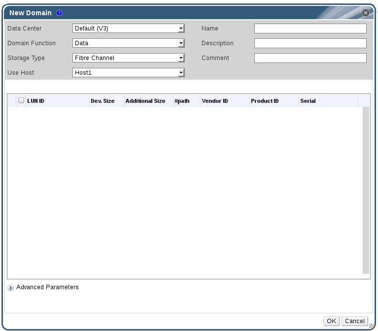

# Adding FCP Storage

Red Hat Virtualization platform supports SAN storage by creating a storage domain from a volume group made of pre-existing LUNs. Neither volume groups nor LUNs can be attached to more than one storage domain at a time.

Red Hat Virtualization system administrators need a working knowledge of Storage Area Networks (SAN) concepts. SAN usually uses Fibre Channel Protocol (FCP) for traffic between hosts and shared external storage. For this reason, SAN may occasionally be referred to as FCP storage.

For information regarding the setup and configuration of FCP or multipathing on Red Hat Enterprise Linux, see the [Storage Administration Guide](https://access.redhat.com/documentation/en-US/Red_Hat_Enterprise_Linux/7/html/Storage_Administration_Guide/index.html) and [DM Multipath Guide](https://access.redhat.com/documentation/en-US/Red_Hat_Enterprise_Linux/7/html/DM_Multipath/index.html).

The following procedure shows you how to attach existing FCP storage to your Red Hat Virtualization environment as a data domain. For more information on other supported storage types, see [Storage](chap-Storage).

**Adding FCP Storage**

1. Click the **Storage** resource tab to list all storage domains.

2. Click **New Domain** to open the **New Domain** window.

3. Enter the **Name** of the storage domain.

    **Adding FCP Storage**

    

4. Use the **Data Center** drop-down menu to select an FCP data center.

    If you do not yet have an appropriate FCP data center, select `(none)`.

5. Use the drop-down menus to select the **Domain Function** and the **Storage Type**. The storage domain types that are not compatible with the chosen data center are not available.

6. Select an active host in the **Use Host** field. If this is not the first data domain in a data center, you must select the data center's SPM host.

    **Important:** All communication to the storage domain is through the selected host and not directly from the Red Hat Virtualization Manager. At least one active host must exist in the system and be attached to the chosen data center. All hosts must have access to the storage device before the storage domain can be configured.

7. The **New Domain** window automatically displays known targets with unused LUNs when **Data / Fibre Channel** is selected as the storage type. Select the **LUN ID** check box to select all of the available LUNs.

8. Optionally, you can configure the advanced parameters.

    1. Click **Advanced Parameters**.

    2. Enter a percentage value into the **Warning Low Space Indicator** field. If the free space available on the storage domain is below this percentage, warning messages are displayed to the user and logged.

    3. Enter a GB value into the **Critical Space Action Blocker** field. If the free space available on the storage domain is below this value, error messages are displayed to the user and logged, and any new action that consumes space, even temporarily, will be blocked.

    4. Select the **Wipe After Delete** check box to enable the wipe after delete option. This option can be edited after the domain is created, but doing so will not change the wipe after delete property of disks that already exist.

9.  Click **OK** to create the storage domain and close the window.

The new FCP data domain displays on the **Storage** tab. It will remain with a `Locked` status while it is being prepared for use. When ready, it is automatically attached to the data center.

