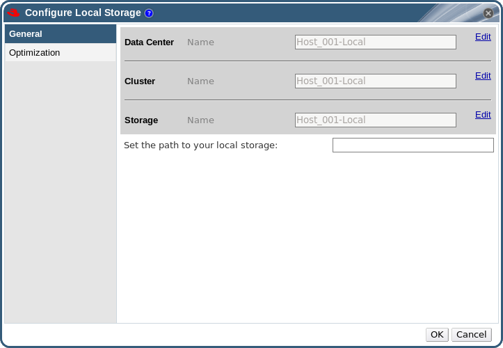

# Adding Local Storage

Storage local to your host has been prepared. Now use the Manager to add it to the host.

Adding local storage to a host in this manner causes the host to be put in a new data center and cluster. The local storage configuration window combines the creation of a data center, a cluster, and storage into a single process.

**Adding Local Storage**

1. Click the **Hosts** resource tab, and select a host in the results list.

2. Click **Maintenance** to open the **Maintenance Host(s)** confirmation window.

3. Click **OK** to initiate maintenance mode.

4. Click **Configure Local Storage** to open the **Configure Local Storage** window.

    **Configure Local Storage Window**

    

5. Click the **Edit** buttons next to the **Data Center**, **Cluster**, and **Storage** fields to configure and name the local storage domain.

6. Set the path to your local storage in the text entry field.

7. If applicable, select the **Optimization** tab to configure the memory optimization policy for the new local storage cluster.

8. Click **OK** to save the settings and close the window.

Your host comes online in a data center of its own.
