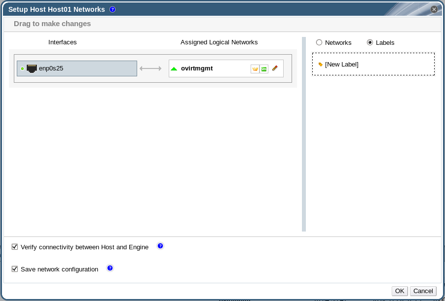

# Adding Network Labels to Host Network Interfaces

Using network labels allows you to greatly simplify the administrative workload associated with assigning logical networks to host network interfaces.

**Note:** Setting a label on a role network (for instance, a migration network or a display network) causes a mass deployment of that network on all hosts. Such mass additions of networks are achieved through the use of DHCP. This method of mass deployment was chosen over a method of typing in static addresses, because of the unscalable nature of the task of typing in many static IP addresses.

**Adding Network Labels to Host Network Interfaces**

1. Click the **Hosts** resource tab, and select in the results list a host associated with the cluster to which your VLAN-tagged logical networks are assigned.

2. Click the **Network Interfaces** tab in the details pane to list the physical network interfaces attached to the data center.

3. Click **Setup Host Networks** to open the **Setup Host Networks** window.

4. Click **Labels**, and right-click **[New Label]**. Select a physical network interface to label.

    

5. Enter a name for the network label in the **Label** text field.

6. Click **OK**.

You have added a network label to a host network interface. Any newly created logical networks with the same label will be automatically assigned to all host network interfaces with that label. Also, removing a label from a logical network will automatically remove that logical network from all host network interfaces with that label.
