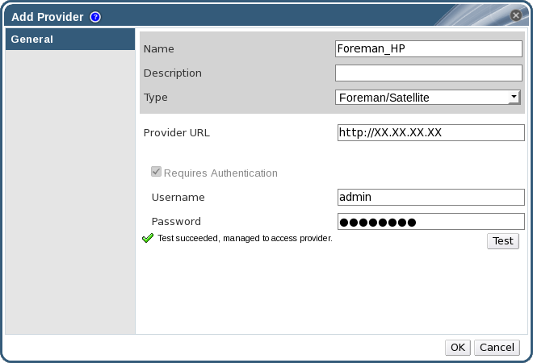

# Adding a Red Hat Satellite Instance for Host Provisioning

Add a Satellite instance for host provisioning to the Red Hat Virtualization Manager. Red Hat Virtualization 4.0 is supported with Red Hat Satellite 6.1.

**Adding a Satellite Instance for Host Provisioning**

1. Select the **External Providers** entry in the tree pane.

2. Click **Add** to open the **Add Provider** window.

    **The Add Provider Window**

    

2. Enter a **Name** and **Description**.

3. From the **Type** list, ensure that **Foreman/Satellite** is selected.

4. Enter the URL or fully qualified domain name of the machine on which the Satellite instance is installed in the **Provider URL** text field. You do not need to specify a port number.

    **Important:** IP addresses cannot be used to add a Satellite instance.

5. Enter the **Username** and **Password** for the Satellite instance. You must use the same user name and password as you would use to log in to the Satellite provisioning portal.

6. Test the credentials:

    1. Click **Test** to test whether you can authenticate successfully with the Satellite instance using the provided credentials.

    2. If the Satellite instance uses SSL, the **Import provider certificates** window opens; click **OK** to import the certificate that the Satellite instance provides.

        **Important:** You must import the certificate that the Satellite instance provides to ensure the Manager can communicate with the instance.

7. Click **OK**.

You have added the Satellite instance to the Red Hat Virtualization Manager, and can work with the hosts it provides.
