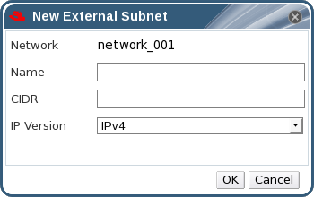

# Adding Subnets to External Provider Logical Networks

Create a subnet on a logical network provided by an external provider.

**Adding Subnets to External Provider Logical Networks**

1. Click the **Networks** tab.

2. Click the logical network provided by an external provider to which the subnet will be added.

3. Click the **Subnets** tab in the details pane.

4. Click the **New** button to open the **New External Subnet** window.

    **The New External Subnet Window**

    

5. Enter a **Name** and **CIDR** for the new subnet.

6. From the **IP Version** drop-down menu, select either **IPv4** or **IPv6**.

7. Click **OK**.
