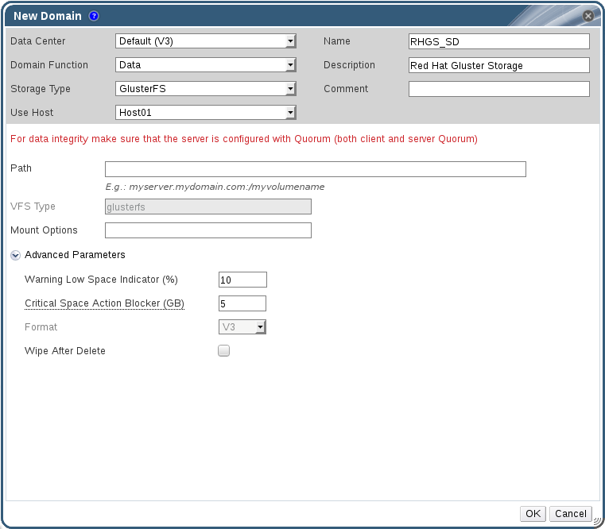

# Attaching a Red Hat Gluster Storage Volume as a Storage Domain

Add a Red Hat Gluster Storage volume to the Red Hat Virtualization Manager to be used directly as a storage domain. This differs from adding a Red Hat Storage Gluster node, which enables control over the volumes and bricks of the node from within the Red Hat Virtualization Manager, and does not require a Gluster-enabled cluster.

The host requires the `glusterfs`, `glusterfs-fuse`, and `glusterfs-cli` packages to be installed in order to mount the volume. The `glusterfs-cli` package is available from the `rh-common-rpms` channel on the Customer Portal.

For information on setting up a Red Hat Gluster Storage node, see the [Red Hat Gluster Storage Installation Guide](https://access.redhat.com/documentation/en-US/Red_Hat_Storage/3.1/html/Installation_Guide/chap-Installing_Red_Hat_Storage.html). For more information on preparing a host to be used with Red Hat Storage Gluster volumes, see the [Configuring Red Hat Virtualization with Red Hat Gluster Storage Guide](https://access.redhat.com/documentation/en-US/Red_Hat_Storage/3.1/html/Configuring_Red_Hat_Enterprise_Virtualization_with_Red_Hat_Gluster_Storage/chap-Enabling_Red_Hat_Storage_in_Red_Hat_Enterprise_Virtualization_Manager.html). For more information on the compatibility matrix, see the [Red Hat Gluster Storage Version Compatibility and Support](https://access.redhat.com/articles/2356261).

**Adding a Red Hat Gluster Storage Volume as a Storage Domain**

1. Click the **Storage** resource tab to list the existing storage domains in the results list.

2. Click **New Domain** to open the **New Domain** window.

    **Red Hat Gluster Storage**

    

3. Enter the **Name** for the storage domain.

4. Select the **Data Center** to be associated with the storage domain.

5. Select `Data` from the **Domain Function** drop-down list.

6. Select `GlusterFS` from the **Storage Type** drop-down list.

7. Select a host from the **Use Host** drop-down list. Only hosts within the selected data center will be listed. To mount the volume, the host that you select must have the `glusterfs` and `glusterfs-fuse` packages installed.

8. In the **Path** field, enter the IP address or FQDN of the Red Hat Gluster Storage server and the volume name separated by a colon.

9. Enter additional **Mount Options**, as you would normally provide them to the `mount` command using the `-o` argument. The mount options should be provided in a comma-separated list. See `man mount` for a list of valid mount options.

10. Optionally, you can configure the advanced parameters.

    1. Click **Advanced Parameters**.

    2. Enter a percentage value into the **Warning Low Space Indicator** field. If the free space available on the storage domain is below this percentage, warning messages are displayed to the user and logged.

    3. Enter a GB value into the **Critical Space Action Blocker** field. If the free space available on the storage domain is below this value, error messages are displayed to the user and logged, and any new action that consumes space, even temporarily, will be blocked.

    4. Select the **Wipe After Delete** check box to enable the wipe after delete option. This option can be edited after the domain is created, but doing so will not change the wipe after delete property of disks that already exist.

11. Click **OK** to mount the volume as a storage domain and close the window.

