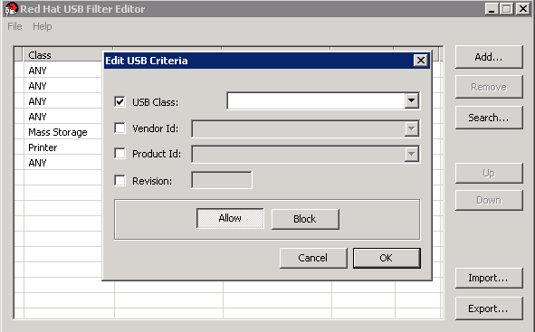
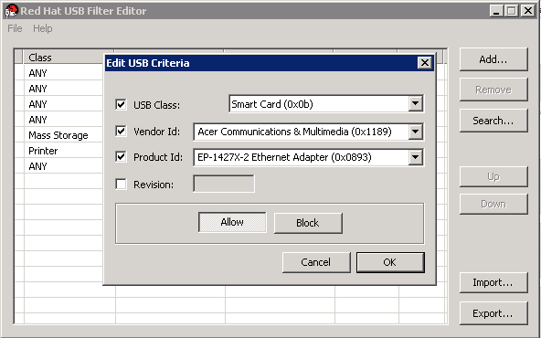

# Adding a USB Policy

**Summary**

Add a USB policy to the USB Filter Editor.

Double-click the USB Filter Editor shortcut icon on your desktop to open the editor.

**Adding a USB Policy**

1. Click the **Add** button. The **Edit USB Criteria** window opens:

    **Edit USB Criteria**

    

2. Use the **USB Class**, **Vendor ID**, **Product ID**, and **Revision** check boxes and lists to specify the device.

    Click the **Allow** button to permit virtual machines use of the USB device; click the **Block** button to prohibit the USB device from virtual machines.

    Click **OK** to add the selected filter rule to the list and close the window.

    **Adding a Device**

    The following is an example of how to add USB Class `Smartcard`, device `EP-1427X-2 Ethernet Adapter`, from manufacturer `Acer Communications & Multimedia` to the list of allowed devices.

    

3. Click **File** > **Save** to save the changes.

**Result**

You have added a USB policy to the USB Filter Editor. USB filter policies need to be exported to the Red Hat Virtualization Manager to take effect.
