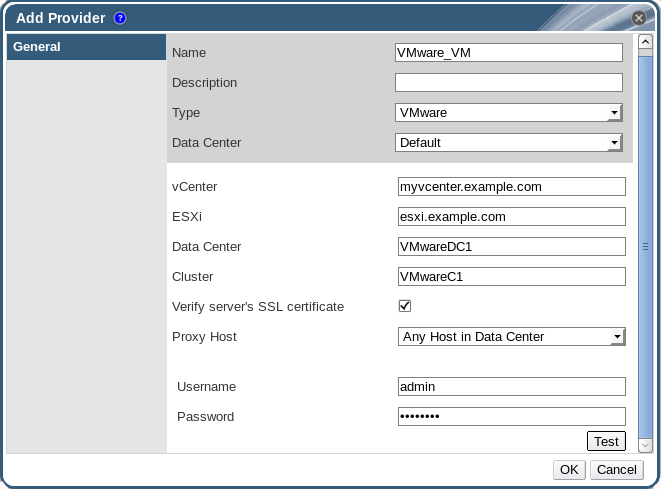

# Adding a VMware Instance as a Virtual Machine Provider

Add a VMware vCenter instance to import virtual machines from VMware to the Red Hat Virtualization Manager.

Red Hat Virtualization uses V2V to convert VMware virtual machines to the correct format before they are imported. You must install the `virt-v2v` package on a least one Red Hat Enterprise Linux 7.2 or later host. This package is available in the base `rhel-7-server-rpms` repository.

**Adding a VMware vCenter Instance as a Virtual Machine Provider**

1. Select the **External Providers** entry in the tree pane.

2. Click **Add** to open the **Add Provider** window.

    **The Add Provider Window**

    

3. Enter a **Name** and **Description**.

4. From the **Type** list, select **VMware**.

5. Select the **Data Center** into which VMware virtual machines will be imported, or select **Any Data Center** to instead specify the destination data center during individual import operations (using the **Import** function in the **Virtual Machines** tab).

6. Enter the IP address or fully qualified domain name of the VMware vCenter instance in the **vCenter** field.

7. Enter the IP address or fully qualified domain name of the host from which the virtual machines will be imported in the **ESXi** field.

8. Enter the name of the data center in which the specified ESXi host resides in the **Data Center** field.

9. If you have exchanged the SSL certificate between the ESXi host and the Manager, leave **Verify server's SSL certificate** checked to verify the ESXi host's certificate. If not, uncheck the option.

10. Select a host in the chosen data center with `virt-v2v` installed to serve as the **Proxy Host** during virtual machine import operations. This host must also be able to connect to the network of the VMware vCenter external provider. If you selected **Any Data Center** above, you cannot choose the host here, but instead can specify a host during individual import operations (using the **Import** function in the **Virtual Machines** tab).

11. Enter the **Username** and **Password** for the VMware vCenter instance. The user must have access to the VMware data center and ESXi host on which the virtual machines reside.

12. Test the credentials:

    1. Click **Test** to test whether you can authenticate successfully with the VMware vCenter instance using the provided credentials.

    2. If the VMware vCenter instance uses SSL, the **Import provider certificates** window opens; click **OK** to import the certificate that the VMware vCenter instance provides.

        **Important:** You must import the certificate that the VMware vCenter instance provides to ensure the Manager can communicate with the instance.

13. Click **OK**.

You have added the VMware vCenter instance to the Red Hat Virtualization Manager, and can import the virtual machines it provides. See [Importing a Virtual Machine from a VMware Provider](https://access.redhat.com/documentation/en/red-hat-virtualization/4.0/single/virtual-machine-management-guide/#Importing_a_Virtual_Machine_from_a_VMware_Provider) in the *Virtual Machine Management Guide* for more information.

