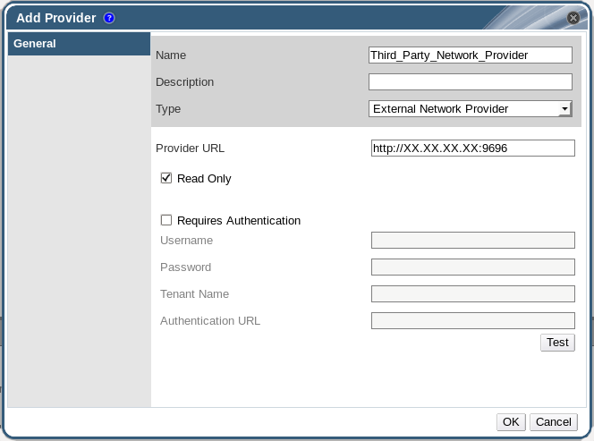

# Adding an External Network Provider

Any network provider that implements the OpenStack Neutron REST API can be added to Red Hat Virtualization. The virtual interface driver needs to be provided by the implementer of the external network provider. A reference implementation of a network provider and a virtual interface driver are available at [https://github.com/mmirecki/ovirt-provider-mock](https://github.com/mmirecki/ovirt-provider-mock) and [https://github.com/mmirecki/ovirt-provider-mock/blob/master/docs/driver_instalation](https://github.com/mmirecki/ovirt-provider-mock/blob/master/docs/driver_instalation).

**Adding an External Network Provider for Network Provisioning**

1. Select the **External Providers** entry in the tree pane.

2. Click **Add**.

    **The Add Provider Window**

    

3. Enter a **Name** and **Description**.

4. From the **Type** list, select **External Network Provider**.

5. Enter the URL or fully qualified domain name of the machine on which the external network provider is installed in the **Provider URL** text field, followed by the port number. The **Read-Only** check box is selected by default. This prevents users from modifying the external network provider.

    **Important:** You must leave the **Read-Only** check box selected for your setup to be supported by Red Hat.

6. Optionally, select the **Requires Authentication** check box and enter the **Username**, **Password**, **Tenant Name**, and **Authentication URL** for the external network provider.

7. Test the credentials:

    1. Click **Test** to test whether you can authenticate successfully with the external network provider using the provided credentials.

    2. If the external network provider uses SSL, the **Import provider certificates** window opens; click **OK** to import the certificate that the external network provider provides to ensure the Manager can communicate with the instance.

You have added an external networking provider to the Red Hat Virtualization Manager. Before you can use the networks it provides, you need to install the virtual interface driver on the hosts and import the networks. To import networks, see [Importing Networks](Importing_Networks).
