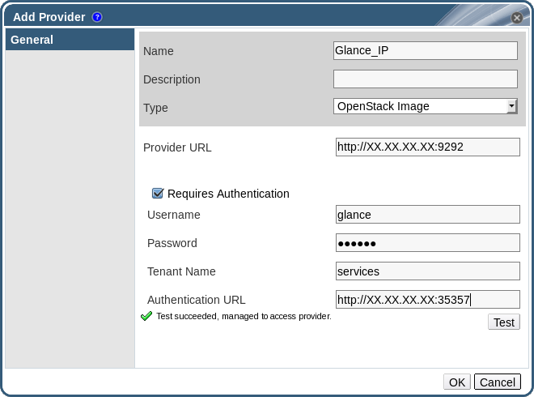

# Adding an OpenStack Image (Glance) Instance for Image Management

Add an OpenStack Image (Glance) instance for image management to the Red Hat Virtualization Manager.

**Adding an OpenStack Image (Glance) Instance for Image Management**

1. Select the **External Providers** entry in the tree pane.

2. Click **Add** to open the **Add Provider** window.

    **The Add Provider Window**

    

3. Enter a **Name** and **Description**.

4. From the **Type** list, select **OpenStack Image**.

5. Enter the URL or fully qualified domain name of the machine on which the OpenStack Image instance is installed in the **Provider URL** text field.

6. Optionally, select the **Requires Authentication** check box and enter the **Username**, **Password**, **Tenant Name**, and **Authentication URL** for the OpenStack Image instance. You must use the user name and password for the OpenStack Image user registered in Keystone, the tenant of which the OpenStack Image instance is a member, and the URL and port of the Keystone server.

7. Test the credentials:

    1. Click **Test** to test whether you can authenticate successfully with the OpenStack Image instance using the provided credentials.

    2. If the OpenStack Image instance uses SSL, the **Import provider certificates** window opens; click **OK** to import the certificate that the OpenStack Image instance provides.

        **Important:** You must import the certificate that the OpenStack Image instance provides to ensure the Manager can communicate with the instance.

8. Click **OK**.

You have added the OpenStack Image instance to the Red Hat Virtualization Manager, and can work with the images it provides.
