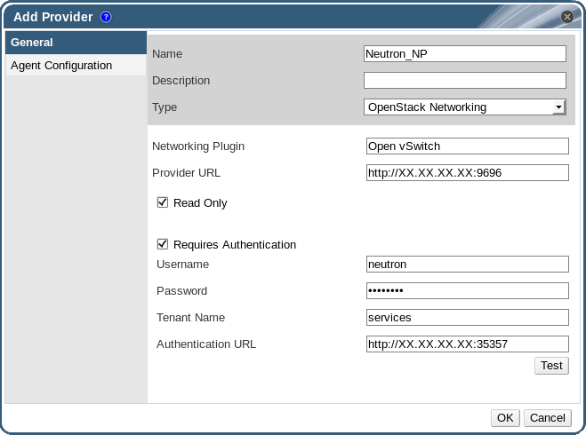
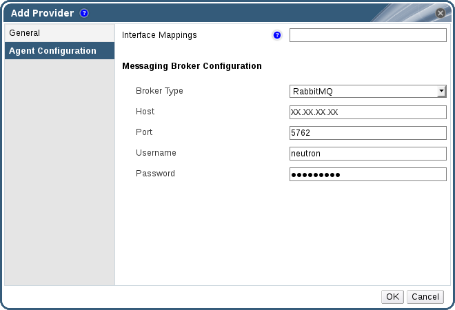

# Adding an OpenStack Networking (Neutron) Instance for Network Provisioning

Add an OpenStack Networking (Neutron) instance for network provisioning to the Red Hat Virtualization Manager. To add other third-party network providers that implement the OpenStack Neutron REST API, see [Adding an External Network Provider](Adding_an_External_Network_Provider).

**Important:** Red Hat Virtualization supports Red Hat OpenStack Platform 8 as an external network provider.

**Adding an OpenStack Networking (Neutron) Instance for Network Provisioning**

1. Select the **External Providers** entry in the tree pane.

2. Click **Add** to open the **Add Provider** window.

    **The Add Provider Window**

    

3. Enter a **Name** and **Description**.

4. From the **Type** list, select **OpenStack Networking**.

5. Ensure that **Open vSwitch** is selected in the **Networking Plugin** field.

6. Enter the URL or fully qualified domain name of the machine on which the OpenStack Networking instance is installed in the **Provider URL** text field, followed by the port number. The **Read-Only** check box is selected by default. This prevents users from modifying the OpenStack Networking instance.

    **Important:** You must leave the **Read-Only** check box selected for your setup to be supported by Red Hat.

7. Optionally, select the **Requires Authentication** check box and enter the **Username**, **Password**, **Tenant Name**, and **Authentication URL** for the OpenStack Networking instance. You must use the user name and password for the OpenStack Networking user registered in Keystone, the tenant of which the OpenStack Networking instance is a member, and the URL and port of the Keystone server.

8. Test the credentials:

    1. Click **Test** to test whether you can authenticate successfully with the OpenStack Networking instance using the provided credentials.

    2. If the OpenStack Networking instance uses SSL, the **Import provider certificates** window opens; click **OK** to import the certificate that the OpenStack Networking instance provides to ensure the Manager can communicate with the instance.

    **Warning:** The following steps are provided only as a Technology Preview. Red Hat Virtualization only supports preconfigured Neutron hosts.

9. Click the **Agent Configuration** tab.

    **The Agent Configuration Tab**

    

10. Enter a comma-separated list of interface mappings for the Open vSwitch agent in the **Interface Mappings** field.

11. Select the message broker type that the OpenStack Networking instance uses from the **Broker Type** list.

12. Enter the URL or fully qualified domain name of the host on which the message broker is hosted in the **Host** field.

13. Enter the **Port** by which to connect to the message broker. This port number will be 5762 by default if the message broker is not configured to use SSL, and 5761 if it is configured to use SSL.

14. Enter the **Username** and **Password** of the OpenStack Networking user registered in the message broker instance.

15. Click **OK**.

You have added the OpenStack Networking instance to the Red Hat Virtualization Manager. Before you can use the networks it provides, import the networks into the Manager. See [Importing Networks](Importing_Networks).
