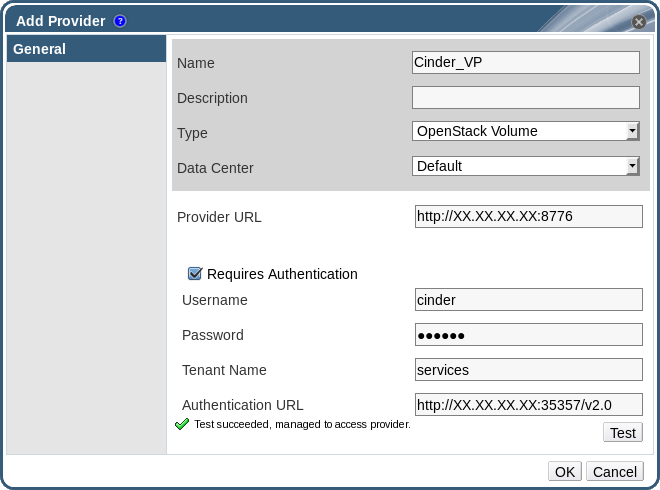

# Adding an OpenStack Volume (Cinder) Instance for Storage Management

Add an OpenStack Volume (Cinder) instance for storage management to the Red Hat Virtualization Manager. The OpenStack Cinder volumes are provisioned by Ceph Storage.

**Adding an OpenStack Volume (Cinder) Instance for Storage Management**

1. Select the **External Providers** entry in the tree pane.

2. Click **Add** to open the **Add Provider** window.

    **The Add Provider Window**

    

3. Enter a **Name** and **Description**.

4. From the **Type** list, select **OpenStack Volume**.

5. Select the **Data Center** to which OpenStack Volume storage volumes will be attached.

6. Enter the URL or fully qualified domain name of the machine on which the OpenStack Volume instance is installed, followed by the port number, in the **Provider URL** text field.

7. Optionally, select the **Requires Authentication** check box and enter the **Username**, **Password**, **Tenant Name**, and **Authentication URL** for the OpenStack Volume instance. You must use the user name and password for the OpenStack Volume user registered in Keystone, the tenant of which the OpenStack Volume instance is a member, and the URL, port, and API version of the Keystone server.

8. Click **Test** to test whether you can authenticate successfully with the OpenStack Volume instance using the provided credentials.

9. Click **OK**.

10. If client Ceph authentication (`cephx`) is enabled, you must also complete the following steps. The `cephx` protocol is enabled by default.

    1. On your Ceph server, create a new secret key for the `client.cinder` user using the `ceph auth get-or-create` command. See [Cephx Config Reference](https://access.redhat.com/documentation/en/red-hat-ceph-storage/version-1.3/configuration-guide/#cephx_configuration_reference) for more information on `cephx`, and [Managing Users](https://access.redhat.com/documentation/en/red-hat-ceph-storage/version-1.3/red-hat-ceph-storage-13-red-hat-ceph-administration-guide/chapter-5-managing-users#managing-users) for more information on creating keys for new users. If a key already exists for the `client.cinder` user, retrieve it using the same command.

    2. In the Administration Portal, select the newly-created Cinder external provider from the **Providers** list.

    3. Click the **Authentication Keys** sub-tab.

    4. Click **New**.

    5. Enter the secret key in the **Value** field.

    6. Copy the automatically-generated **UUID**, or enter an existing UUID in the text field. 

    7. On your Cinder server, add the UUID from the previous step and the `cinder` user to `/etc/cinder/cinder.conf`:

            rbd_secret_uuid = UUID
            rbd_user = cinder

You have added the OpenStack Volume instance to the Red Hat Virtualization Manager, and can work with the storage volumes it provides. See [Creating Unassociated Virtual Machine Hard Disks](Creating_Unassociated_Virtual_Machine_Hard_Disks) for more information about creating a OpenStack Volume (Cinder) disk.
