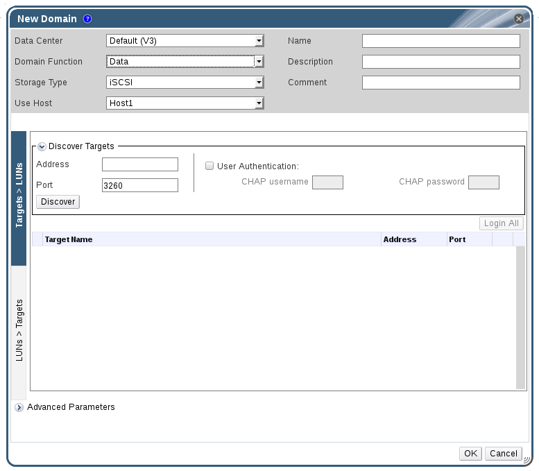

# Adding iSCSI Storage

Red Hat Virtualization platform supports iSCSI storage by creating a storage domain from a volume group made of pre-existing LUNs. Neither volume groups nor LUNs can be attached to more than one storage domain at a time.

For information regarding the setup and configuration of iSCSI on Red Hat Enterprise Linux, see [Online Storage Management](https://access.redhat.com/documentation/en-US/Red_Hat_Enterprise_Linux/7/html/Storage_Administration_Guide/ch25.html) in the *Red Hat Enterprise Linux Storage Administration Guide*.

**Adding iSCSI Storage**

1. Click the **Storage** resource tab to list the existing storage domains in the results list.

2. Click the **New Domain** button to open the **New Domain** window.

3. Enter the **Name** of the new storage domain.

    **New iSCSI Domain**

    

4. Use the **Data Center** drop-down menu to select an data center.

5. Use the drop-down menus to select the **Domain Function** and the **Storage Type**. The storage domain types that are not compatible with the chosen domain function are not available.

6. Select an active host in the **Use Host** field. If this is not the first data domain in a data center, you must select the data center's SPM host.

    **Important:** All communication to the storage domain is through the selected host and not directly from the Red Hat Virtualization Manager. At least one active host must exist in the system and be attached to the chosen data center. All hosts must have access to the storage device before the storage domain can be configured.

7. The Red Hat Virtualization Manager is able to map either iSCSI targets to LUNs, or LUNs to iSCSI targets. The **New Domain** window automatically displays known targets with unused LUNs when iSCSI is selected as the storage type. If the target that you are adding storage from is not listed then you can use target discovery to find it, otherwise proceed to the next step.

    **iSCSI Target Discovery**

    1. Click **Discover Targets** to enable target discovery options. When targets have been discovered and logged in to, the **New Domain** window automatically displays targets with LUNs unused by the environment.

        **Note:** LUNs used externally to the environment are also displayed.

        You can use the **Discover Targets** options to add LUNs on many targets, or multiple paths to the same LUNs.

    2. Enter the fully qualified domain name or IP address of the iSCSI host in the **Address** field.

    3. Enter the port to connect to the host on when browsing for targets in the **Port** field. The default is `3260`.

    4. If the Challenge Handshake Authentication Protocol (CHAP) is being used to secure the storage, select the **User Authentication** check box. Enter the **CHAP user name** and **CHAP password**.

        **Note:** It is now possible to use the REST API to define specific credentials to each iSCSI target per host. See [Defining Credentials to an iSCSI Target](https://access.redhat.com/documentation/en/red-hat-virtualization/4.0/single/rest-api-guide/#Defining_Credentials_to_an_iSCSI_Target) in the *REST API Guide* for more information.

    5. Click the **Discover** button.

    6. Select the target to use from the discovery results and click the **Login** button.

        Alternatively, click the **Login All** to log in to all of the discovered targets.

        **Important:** If more than one path access is required, ensure to discover and log in to the target through all the required paths. Modifying a storage domain to add additional paths is currently not supported.

8. Click the **+** button next to the desired target. This will expand the entry and display all unused LUNs attached to the target.

9. Select the check box for each LUN that you are using to create the storage domain.

10. Optionally, you can configure the advanced parameters.

    1. Click **Advanced Parameters**.

    2. Enter a percentage value into the **Warning Low Space Indicator** field. If the free space available on the storage domain is below this percentage, warning messages are displayed to the user and logged.

    3. Enter a GB value into the **Critical Space Action Blocker** field. If the free space available on the storage domain is below this value, error messages are displayed to the user and logged, and any new action that consumes space, even temporarily, will be blocked.

    4. Select the **Wipe After Delete** check box to enable the wipe after delete option. This option can be edited after the domain is created, but doing so will not change the wipe after delete property of disks that already exist.

11. Click **OK** to create the storage domain and close the window.

If you have configured multiple storage connection paths to the same target, follow the procedure in [Configuring iSCSI Multipathing](Configuring_iSCSI_Multipathing) to complete iSCSI bonding.

