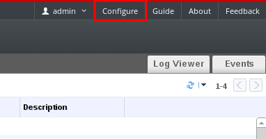

# Adding Users and Assigning User Portal Permissions

Users must be created already before they can be added and assigned roles and permissions. The roles and permissions assigned in this procedure give the user the permission to log in to the User Portal and to start creating virtual machines. The procedure also applies to group accounts.

**Adding Users and Assigning User Portal Permissions**

1. On the header bar, click **Configure** to open the **Configure** window. Click **System Permissions**.

    

2. Click **Add** to open the **Add System Permission to User** window.

3. Select a profile under **Search**. The profile is the domain you want to search. Enter a name or part of a name in the search text field, and click **GO**. Alternatively, click **GO** to view a list of all users and groups.

4. Select the check boxes for the appropriate users or groups.

5. Select an appropriate role to assign under **Role to Assign**. The **UserRole** role gives the user account the permission to log in to the User Portal.

6. Click **OK**.

Log in to the User Portal to verify that the user account has the permissions to log in.
