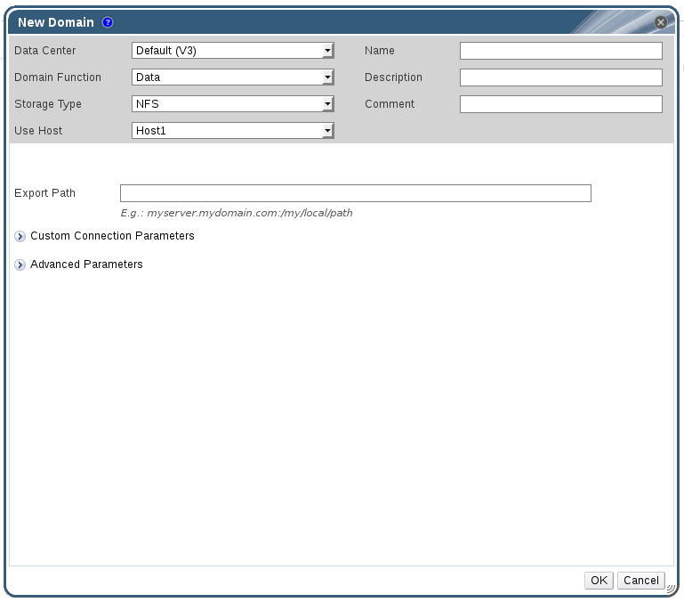

# Attaching NFS Storage

Attach an NFS storage domain to the data center in your Red Hat Virtualization environment. This storage domain provides storage for virtualized guest images and ISO boot media. This procedure assumes that you have already exported shares. You must create the data domain before creating the export domain. Use the same procedure to create the export domain, selecting **Export / NFS** in the **Domain Function / Storage Type** list.

1. In the Red Hat Virtualization Manager Administration Portal, click the **Storage** resource tab.

2. Click **New Domain**.

    **The New Domain Window**

    

3. Enter a **Name** for the storage domain.

4. Accept the default values for the **Data Center**, **Domain Function**, **Storage Type**, **Format**, and **Use Host** lists.

5. Enter the **Export Path** to be used for the storage domain.

    The export path should be in the format of `192.168.0.10:/data` or `domain.example.com:/data`.

6. Optionally, you can configure the advanced parameters.

    1. Click **Advanced Parameters**.

    2. Enter a percentage value into the **Warning Low Space Indicator** field. If the free space available on the storage domain is below this percentage, warning messages are displayed to the user and logged.

    3. Enter a GB value into the **Critical Space Action Blocker** field. If the free space available on the storage domain is below this value, error messages are displayed to the user and logged, and any new action that consumes space, even temporarily, will be blocked.

    4. Select the **Wipe After Delete** check box to enable the wipe after delete option. This option can be edited after the domain is created, but doing so will not change the wipe after delete property of disks that already exist.

7. Click **OK**.

    The new NFS data domain is displayed in the **Storage** tab with a status of `Locked` until the disk is prepared. The data domain is then automatically attached to the data center.

