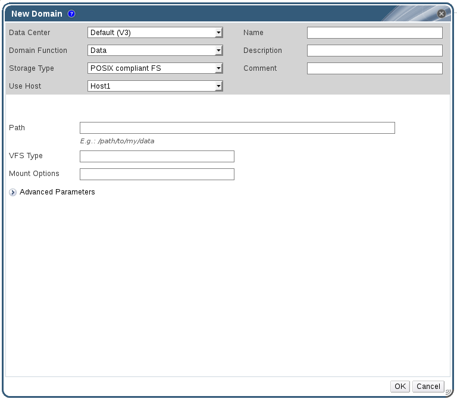

# Attaching POSIX Compliant File System Storage

You want to use a POSIX compliant file system that is not exposed using NFS, iSCSI, or FCP as a storage domain.

**Attaching POSIX Compliant File System Storage**

1. Click the **Storage** resource tab to list the existing storage domains in the results list.

2. Click **New Domain** to open the **New Domain** window.

    **POSIX Storage**

    

3. Enter the **Name** for the storage domain.

4. Select the **Data Center** to be associated with the storage domain. The Data Center selected must be of type **POSIX (POSIX compliant FS)**. Alternatively, select `(none)`.

5. Select `Data / POSIX compliant FS` from the **Domain Function / Storage Type** drop-down menu.

    If applicable, select the **Format** from the drop-down menu.

6. Select a host from the **Use Host** drop-down menu. Only hosts within the selected data center will be listed. The host that you select will be used to connect the storage domain.

7. Enter the **Path** to the POSIX file system, as you would normally provide it to the `mount` command.

8. Enter the **VFS Type**, as you would normally provide it to the `mount` command using the `-t` argument. See `man mount` for a list of valid VFS types.

9. Enter additional **Mount Options**, as you would normally provide them to the `mount` command using the `-o` argument. The mount options should be provided in a comma-separated list. See `man mount` for a list of valid mount options.

10. Optionally, you can configure the advanced parameters.

    1. Click **Advanced Parameters**.

    2. Enter a percentage value into the **Warning Low Space Indicator** field. If the free space available on the storage domain is below this percentage, warning messages are displayed to the user and logged.

    3. Enter a GB value into the **Critical Space Action Blocker** field. If the free space available on the storage domain is below this value, error messages are displayed to the user and logged, and any new action that consumes space, even temporarily, will be blocked.

    4. Select the **Wipe After Delete** check box to enable the wipe after delete option. This option can be edited after the domain is created, but doing so will not change the wipe after delete property of disks that already exist.

11. Click **OK** to attach the new Storage Domain and close the window.
