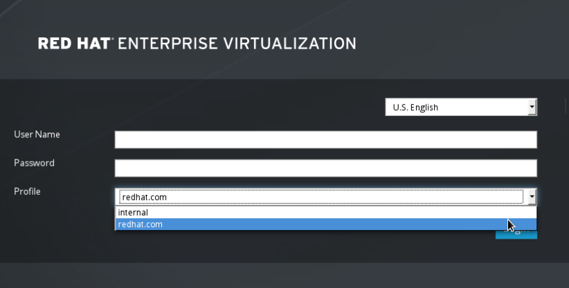

# Attaching an Active Directory

**Prerequisites:**

* You need to know the Active Directory forest name. The forest name is also known as the root domain name.

* You need to either add the DNS server that can resolve the Active Directory forest name to the `/etc/resolv.conf` file on the Manager, or note down the Active Directory DNS servers and enter them when prompted by the interactive setup script.

* To set up secure connection between the LDAP server and the Manager, ensure a PEM-encoded CA certificate has been prepared. See [Setting Up SSL or TLS Connections between the Manager and an LDAP Server](Setting_Up_SSL_or_TLS_Connections_between_the_Manager_and_an_LDAP_Server) for more information.

* Unless anonymous search is supported, a user with permissions to browse all users and groups must be available on the Active Directory to be used as the search user. Note down the search user's distinguished name (DN). Do not use the administrative user for the Active Directory.

* Have at least one set of account name and password ready to perform search and login queries to the Active Directory.

**Configuring an External LDAP Provider**

1. On the Red Hat Virtualization Manager, install the LDAP extension package:

        # yum install ovirt-engine-extension-aaa-ldap-setup

2. Run `ovirt-engine-extension-aaa-ldap-setup` to start the interactive setup:

        # ovirt-engine-extension-aaa-ldap-setup

3. Specify a profile name. The profile name is visible to users on the login page. This example uses `redhat.com`.

        Please specify profile name that will be visible to users:redhat.com

    **The Administration Portal Login Page**

    

    **Note:** Users need to select the desired profile from the drop-down list when logging in for the first time. The information is then stored in browser cookies and preselected the next time the user logs in.

4. Select an LDAP type by entering the corresponding number. The LDAP related questions after this step is different for different LDAP types.

        Available LDAP implementations:
        1 - 389ds
        2 - 389ds RFC-2307 Schema
        3 - Active Directory
        4 - IPA
        5 - Novell eDirectory RFC-2307 Schema
        6 - OpenLDAP RFC-2307 Schema
        7 - OpenLDAP Standard Schema
        8 - Oracle Unified Directory RFC-2307 Schema
        9 - RFC-2307 Schema (Generic)
        10 - RHDS
        11 - RHDS RFC-2307 Schema
        12 - iPlanet
        Please select: 3

5. Enter the Active Directory forest name. If the forest name is not resolvable by your Manager's DNS, the script prompts you to enter a space-separated list of Active Directory DNS server names.

        Please enter Active Directory Forest name: ad-example.redhat.com
        [ INFO  ] Resolving Global Catalog SRV record for ad-example.redhat.com
        [ INFO  ] Resolving LDAP SRV record for ad-example.redhat.com

6. Select the secure connection method your LDAP server supports and specify the method to obtain a PEM-encoded CA certificate. The file option allows you to provide the full path to the certificate. The URL option allows you to specify a URL to the certificate. Use the inline option to paste the content of the certificate in the terminal. The system option allows you to specify the location for all CA files. The insecure option allows you to use startTLS in insecure mode.

        NOTE:
        It is highly recommended to use secure protocol to access the LDAP server.
        Protocol startTLS is the standard recommended method to do so.
        Only in cases in which the startTLS is not supported, fallback to non standard ldaps protocol.
        Use plain for test environments only.
        Please select protocol to use (startTLS, ldaps, plain) [startTLS]: startTLS
        Please select method to obtain PEM encoded CA certificate (File, URL, Inline, System, Insecure): File
        Please enter the password:

    **Note:** LDAPS stands for Lightweight Directory Access Protocol Over Secure Socket Links. For SSL connections, select the `ldaps` option.

    For more information on creating a PEM-encoded CA certificate, see [Setting Up SSL or TLS Connections between the Manager and an LDAP Server](Setting_Up_SSL_or_TLS_Connections_between_the_Manager_and_an_LDAP_Server).

7. Enter the search user distinguished name (DN). The user must have permissions to browse all users and groups on the directory server. The search user must be of LDAP annotation. If anonymous search is allowed, press **Enter** without any input.

        Enter search user DN (empty for anonymous): uid=user1,ou=Users,dc=test,dc=redhat,dc=com
        Enter search user password:

8. Test the search and login function to ensure your LDAP server is connected to your Red Hat Virtualization environment properly. For the login query, enter the account name and password. For the search query, select `Principal` for user accounts, and select `Group` for group accounts. Enter `Yes` to `Resolve Groups` if you want the group account information for the user account to be returned. Select `Done` to complete the setup. Three configuration files are created and displayed in the screen output.

        NOTE:
        It is highly recommended to test drive the configuration before applying it into engine.
        Perform at least one Login sequence and one Search sequence.
        Select test sequence to execute (Done, Abort, Login, Search) [Abort]: Login
        Enter search user name: testuser1
        Enter search user password:
        [ INFO  ] Executing login sequence...
        ...
        Select test sequence to execute (Done, Abort, Login, Search) [Abort]: Search
        Select entity to search (Principal, Group) [Principal]:
        Term to search, trailing '*' is allowed: testuser1
        Resolve Groups (Yes, No) [No]: 
        [ INFO  ] Executing login sequence...
        ...
        Select test sequence to execute (Done, Abort, Login, Search) [Abort]: Done
        [ INFO  ] Stage: Transaction setup
        [ INFO  ] Stage: Misc configuration
        [ INFO  ] Stage: Package installation
        [ INFO  ] Stage: Misc configuration
        [ INFO  ] Stage: Transaction commit
        [ INFO  ] Stage: Closing up
                  CONFIGURATION SUMMARY
                  Profile name is: redhat.com
                  The following files were created:
                      /etc/ovirt-engine/aaa/redhat.com.properties
                      /etc/ovirt-engine/extensions.d/redhat.com-authz.properties
                      /etc/ovirt-engine/extensions.d/redhat.com-authn.properties
        [ INFO  ] Stage: Clean up
                  Log file is available at /tmp/ovirt-engine-extension-aaa-ldap-setup-20160114064955-1yar9i.log:
        [ INFO  ] Stage: Pre-termination
        [ INFO  ] Stage: Termination

9. The profile you have created is now available on the Administration Portal and the User Portal login pages. To assign the user accounts on the LDAP server appropriate roles and permissions, for example to log in to the User Portal, see [Red Hat Enterprise Virtualization Manager User Tasks](sect-Red_Hat_Enterprise_Virtualization_Manager_User_Tasks).

**Note:** For more information, see the LDAP authentication and authorization extension README file at `/usr/share/doc/ovirt-engine-extension-aaa-ldap-version`.
