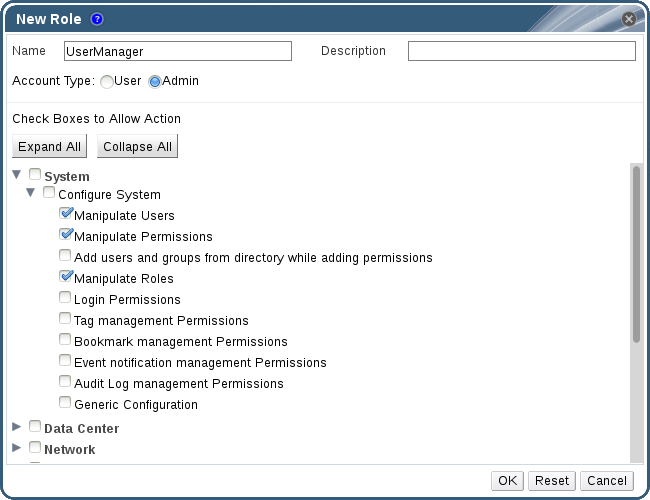

# User Role and Authorization Examples

The following examples illustrate how to apply authorization controls for various scenarios, using the different features of the authorization system described in this chapter.

**Cluster Permissions**

Sarah is the system administrator for the accounts department of a company. All the virtual resources for her department are organized under a Red Hat Virtualization `cluster` called `Accounts`. She is assigned the `ClusterAdmin` role on the accounts cluster. This enables her to manage all virtual machines in the cluster, since the virtual machines are child objects of the cluster. Managing the virtual machines includes editing, adding, or removing virtual resources such as disks, and taking snapshots. It does not allow her to manage any resources outside this cluster. Because `ClusterAdmin` is an administrator role, it allows her to use the Administration Portal to manage these resources, but does not give her any access via the User Portal.

**VM PowerUser Permissions**

John is a software developer in the accounts department. He uses virtual machines to build and test his software. Sarah has created a virtual desktop called `johndesktop` for him. John is assigned the `UserVmManager` role on the `johndesktop` virtual machine. This allows him to access this single virtual machine using the User Portal. Because he has `UserVmManager` permissions, he can modify the virtual machine and add resources to it, such as new virtual disks. Because `UserVmManager` is a user role, it does not allow him to use the Administration Portal.

**Data Center Power User Role Permissions**

Penelope is an office manager. In addition to her own responsibilities, she occasionally helps the HR manager with recruitment tasks, such as scheduling interviews and following up on reference checks. As per corporate policy, Penelope needs to use a particular application for recruitment tasks.

While Penelope has her own machine for office management tasks, she wants to create a separate virtual machine to run the recruitment application. She is assigned `PowerUserRole` permissions for the data center in which her new virtual machine will reside. This is because to create a new virtual machine, she needs to make changes to several components within the data center, including creating the virtual machine disk image in the storage domain.

Note that this is not the same as assigning `DataCenterAdmin` privileges to Penelope. As a PowerUser for a data center, Penelope can log in to the User Portal and perform virtual machine-specific actions on virtual machines within the data center. She cannot perform data center-level operations such as attaching hosts or storage to a data center.

**Network Administrator Permissions**

Chris works as the network administrator in the IT department. Her day-to-day responsibilities include creating, manipulating, and removing networks in the department's Red Hat Virtualization environment. For her role, she requires administrative privileges on the resources and on the networks of each resource. For example, if Chris has `NetworkAdmin` privileges on the IT department's data center, she can add and remove networks in the data center, and attach and detach networks for all virtual machines belonging to the data center.

In addition to managing the networks of the company's virtualized infrastructure, Chris also has a junior network administrator reporting to her. The junior network administrator, Pat, is managing a smaller virtualized environment for the company's internal training department. Chris has assigned Pat `VnicProfileUser` permissions and `UserVmManager` permissions for the virtual machines used by the internal training department. With these permissions, Pat can perform simple administrative tasks such as adding network interfaces onto virtual machines in the **Extended** tab of the User Portal. However, he does not have permissions to alter the networks for the hosts on which the virtual machines run, or the networks on the data center to which the virtual machines belong.

**Custom Role Permissions**

Rachel works in the IT department, and is responsible for managing user accounts in Red Hat Virtualization. She needs permission to add user accounts and assign them the appropriate roles and permissions. She does not use any virtual machines herself, and should not have access to administration of hosts, virtual machines, clusters or data centers. There is no built-in role which provides her with this specific set of permissions. A custom role must be created to define the set of permissions appropriate to Rachel's position. 

**UserManager Custom Role**

The **UserManager** custom role shown above allows manipulation of users, permissions and roles. These actions are organized under `System` - the top level object of the hierarchy shown in [rhev-object-hierarchy](rhev-object-hierarchy). This means they apply to all other objects in the system. The role is set to have an **Account Type** of **Admin**. This means that when she is assigned this role, Rachel can only use the Administration Portal, not the User Portal.
