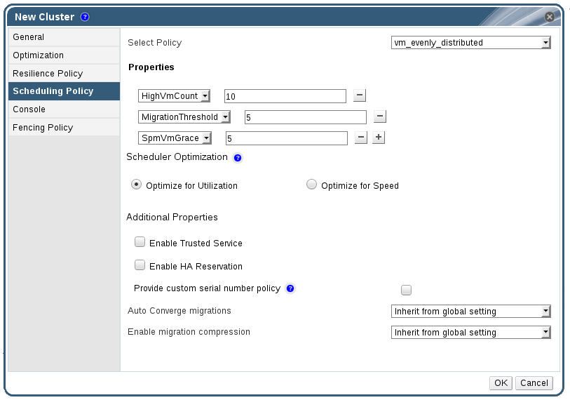

# Scheduling Policy Settings Explained

Scheduling policies allow you to specify the usage and distribution of virtual machines between available hosts. Define the scheduling policy to enable automatic load balancing across the hosts in a cluster.

To add a scheduling policy to an existing cluster, click the **Clusters** tab and click the **Edit** button, then click the **Scheduling Policy** tab.

**Scheduling Policy Settings: vm_evenly_distributed**

The table below describes the settings for the **Scheduling Policy** tab.

**Scheduling Policy Tab Properties**

<table>
 <thead>
  <tr>
   <td>Field</td>
   <td>Description/Action</td>
  </tr>
 </thead>
 <tbody>
  <tr>
   <td><b>Select Policy</b></td>
   <td>
    
Select a policy from the drop-down list.

    <ul>
     <li><b>none</b>: Set the policy value to <b>none</b> to have no load or power sharing between hosts. This is the default mode.</li>
     <li><b>evenly_distributed</b>: Distributes the memory and CPU processing load evenly across all hosts in the cluster. Additional virtual machines attached to a host will not start if that host has reached the defined Maximum Service Level.</li>

     <li><b>InClusterUpgrade</b>: Distributes virtual machines based on host operating system version. Hosts with a newer operating system than the virtual machine currently runs on are given priority over hosts with the same operating system. Virtual machines that migrate to a host with a newer operating system will not migrate back to an older operating system. A virtual machine can restart on any host in the cluster. The policy allows hosts in the cluster to be upgraded by allowing the cluster to have mixed operating system versions. Preconditions must be met before the policy can be enabled. See the <a href="https://access.redhat.com/documentation/en/red-hat-virtualization/4.0/paged/upgrade-guide/Upgrading_a_Red_Hat_Enterprise_Linux_6_Cluster_to_Red_Hat_Enterprise_Linux_7.html"><i>Upgrade Guide</i></a> for more information.</li>
     <li><b>power_saving</b>: Distributes the memory and CPU processing load across a subset of available hosts to reduce power consumption on underutilized hosts. Hosts with a CPU load below the low utilization value for longer than the defined time interval will migrate all virtual machines to other hosts so that it can be powered down. Additional virtual machines attached to a host will not start if that host has reached the defined high utilization value.</li>
     <li><b>vm_evenly_distributed</b>: Distributes virtual machines evenly between hosts based on a count of the virtual machines. The cluster is considered unbalanced if any host is running more virtual machines than the <b>HighVmCount</b> and there is at least one host with a virtual machine count that falls outside of the <b>MigrationThreshold</b>.</li>
    </ul>
   </td>
  </tr>
  <tr>
   <td><b>Properties</b></td>
   <td>
    
The following properties appear depending on the selected policy, and can be edited if necessary:

    <ul>
     <li><b>HighVmCount</b>: Sets the maximum number of virtual machines that can run on each host. Exceeding this limit qualifies the host as overloaded. The default value is <b>10</b>.</li>
     <li><b>MigrationThreshold</b>: Defines a buffer before virtual machines are migrated from the host. It is the maximum inclusive difference in virtual machine count between the most highly-utilized host and the least-utilized host. The cluster is balanced when every host in the cluster has a virtual machine count that falls inside the migration threshold. The default value is <b>5</b>.</li>
     <li><b>SpmVmGrace</b>: Defines the number of slots for virtual machines to be reserved on SPM hosts. The SPM host will have a lower load than other hosts, so this variable defines how many fewer virtual machines than other hosts it can run. The default value is <b>5</b>.</li>
     <li><b>CpuOverCommitDurationMinutes</b>: Sets the time (in minutes) that a host can run a CPU load outside of the defined utilization values before the scheduling policy takes action. The defined time interval protects against temporary spikes in CPU load activating scheduling policies and instigating unnecessary virtual machine migration. Maximum two characters. The default value is <b>2</b>.</li>
     <li><b>HighUtilization</b>: Expressed as a percentage. If the host runs with CPU usage at or above the high utilization value for the defined time interval, the Red Hat Virtualization Manager migrates virtual machines to other hosts in the cluster until the host's CPU load is below the maximum service threshold. The default value is <b>80</b>.</li>
     <li><b>LowUtilization</b>: Expressed as a percentage. If the host runs with CPU usage below the low utilization value for the defined time interval, the Red Hat Virtualization Manager will migrate virtual machines to other hosts in the cluster. The Manager will power down the original host machine, and restart it again when load balancing requires or there are not enough free hosts in the cluster. The default value is <b>20</b>.</li>
     <li><b>ScaleDown</b>: Reduces the impact of the <b>HA Reservation</b> weight function, by dividing a host's score by the specified amount. This is an optional property that can be added to any policy, including <b>none</b>.</li>
     <li><b>HostsInReserve</b>: Specifies a number of hosts to keep running even though there are no running virtual machines on them. This is an optional property that can be added to the <b>power_saving</b> policy.</li>
     <li><b>EnableAutomaticHostPowerManagement</b>: Enables automatic power management for all hosts in the cluster. This is an optional property that can be added to the <b>power_saving</b> policy. The default value is <b>true</b>.</li>
     <li><b>MaxFreeMemoryForOverUtilized</b>: Sets the maximum free memory required in MB for the minimum service level. If the host's memory usage runs at, or above this value, the Red Hat Virtualization Manager migrates virtual machines to other hosts in the cluster until the host's available memory is below the minimum service threshold. Setting both <b>MaxFreeMemoryForOverUtilized</b> and <b>MinFreeMemoryForUnderUtilized</b> to 0 MB disables memory based balancing. This is an optional property that can be added to the <b>power_saving</b> and <b>evenly_distributed</b> policies.</li>
     <li><b>MinFreeMemoryForUnderUtilized</b>: Sets the minimum free memory required in MB before the host is considered underutilized. If the host's memory usage runs below this value, the Red Hat Virtualization Manager migrates virtual machines to other hosts in the cluster and will automatically power down the host machine, and restart it again when load balancing requires or there are not enough free hosts in the cluster. Setting both <b>MaxFreeMemoryForOverUtilized</b> and <b>MinFreeMemoryForUnderUtilized</b> to 0MB disables memory based balancing. This is an optional property that can be added to the <b>power_saving</b> and <b>evenly_distributed</b> policies.</li>
    </ul>
   </td>
  </tr>
  <tr>
   <td><b>Scheduler Optimization</b></td>
   <td>
    
Optimize scheduling for host weighing/ordering.

    <ul>
     <li><b>Optimize for Utilization</b>: Includes weight modules in scheduling to allow best selection.</li>
     <li><b>Optimize for Speed</b>: Skips host weighting in cases where there are more than ten pending requests.</li>
    </ul>
   </td>
  </tr>
  <tr>
   <td><b>Enable Trusted Service</b></td>
   <td>Enable integration with an OpenAttestation server. Before this can be enabled, use the <tt>engine-config</tt> tool to enter the OpenAttestation server's details. For more information, see <a href="sect-Trusted_Compute_Pools">Trusted Compute Pools</a>.</td>
  </tr>
  <tr>
   <td><b>Enable HA Reservation</b></td>
   <td>Enable the Manager to monitor cluster capacity for highly available virtual machines. The Manager ensures that appropriate capacity exists within a cluster for virtual machines designated as highly available to migrate in the event that their existing host fails unexpectedly.</td>
  </tr>
  <tr>
   <td><b>Provide custom serial number policy</b></td>
   <td>
    
This check box allows you to specify a serial number policy for the virtual machines in the cluster. Select one of the following options:

    <ul>
     <li><b>Host ID</b>: Sets the host's UUID as the virtual machine's serial number.</li>
     <li><b>Vm ID</b>: Sets the virtual machine's UUID as its serial number.</li>
     <li><b>Custom serial number</b>: Allows you to specify a custom serial number.</li>
    </ul>
   </td>
  </tr>
  <tr>
   <td><b>Auto Converge migrations</b></td>
   <td>
    
This option allows you to set whether auto-convergence is used during live migration of virtual machines in the cluster. Large virtual machines with high workloads can dirty memory more quickly than the transfer rate achieved during live migration, and prevent the migration from converging. Auto-convergence capabilities in QEMU allow you to force convergence of virtual machine migrations. QEMU automatically detects a lack of convergence and triggers a throttle-down of the vCPUs on the virtual machines. Auto-convergence is disabled globally by default.

    <ul>
     <li>Select <b>Inherit from global setting</b> to use the auto-convergence setting that is set at the global level with <tt>engine-config</tt>. This option is selected by default.</li>
     <li>Select <b>Auto Converge</b> to override the global setting and allow auto-convergence for virtual machines in the cluster.</li>
     <li>Select <b>Don't Auto Converge</b> to override the global setting and prevent auto-convergence for virtual machines in the cluster.</li>
    </ul>
   </td>
  </tr>
  <tr>
   <td><b>Enable migration compression</b></td>
   <td>
    
This option allows you to set whether migration compression is used during live migration of virtual machines in the cluster. This feature uses Xor Binary Zero Run-Length-Encoding to reduce virtual machine downtime and total live migration time for virtual machines running memory write-intensive workloads or for any application with a sparse memory update pattern. Migration compression is disabled globally by default.

    <ul>
     <li>Select <b>Inherit from global setting</b> to use the compression setting that is set at the global level with <tt>engine-config</tt>. This option is selected by default.</li>
     <li>Select <b>Compress</b> to override the global setting and allow compression for virtual machines in the cluster.</li>
     <li>Select <b>Don't compress</b> to override the global setting and prevent compression for virtual machines in the cluster.</li>
    </ul>
   </td>
  </tr>
 </tbody>
</table>

When a host's free memory drops below 20%, ballooning tts like `mom.Controllers.Balloon - INFO Ballooning guest:half1 from 1096400 to 1991580` are logged to `/var/log/vdsm/mom.log`. `/var/log/vdsm/mom.log` is the Memory Overcommit Manager log file.

