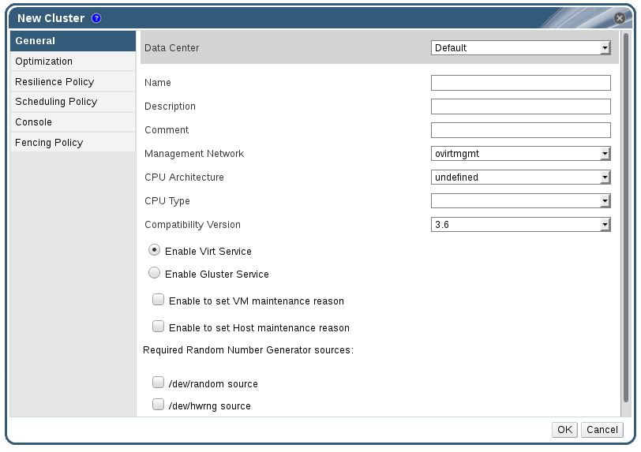

# General Cluster Settings Explained

**New Cluster window**

The table below describes the settings for the **General** tab in the **New Cluster** and **Edit Cluster** windows. Invalid entries are outlined in orange when you click **OK**, prohibiting the changes being accepted. In addition, field prompts indicate the expected values or range of values.

**General Cluster Settings**

<table>
 <thead>
  <tr>
   <td>Field</td>
   <td>Description/Action</td>
  </tr>
 </thead>
 <tbody>
  <tr>
   <td><b>Data Center</b></td>
   <td>The data center that will contain the cluster. The data center must be created before adding a cluster.</td>
  </tr>
  <tr>
   <td><b>Name</b></td>
   <td>The name of the cluster. This text field has a 40-character limit and must be a unique name with any combination of uppercase and lowercase letters, numbers, hyphens, and underscores.</td>
  </tr>
  <tr>
   <td><b>Description / Comment</b></td>
   <td>The description of the cluster or additional notes. These fields are recommended but not mandatory.</td>
  </tr>
  <tr>
   <td><b>Management Network</b></td>
   <td>The logical network which will be assigned the management network role. The default is <b>ovirtmgmt</b>. On existing clusters, the management network can only be changed via the <b>Manage Networks</b> button in the <b>Logical Networks</b> tab in the details pane.</td>
  </tr>
  <tr>
   <td><b>CPU Architecture</b></td>
   <td>
    
The CPU architecture of the cluster. Different CPU types are available depending on which CPU architecture is selected.

    <ul>
     <li><b>undefined</b>: All CPU types are available.</li>
     <li><b>x86_64</b>: All Intel and AMD CPU types are available.</li>
     <li><b>ppc64</b>: Only IBM POWER 8 is available.</li>
    </ul>
   </td>
  </tr>
  <tr>
   <td><b>CPU Type</b></td>
   <td>
    
The CPU type of the cluster. Choose one of:

    <ul>
     <li>Intel Conroe Family</li>
     <li>Intel Penryn Family</li>
     <li>Intel Nehalem Family</li>
     <li>Intel Westmere Family</li>
     <li>Intel SandyBridge Family</li>
     <li>Intel Haswell</li>
     <li>AMD Opteron G1</li>
     <li>AMD Opteron G2</li>
     <li>AMD Opteron G3</li>
     <li>AMD Opteron G4</li>
     <li>AMD Opteron G5</li>
     <li>IBM POWER 8</li>
    </ul>
    
All hosts in a cluster must run either Intel, AMD, or IBM POWER 8 CPU type; this cannot be changed after creation without significant disruption. The CPU type should be set to the oldest CPU model in the cluster. Only features present in all models can be used. For both Intel and AMD CPU types, the listed CPU models are in logical order from the oldest to the newest.

   </td>
  </tr>
  <tr>
   <td><b>Compatibility Version</b></td>
   <td>
    
The version of Red Hat Virtualization. Choose one of:

    <ul>
     <li>3.6</li>
     <li>4.0</li>
    </ul>
    
You will not be able to select a version older than the version specified for the data center.

   </td>
  </tr>
  <tr>
   <td><b>Enable Virt Service</b></td>
   <td>If this radio button is selected, hosts in this cluster will be used to run virtual machines.</td>
  </tr>
  <tr>
   <td><b>Enable Gluster Service</b></td>
   <td>If this radio button is selected, hosts in this cluster will be used as Red Hat Gluster Storage Server nodes, and not for running virtual machines. You cannot add a Red Hat Virtualization Host to a cluster with this option enabled.</td>
  </tr>
  <tr>
   <td><b>Import existing gluster configuration</b></td>
   <td>
    
This check box is only available if the <b>Enable Gluster Service</b> radio button is selected. This option allows you to import an existing Gluster-enabled cluster and all its attached hosts to Red Hat Virtualization Manager.

    
The following options are required for each host in the cluster that is being imported:

    <ul>
     <li><b>Address</b>: Enter the IP or fully qualified domain name of the Gluster host server.</li>
     <li><b>Fingerprint</b>: Red Hat Virtualization Manager fetches the host's fingerprint, to ensure you are connecting with the correct host.</li>
     <li><b>Root Password</b>: Enter the root password required for communicating with the host.</li>
    </ul>
   </td>
  </tr>
  <tr>
   <td><b>Enable to set VM maintenance reason</b></td>
   <td>If this check box is selected, an optional reason field will appear when a virtual machine in the cluster is shut down from the Manager. This allows you to provide an explanation for the maintenance, which will appear in the logs and when the virtual machine is powered on again.</td>
  </tr>
  <tr>
   <td><b>Enable to set Host maintenance reason</b></td>
   <td>If this check box is selected, an optional reason field will appear when a host in the cluster is moved into maintenance mode from the Manager. This allows you to provide an explanation for the maintenance, which will appear in the logs and when the host is activated again.</td>
  </tr>
  <tr>
   <td><b>Required Random Number Generator sources:</b></td>
   <td>
    
If one of the following check boxes is selected, all hosts in the cluster must have that device available. This enables passthrough of entropy from the random number generator device to virtual machines.

    <ul>
     <li><b>/dev/random source</b> - The Linux-provided random number generator.</li>
     <li><b>/dev/hwrng source</b> - An external hardware generator.</li>
    </ul>
   </td>
  </tr>
 </tbody>
</table>
